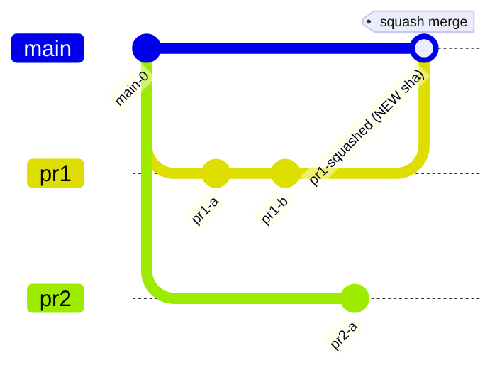
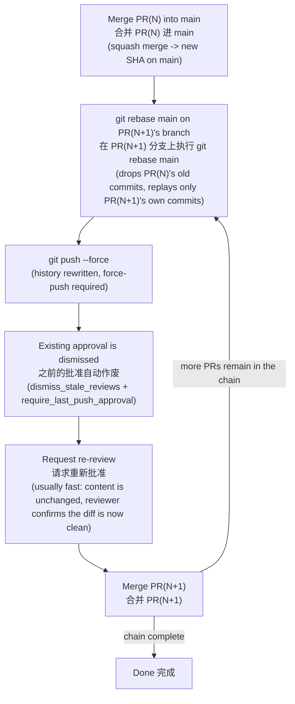

# GitHub Stacked PRs + Squash Merge 链式 PR 与压缩合并

---

## Overview

A stacked PR chain (PR2 based on PR1's branch, PR3 based on PR2's branch) reviews cleanly, but
merging it in a repo that only allows **squash merge** creates a specific, repeatable problem: each
squash merge rewrites the base PR's commits into one new commit with a new SHA, which the next PR
in the chain does not recognize as already-merged. Left alone, that PR's diff balloons to include
the base PR's changes again. This note covers why that happens, why merge order cannot be reversed
to avoid it, and the repeatable procedure (rebase, force-push, re-approve) that keeps each PR's diff
clean through the whole chain.

## The problem: squash merge gives every merge a new SHA 压缩合并会给每次合并一个全新的提交编号

Squash merge takes every commit on a PR's branch and welds them into a
single new commit on the target branch, with a brand-new commit SHA. The commit's *content* matches
the sum of the original commits, but its *identity* (the SHA git actually tracks) has never existed
before.

压缩合并（Squash Merge）会把一个 PR 分支上的所有提交，熔合焊接成目标分支上的**一个全新提交**，并生成一个全新的
SHA 编号。这个新提交的**内容**等于原来那些提交内容之和，但它的**身份**（git 真正追踪的 SHA）是之前从未存在过的。

That is fine for a standalone PR. It breaks down the moment a second PR was built on top of the
first PR's branch, because the second PR's branch still carries the *original* commits (with their
*original* SHAs), and those original SHAs never land on the target branch — only the new squashed
SHA does.

这对单独的 PR 没有任何问题。但一旦第二个 PR 是接在第一个 PR 分支后面建的，麻烦就来了：第二个 PR 的分支上带着的仍然是
**原始的**提交（带着**原始的** SHA），而这些原始 SHA 永远不会出现在目标分支上——出现在目标分支上的只有那个全新的压缩
SHA。

After `pr1` squash-merges into `main`, `main` holds one new commit (`pr1-squashed`). The `pr2`
branch, though, still points at `pr1-a` and `pr1-b` as its own history — commits `main` no longer
has any record of under those SHAs. Diffing `pr2` against `main` now shows `pr1-a`, `pr1-b`, *and*
`pr2-a` as "new" changes, even though `pr1-a`/`pr1-b`'s content is already sitting on `main` inside
`pr1-squashed`.

`pr1`压缩合并进 `main` 之后，`main` 上只有一个新提交（`pr1-squashed`）。但 `pr2` 分支的历史里，仍然认为
`pr1-a` 和 `pr1-b` 是自己的一部分——而这两个 SHA 在 `main` 上根本没有任何记录。这时候拿 `pr2` 去跟 `main` 做
diff，会显示 `pr1-a`、`pr1-b` 和 `pr2-a` 全部都是"新"改动，尽管 `pr1-a`/`pr1-b` 的内容其实已经躺在 `main` 上的
`pr1-squashed` 里了。

If `pr2` is merged as-is at this point, GitHub squashes *all three* commits (`pr1-a`, `pr1-b`,
`pr2-a`) into a second new commit on `main` — silently re-landing PR1's already-merged content a
second time, and risking a real conflict if PR1 picked up even one review-driven tweak after being
approved.

如果这时候直接合并 `pr2`，GitHub 会把这三个提交（`pr1-a`、`pr1-b`、`pr2-a`）**全部**压缩焊接成第二个新提交合并进
`main`——这就悄悄把 PR1 已经合并过的内容又合并了一遍，而且只要 PR1 在批准之后哪怕改过一个字，这里就会真的冲突。

## Why merge order cannot be reversed 为什么不能反过来先合并末端的 PR

Merging the end of the chain first (PR3 before PR1/PR2) looks tempting — surely the last PR carries
everything already? It does, but that is exactly the problem: PR3's branch carries PR1's original
commits, PR2's original commits, and PR3's own commits, all under their pre-squash SHAs. Merging
PR3 directly into `main` dumps all three PRs' changes into `main` in one shot, and PR1/PR2 are left
permanently showing as unmerged on GitHub (their commit SHAs never appear in `main`'s history),
along with every review comment and approval attached to them.

先合并链条末端的 PR（比如先合并 PR3，再合并 PR1/PR2）看起来很诱人——反正最后一个 PR 不是已经带着前面所有改动了吗？确实带着，但这正是问题所在：PR3 的分支带着 PR1 的原始提交、PR2 的原始提交、以及 PR3 自己的提交，全都是压缩前的旧 SHA。直接把 PR3
合并进 `main`，等于一次性把三个 PR 的改动全部倒进 `main`，而 PR1 和 PR2 会在 GitHub 上**永远显示为未合并**（它们的提交
SHA 从未出现在 `main` 的历史里），连带它们身上的所有审阅评论和批准记录也白白浪费。

Merge order must follow dependency order: PR1 → PR2 → PR3, matching the order the branches were
created in.

合并顺序必须跟分支的依赖顺序一致：PR1 → PR2 → PR3，跟分支被创建的顺序完全一样。

## The correct procedure: merge, then rebase the next one 正确做法：合并一个，就给下一个做一次变基

Each merge in the chain needs one extra step before the next PR can merge cleanly: rebase the next
PR's branch onto the now-updated target branch, dropping the commits that already landed.

链条里的每一次合并，都需要在下一个 PR 能干净合并之前多做一步：把下一个 PR 的分支变基（rebase）到刚更新过的目标分支上，
去掉那些已经落地的提交。

Two settings determine how painful step D is, and are worth checking on any repo before relying on
a stacked-PR workflow:

第 D 步有多痛，取决于两个仓库设置，在依赖链式 PR 工作流之前值得先查一下：

- `allow_merge_commit` / `allow_squash_merge` / `allow_rebase_merge` — whether the repo allows a real
  merge commit as an alternative to squash. A true merge commit does not re-weld the base PR's
  commits with new SHAs, so a stacked PR chain never hits this problem under merge-commit strategy.
  是否允许用真正的合并提交（merge commit）代替压缩合并。真正的合并提交不会把基础 PR 的提交重新焊接成新
  SHA，所以在合并提交策略下，链式 PR 根本不会遇到这个问题。
- `dismiss_stale_reviews` + `require_last_push_approval` — whether any new push (including the
  rebase's force-push) voids existing approval, and whether only the *last* pushed commit's approval
  counts. Both together mean step D always happens; only one of them may soften it.
  是否任何新的推送（包括变基后的强制推送）都会作废已有批准，以及是否只有"最后一次推送"拿到的批准才算数。两个
  都开启，第 D 步就一定会发生；只开其中一个，情况可能会缓和一些。

## When to avoid stacking altogether 什么时候干脆别用链式 PR

Stacking is the right call when a later PR's code genuinely does not make sense without the earlier
PR's changes already existing — that dependency is real regardless of how the PRs are merged, and
GitHub's own "review against the base PR's branch" feature exists specifically to support this
during review.

如果后面的 PR 在代码逻辑上确实**必须依赖**前面 PR 已经存在的改动才讲得通，那链式 PR 就是正确的做法——这个依赖关系是
真实存在的，不管最终怎么合并都一样，而且 GitHub 自己那个"对着 base PR 的分支去审阅"的功能，本来就是为了在审阅阶段支持
这种场景而设计的。

If the PRs are actually independent of each other (PR2/PR3 do not need PR1 to exist to make sense),
merge PR1 first and open PR2 fresh off the updated `main` afterward, rather than stacking. Every new
PR then starts clean, never needs the rebase-and-re-approve cycle above, and never loses an
approval to a force-push. The tradeoff is losing the ability to review all of them in parallel — they
queue instead.

如果这些 PR 其实互相独立（PR2/PR3 不需要 PR1 真的存在也讲得通），那就应该先合并 PR1，再从更新后的 `main` 上重新开
PR2，而不是叠着建。这样每个新 PR 从一开始就是干净的，永远不需要上面那套"变基再重新批准"的循环，也永远不会因为强制
推送丢失批准。代价是没法把它们放在一起并行审阅——只能排队一个一个来。

## Meow's Security Considerations 安全注意事项

Force-push and stale-review-dismissal are the two mechanics this workflow leans on directly, so the
considerations below are scoped to those rather than the full generic checklist (this note does not
touch secrets, network exposure, or the software supply chain).

这个工作流直接依赖的是"强制推送"和"批准作废"这两个机制，所以下面只针对这两点展开，而不是套用完整的通用检查表（本篇
不涉及密钥、网络暴露或软件供应链相关的问题）。

| Severity 严重程度 | Concern 问题 |
|---|---|
| Medium 中 | Force-push during rebase can discard commits if run against the wrong branch 变基时如果推错分支，强制推送可能会丢弃提交 |
| Low 低 | Approval-integrity bypass if `require_last_push_approval` is disabled 如果关闭了 require_last_push_approval，可能存在批准完整性被绕过的风险 |

---

### 1. Force-push targeting the wrong branch — Medium 变基强推错分支 — 中等风险

变基（rebase）之后必须用 `git push --force`，因为提交历史和 SHA 全部变了。如果在错误的本地分支上执行这个命令（比如
忘记切换分支，还停留在链条中另一个 PR 的分支上），强制推送会用变基后的历史覆盖远程分支，把该分支上原有的、未被
包含在变基结果里的提交永久丢弃，且没有任何确认提示。

`git push --force` is required after a rebase, since the commit history and every SHA changed. If run
against the wrong local branch (forgetting to switch, still sitting on another PR's branch in the
chain), the force-push overwrites that remote branch with the rebased history, permanently discarding
whatever commits were on it that aren't part of the rebase result — with no confirmation prompt.

**攻击向量 Attack Vectors:**

- 误操作而非恶意攻击是主要风险来源：链条越长，越容易在多个相似命名的分支之间搞混 / Misconfiguration rather than
  malice is the primary risk here: the longer the chain, the easier it is to confuse similarly-named
  branches
- 若仓库允许对 `main` 或受保护分支强推（配置疏忽），同样的丢失历史风险会直接影响所有协作者 / If a repo ever
  permits force-push to `main` or a protected branch (a protection misconfiguration), the same
  history-loss risk directly affects every collaborator

**缓解措施 Mitigation:** 用 `git push --force-with-lease` 代替 `--force`——如果远程分支在此期间被别人推送过新提交，
`--force-with-lease` 会拒绝覆盖，而不是直接强推过去。同时保持分支保护规则里对 `main` 关闭强推权限。
Use `git push --force-with-lease` instead of `--force` — it refuses to overwrite if the remote branch
picked up a new commit from someone else in the meantime, rather than blindly force-pushing over it.
Keep branch protection on `main` denying force-push entirely.

---

### 2. Approval-integrity bypass without require_last_push_approval — Low 未开启 require_last_push_approval 时的批准完整性风险 — 低风险

`dismiss_stale_reviews` 只保证"有新推送就作废旧批准"，但如果 `require_last_push_approval` 没有同时开启，理论上
存在一个时间窗口：批准发生在某次推送**之前**，而合并发生在**之后**又推送了一次未经审阅的新提交之后——只要那次新推送
没有触发作废逻辑的边界条件被绕开，被批准的内容和实际合并的内容就可能不完全一致。

`dismiss_stale_reviews` alone only guarantees "a new push voids the old approval." Without
`require_last_push_approval` also enabled, there is theoretically a window where approval happens
*before* a push and merge happens *after* one more unreviewed push slips in — if that push manages to
avoid whatever triggers the dismissal logic, what was approved and what actually gets merged could
diverge.

**缓解措施 Mitigation:** 确认仓库分支保护规则同时开启 `dismiss_stale_reviews` 和
`require_last_push_approval`（本篇工作流依赖的 code-guard 仓库两者都已开启）。
Confirm branch protection has both `dismiss_stale_reviews` and `require_last_push_approval` enabled
(the code-guard repo this workflow was written against has both on).

---

### Summary Table 汇总表

| # | 问题 Concern | 状态 Status |
|---|---|---|
| 1 | Force-push to the wrong branch discards history 强推错分支丢失历史 | Mitigated by `--force-with-lease` + protected `main` |
| 2 | Approval bypass without require_last_push_approval 缺少 require_last_push_approval 时的批准绕过 | Mitigated by enabling the setting |

## Key Takeaways

- Squash merge gives every merge a brand-new commit SHA; a stacked PR's branch still carries the base
  PR's *original* SHAs, which git cannot match against the new squashed one.
- Merge order must follow creation order (PR1 -> PR2 -> PR3). Merging the end of the chain first dumps
  every PR's changes into one merge and leaves the earlier PRs permanently unmerged on GitHub.
- After each merge, rebase the next PR onto the updated target branch and force-push before it can
  merge cleanly — this will dismiss its existing approval under `dismiss_stale_reviews`, so budget time
  for a quick re-review.
- A repo that allows real merge commits (not squash-only) does not hit this problem at all; that is a
  repo-admin-level setting, not something fixable from an individual PR.
- If the PRs are not actually dependent on each other, merge and open one at a time from an updated
  `main` instead of stacking, trading review parallelism for a permanently clean history.

## References

- Worked through against a live 3-PR stacked chain (PR1 <- PR2 <- PR3) on a repo with
  `allow_merge_commit: false`, `allow_squash_merge: true`, `dismiss_stale_reviews: true`,
  `require_last_push_approval: true`.
- [GitHub Docs: About pull request reviews](https://docs.github.com/en/pull-requests/collaborating-with-pull-requests/reviewing-changes-in-pull-requests/about-pull-request-reviews)
- [GitHub Docs: About protected branches](https://docs.github.com/en/repositories/configuring-branches-and-merges-in-your-repository/managing-protected-branches/about-protected-branches)
