# Real Estate Exam

- [Real Estate Exam](#real-estate-exam)
  - [Texas 房地产执照考试 知识结构思维导图（中文版）](#texas-房地产执照考试-知识结构思维导图中文版)
  - [Texas Real Estate License Exam](#texas-real-estate-license-exam)
    - [📚 Section 1: 权益与地产；所有权（Interests \& Estates; Ownership）](#-section-1-权益与地产所有权interests--estates-ownership)
    - [📚 Section 2: 产权负担；留置权；产权转移与记录；租赁](#-section-2-产权负担留置权产权转移与记录租赁)
    - [📚 Section 3: 土地使用；法律描述；合同法](#-section-3-土地使用法律描述合同法)
    - [📚 Section 4: 代理关系；挂牌协议](#-section-4-代理关系挂牌协议)
    - [📚 Section 5: 经纪业务；销售合同](#-section-5-经纪业务销售合同)
    - [📚 Section 6: 经济学；评估](#-section-6-经济学评估)
    - [📚 Section 7: 融资](#-section-7-融资)
    - [📚 Section 8: 投资；税收；专业实践](#-section-8-投资税收专业实践)
    - [📚 Section 9: 交易结算；风险管理；物业管理](#-section-9-交易结算风险管理物业管理)
        - [核心概念](#核心概念)
    - [📚 Section 10: 房地产数学](#-section-10-房地产数学)
  - [Book detail](#book-detail)
    - [Section 1: National Principles \& Law Key Point Review](#section-1-national-principles--law-key-point-review)
      - [📖 Right](#-right)
        - [✅ 房地产的定义 (Land / Real Estate / Real Property Definition)](#-房地产的定义-land--real-estate--real-property-definition)
        - [✅ 土地的物理特性 (Physical Characteristics of Land)](#-土地的物理特性-physical-characteristics-of-land)
        - [✅ Land vs Real Estate](#-land-vs-real-estate)
        - [✅ Real eEstate as Property](#-real-eestate-as-property)
        - [✅ 法律产权 vs 衡平产权 (Legal Title vs Equitable title)](#-法律产权-vs-衡平产权-legal-title-vs-equitable-title)
        - [✅ 房地产权利（Real Property Rights）](#-房地产权利real-property-rights)
        - [✅ 房地产 (Real Property) vs. 动产 (Personal Property)](#-房地产-real-property-vs-动产-personal-property)
        - [✅ 土地的经济特性 (Economic Characteristics of Land)](#-土地的经济特性-economic-characteristics-of-land)
        - [✅ 房地产所有权类型 (Forms of Real Estate Ownership)](#-房地产所有权类型-forms-of-real-estate-ownership)
        - [✅ 房地产市场特点 (Market Characteristics)](#-房地产市场特点-market-characteristics)
      - [📖 权利、权益与地产 (Rights, Interests \& Estates)](#-权利权益与地产-rights-interests--estates)
        - [✅ 财产权利 (Bundle of Rights)](#-财产权利-bundle-of-rights)
        - [✅ 权益 (Interests in Real Estate)](#-权益-interests-in-real-estate)
        - [✅ 地产类型 (Estates in Land)](#-地产类型-estates-in-land)
      - [📖 房地产所有权 (Ownership in Real Estate)](#-房地产所有权-ownership-in-real-estate)
        - [✅ 所有权概念 (Concept of Ownership)](#-所有权概念-concept-of-ownership)
        - [✅ 产权类型 (Types of Ownership)](#-产权类型-types-of-ownership)
      - [📖 产权负担与留置权 (Encumbrances \& Liens)](#-产权负担与留置权-encumbrances--liens)
        - [✅ 产权负担 (Encumbrances)](#-产权负担-encumbrances)
        - [✅ 地役权 (Easements)](#-地役权-easements)
        - [✅ 私设限制 (Deed Restrictions)](#-私设限制-deed-restrictions)
        - [✅ 政府限制 (Government Restrictions)](#-政府限制-government-restrictions)
        - [✅ 留置权 (Liens)](#-留置权-liens)
      - [📖 产权转让与记录 (Transferring \& Recording Title)](#-产权转让与记录-transferring--recording-title)
        - [✅ 产权证书 (Title)](#-产权证书-title)
        - [✅ 产权转让方式 (Methods of Transferring Title)](#-产权转让方式-methods-of-transferring-title)
        - [✅ 产权记录 (Recording Title)](#-产权记录-recording-title)
        - [✅ 产权瑕疵 (Title Defects)](#-产权瑕疵-title-defects)
        - [✅ 产权保险 (Title Insurance)](#-产权保险-title-insurance)
      - [📖 租赁 (Leases)](#-租赁-leases)
        - [✅ 租赁概念 (Definition of Lease)](#-租赁概念-definition-of-lease)
        - [✅ 租赁条款 (Lease Terms)](#-租赁条款-lease-terms)
        - [✅ 租赁类型 (Types of Leases)](#-租赁类型-types-of-leases)
        - [✅ 租金结构 (Types of Rent Agreements)](#-租金结构-types-of-rent-agreements)
        - [✅ 租赁终止方式 (Termination of Lease)](#-租赁终止方式-termination-of-lease)
      - [📖 土地使用与管制 (Land Use Control and Regulation)](#-土地使用与管制-land-use-control-and-regulation)
        - [✅ 土地使用管制的类型 (Types of Land Use Control)](#-土地使用管制的类型-types-of-land-use-control)
        - [✅ 政府的土地使用权力 (Government Rights in Land)](#-政府的土地使用权力-government-rights-in-land)
        - [✅ 土地使用规划 (Zoning and Land Use Planning)](#-土地使用规划-zoning-and-land-use-planning)
        - [✅ 特殊用途分区 (Special Zoning Types)](#-特殊用途分区-special-zoning-types)
        - [✅ 环境法规 (Environmental Regulations)](#-环境法规-environmental-regulations)
      - [📖 法律描述 (Legal Descriptions)](#-法律描述-legal-descriptions)
      - [✅ 法律描述的目的 (Purpose of Legal Descriptions)](#-法律描述的目的-purpose-of-legal-descriptions)
        - [✅ 测量标记与界限法 (Metes and Bounds)](#-测量标记与界限法-metes-and-bounds)
        - [✅ 政府测量法 (Rectangular Survey System / Government Survey System)](#-政府测量法-rectangular-survey-system--government-survey-system)
        - [✅ 区划法 (Lot and Block System / Recorded Plat System)](#-区划法-lot-and-block-system--recorded-plat-system)
      - [📖 合同法 (Contract Law)](#-合同法-contract-law)
        - [✅ 合同的基本要素 (Essential Elements of a Contract)](#-合同的基本要素-essential-elements-of-a-contract)
        - [✅ 合同类型 (Types of Contracts)](#-合同类型-types-of-contracts)
        - [✅ 合同的执行 (Performance of Contract)](#-合同的执行-performance-of-contract)
        - [✅ 合同的补救措施 (Remedies for Breach of Contract)](#-合同的补救措施-remedies-for-breach-of-contract)
      - [📖 房地产代理关系 (Agency in Real Estate)](#-房地产代理关系-agency-in-real-estate)
        - [✅ 代理关系 (Agency Relationship)](#-代理关系-agency-relationship)
        - [✅ 代理类型 (Types of Agency)](#-代理类型-types-of-agency)
        - [✅ 代理义务 (Agent’s Fiduciary Duties)](#-代理义务-agents-fiduciary-duties)
        - [✅ 代理关系的创建与终止 (Creation \& Termination of Agency)](#-代理关系的创建与终止-creation--termination-of-agency)
        - [📝 总结](#-总结)
      - [📖 挂牌协议 (Listing Agreements)](#-挂牌协议-listing-agreements)
        - [✅ 挂牌协议的作用 (Purpose of Listing Agreements)](#-挂牌协议的作用-purpose-of-listing-agreements)
        - [✅ 挂牌协议的主要类型 (Types of Listing Agreements)](#-挂牌协议的主要类型-types-of-listing-agreements)
        - [✅ 挂牌协议的条款 (Listing Agreement Provisions)](#-挂牌协议的条款-listing-agreement-provisions)
        - [✅ 合同终止方式 (Termination of Listing Agreements)](#-合同终止方式-termination-of-listing-agreements)
        - [📝 总结](#-总结-1)
      - [📖 经纪业务 (Brokerage)](#-经纪业务-brokerage)
        - [🔹 1. 谁可以成为房地产经纪人 (Who May Broker)](#-1-谁可以成为房地产经纪人-who-may-broker)
        - [🔹 2. 经纪人-代理人关系 (Broker-Agent Relationship)](#-2-经纪人-代理人关系-broker-agent-relationship)
        - [🔹 3. 代理人的工作职责 (Obligations and Responsibilities)](#-3-代理人的工作职责-obligations-and-responsibilities)
        - [🔹 4. 代理人的佣金 (Agent Compensation)](#-4-代理人的佣金-agent-compensation)
        - [🔹 5. 混合资金与非法挪用资金 (Commingling \& Conversion)](#-5-混合资金与非法挪用资金-commingling--conversion)
        - [🔹 6. 房地产广告规定 (Advertising Requirements)](#-6-房地产广告规定-advertising-requirements)
        - [🔹 7. 反垄断法律 (Anti-Trust Laws)](#-7-反垄断法律-anti-trust-laws)
      - [📖 销售合同 (Sales Contrats)](#-销售合同-sales-contrats)
        - [🔹 1. 什么是销售合同？ (Key Characteristics of Sales Contracts)](#-1-什么是销售合同-key-characteristics-of-sales-contracts)
        - [🔹 2. 销售合同的创建 (Creation of Sales Contracts)](#-2-销售合同的创建-creation-of-sales-contracts)
          - [✅ 创建合同的关键步骤：](#-创建合同的关键步骤)
        - [🔹 3. 定金 (Earnest Money Deposit)](#-3-定金-earnest-money-deposit)
        - [🔹 4. 附带条件 (Contingencies)](#-4-附带条件-contingencies)
        - [🔹 5. 违约责任 (Default \& Remedies)](#-5-违约责任-default--remedies)
      - [📖 房地产经济学 (Economcs)](#-房地产经济学-economcs)
        - [✅ 供需关系 (Supply \& Demand)](#-供需关系-supply--demand)
          - [✅ 价格与市场均衡 (Price \& Market Equilibrium)](#-价格与市场均衡-price--market-equilibrium)
          - [✅ 市场周期 (Market Cycle)](#-市场周期-market-cycle)
          - [✅ 影响供给的因素 (Factors Affecting Supply)](#-影响供给的因素-factors-affecting-supply)
          - [✅ 影响需求的因素 (Factors Affecting Demand)](#-影响需求的因素-factors-affecting-demand)
          - [✅ 政府对房地产市场的影响 (Government Influence on Real Estate Market)](#-政府对房地产市场的影响-government-influence-on-real-estate-market)
          - [✅ 市场指标 (Market Indicators)](#-市场指标-market-indicators)
        - [📝 总结](#-总结-2)
      - [📖 房地产估价 (Appraisal)](#-房地产估价-appraisal)
        - [✅ 估价目的 (Purpose of Appraisal)](#-估价目的-purpose-of-appraisal)
        - [✅ 市场价值与估价原则 (Market Value \& Principles of Value)](#-市场价值与估价原则-market-value--principles-of-value)
        - [✅ 估价方法 (Approaches to Value)](#-估价方法-approaches-to-value)
        - [✅ 折旧与房产价值 (Depreciation \& Property Value)](#-折旧与房产价值-depreciation--property-value)
        - [✅ 估价流程 (Appraisal Process)](#-估价流程-appraisal-process)
      - [📖 房地产金融 (Finance)](#-房地产金融-finance)
        - [✅ 抵押贷款 (Mortgage Loan)](#-抵押贷款-mortgage-loan)
        - [✅ 贷款类型 (Types of Mortgages)](#-贷款类型-types-of-mortgages)
        - [✅ 贷款审批 (Loan Qualification)](#-贷款审批-loan-qualification)
        - [✅ 政府对房地产贷款的监管 (Government Regulations)](#-政府对房地产贷款的监管-government-regulations)
        - [✅ 抵押市场 (Mortgage Market)](#-抵押市场-mortgage-market)
      - [📖 房地产投资 (Investment)](#-房地产投资-investment)
        - [✅ 房地产投资类型 (Types of Investment Properties)](#-房地产投资类型-types-of-investment-properties)
        - [✅ 投资收益计算 (Investment Returns)](#-投资收益计算-investment-returns)
- [资本化率](#资本化率)
- [现金流](#现金流)
- [ROI](#roi)
        - [✅ 杠杆与房地产投资 (Leverage \& Real Estate Investment)](#-杠杆与房地产投资-leverage--real-estate-investment)
        - [✅ 房地产市场分析 (Market Analysis)](#-房地产市场分析-market-analysis)
        - [✅ 税收影响与风险管理 (Tax Implications \& Risk Management)](#-税收影响与风险管理-tax-implications--risk-management)
      - [📖 房地产税收 (Taxation)](#-房地产税收-taxation)
        - [✅ 房地产税种 (Types of Real Estate Taxes)](#-房地产税种-types-of-real-estate-taxes)
        - [✅ 资本利得税 (Capital Gains Tax)](#-资本利得税-capital-gains-tax)
        - [✅ 1031 交换 (1031 Exchange)](#-1031-交换-1031-exchange)
        - [✅ 房产税计算方法 (Property Tax Calculation)](#-房产税计算方法-property-tax-calculation)
        - [✅ 税收影响房地产投资 (Tax Implications on Investment)](#-税收影响房地产投资-tax-implications-on-investment)
- [年度折旧](#年度折旧)
      - [📖 专业实践 (Professional Practices)](#-专业实践-professional-practices)
        - [✅ 道德规范 (Ethics in Real Estate)](#-道德规范-ethics-in-real-estate)
        - [✅ 公平住房法 (Fair Housing Laws)](#-公平住房法-fair-housing-laws)
        - [✅ 反垄断法 (Antitrust Laws)](#-反垄断法-antitrust-laws)
        - [✅ 代理责任 (Agency Responsibilities)](#-代理责任-agency-responsibilities)
        - [✅ 广告合规 (Advertising Compliance)](#-广告合规-advertising-compliance)
        - [✅ 风险管理 (Risk Management)](#-风险管理-risk-management)
      - [📖 房地产交易结算 (Closings)](#-房地产交易结算-closings)
        - [✅ 产权过户 (Title Transfer)](#-产权过户-title-transfer)
        - [✅ 成交流程 (Closing Process)](#-成交流程-closing-process)
        - [✅ 结算成本 (Closing Costs)](#-结算成本-closing-costs)
        - [✅ 托管账户 (Escrow)](#-托管账户-escrow)
        - [✅ 房地产结算程序法 (RESPA)](#-房地产结算程序法-respa)
        - [✅ 产权保险 (Title Insurance)](#-产权保险-title-insurance-1)
      - [📖 风险管理 (Risk Management)](#-风险管理-risk-management-1)
        - [✅ 法律风险 (Legal Risks)](#-法律风险-legal-risks)
        - [✅ 财务风险 (Financial Risks)](#-财务风险-financial-risks)
        - [✅ 市场风险 (Market Risks)](#-市场风险-market-risks)
        - [✅ 运营风险 (Operational Risks)](#-运营风险-operational-risks)
        - [✅ 职业责任与保险 (Professional Liability \& Insurance)](#-职业责任与保险-professional-liability--insurance)
        - [✅ 合规管理 (Regulatory Compliance)](#-合规管理-regulatory-compliance)
      - [📖 物业管理 (Property Management)](#-物业管理-property-management)
        - [✅ 物业管理的目标 (Goals of Property Management)](#-物业管理的目标-goals-of-property-management)
        - [✅ 物业管理者的职责 (Responsibilities of Property Managers)](#-物业管理者的职责-responsibilities-of-property-managers)
        - [✅ 租赁类型 (Types of Lease Agreements)](#-租赁类型-types-of-lease-agreements)
        - [✅ 租户管理 (Tenant Management)](#-租户管理-tenant-management)
        - [✅ 维护与维修 (Maintenance \& Repairs)](#-维护与维修-maintenance--repairs)
        - [✅ 法律合规 (Legal Responsibilities)](#-法律合规-legal-responsibilities)
    - [Section 2: REAL ESTATE MATH REVIEW](#section-2-real-estate-math-review)
      - [📖 基础数学 (Basic Math)](#-基础数学-basic-math)
        - [✅ 百分比计算 (Percentage Calculations)](#-百分比计算-percentage-calculations)
- [LTV](#ltv)
        - [✅ 房地产面积换算 (Measurement Conversions)](#-房地产面积换算-measurement-conversions)
        - [✅ 贷款计算 (Loan Calculations)](#-贷款计算-loan-calculations)
- [月供](#月供)
- [APR](#apr)
        - [✅ 收益计算 (Investment Returns)](#-收益计算-investment-returns)
- [资本化率](#资本化率-1)
- [ROI](#roi-1)
        - [✅ 税收计算 (Tax Calculations)](#-税收计算-tax-calculations)
- [房产税](#房产税)
- [年度折旧](#年度折旧-1)
      - [📖 租赁 (Leases)](#-租赁-leases-1)
        - [✅ 租赁合同 (Lease Contract)](#-租赁合同-lease-contract)
        - [✅ 租赁类型 (Types of Leases)](#-租赁类型-types-of-leases-1)
        - [✅ 租赁条款 (Lease Terms)](#-租赁条款-lease-terms-1)
        - [✅ 租户与房东的权利与责任 (Tenant \& Landlord Rights and Responsibilities)](#-租户与房东的权利与责任-tenant--landlord-rights-and-responsibilities)
        - [✅ 租赁终止 (Lease Termination)](#-租赁终止-lease-termination)
      - [📖 房地产买卖合同 (Contracts for Sale)](#-房地产买卖合同-contracts-for-sale)
        - [✅ 合同要素 (Essential Elements of a Contract)](#-合同要素-essential-elements-of-a-contract)
        - [✅ 合同类型 (Types of Contracts)](#-合同类型-types-of-contracts-1)
        - [✅ 合同条款 (Contract Terms)](#-合同条款-contract-terms)
        - [✅ 合同终止 (Contract Termination)](#-合同终止-contract-termination)
        - [✅ 违约与补救措施 (Breach \& Remedies)](#-违约与补救措施-breach--remedies)
      - [📖 估价与价值 (Appraisal \& Value)](#-估价与价值-appraisal--value)
        - [✅ 估价与价值类型 (Appraisal \& Types of Value)](#-估价与价值类型-appraisal--types-of-value)
        - [✅ 估价方法 (Approaches to Value)](#-估价方法-approaches-to-value-1)
- [房产价值](#房产价值)
- [房产价值](#房产价值-1)
- [房产价值](#房产价值-2)
        - [✅ 市场价值原则 (Principles of Value)](#-市场价值原则-principles-of-value)
        - [✅ 折旧与房产价值 (Depreciation \& Property Value)](#-折旧与房产价值-depreciation--property-value-1)
        - [✅ 评估报告 (Appraisal Report)](#-评估报告-appraisal-report)
      - [📖 房地产金融 (Finance)](#-房地产金融-finance-1)
        - [✅ 抵押贷款 (Mortgage Loan)](#-抵押贷款-mortgage-loan-1)
- [LTV](#ltv-1)
        - [✅ 贷款类型 (Types of Mortgages)](#-贷款类型-types-of-mortgages-1)
        - [✅ 贷款审批流程 (Loan Qualification)](#-贷款审批流程-loan-qualification)
- [DTI](#dti)
        - [✅ 政府对房地产贷款的支持 (Government-Backed Loans)](#-政府对房地产贷款的支持-government-backed-loans)
        - [✅ 二级抵押市场 (Secondary Mortgage Market)](#-二级抵押市场-secondary-mortgage-market)
      - [📖 全国执业考试：测试 2 - 产权负担（Encumbrances）；留置权（Liens）；产权转移与记录（Title Transfer and Recording）；租赁（Leases）](#-全国执业考试测试-2---产权负担encumbrances留置权liens产权转移与记录title-transfer-and-recording租赁leases)
        - [✅ 产权负担（Encumbrances）](#-产权负担encumbrances)
        - [留置权（Liens）](#留置权liens)
        - [产权转移（Title Transfer）](#产权转移title-transfer)
        - [产权记录（Recording）](#产权记录recording)
        - [租赁（Leases）](#租赁leases)
      - [📖 全国执业考试：测试 3 - 土地使用（Land Use）；法律描述（Legal Descriptions）；合同法（Contract Law）](#-全国执业考试测试-3---土地使用land-use法律描述legal-descriptions合同法contract-law)
        - [土地使用（Land Use）](#土地使用land-use)
        - [法律描述（Legal Descriptions）](#法律描述legal-descriptions)
        - [合同法（Contract Law）](#合同法contract-law)
      - [📖 全国执业考试：测试 4 - 代理关系（Agency）；挂牌协议（Listing Agreements）](#-全国执业考试测试-4---代理关系agency挂牌协议listing-agreements)
        - [代理关系（Agency）](#代理关系agency)
        - [挂牌协议（Listing Agreements）](#挂牌协议listing-agreements)
      - [📖 全国执业考试：测试 5 - 经纪业务（Brokerage Business）；销售合同（Sale Contracts）](#-全国执业考试测试-5---经纪业务brokerage-business销售合同sale-contracts)
        - [房地产经纪业务（Brokerage Business）](#房地产经纪业务brokerage-business)
        - [销售合同（Sale Contracts）](#销售合同sale-contracts)
      - [📖 全国执业考试：测试 6 - 经济学（Economics）；评估（Appraisal）](#-全国执业考试测试-6---经济学economics评估appraisal)
        - [房地产经济学（Real Estate Economics）](#房地产经济学real-estate-economics)
        - [房地产评估（Appraisal）](#房地产评估appraisal)
      - [📖 全国执业考试：测试 7 - 房地产金融（Finance）](#-全国执业考试测试-7---房地产金融finance)
        - [1. 抵押贷款基础（Mortgage Basics）](#1-抵押贷款基础mortgage-basics)
        - [2. 主要贷款类型（Types of Mortgage Loans）](#2-主要贷款类型types-of-mortgage-loans)
        - [3. 贷款过程（Loan Process）](#3-贷款过程loan-process)
        - [4. 政府在房地产融资中的作用（Government Role in Finance）](#4-政府在房地产融资中的作用government-role-in-finance)
      - [📖 全国执业考试：测试 8 - 投资、税收和专业实践（Investments, Taxation, Professional Practices）](#-全国执业考试测试-8---投资税收和专业实践investments-taxation-professional-practices)
        - [1. 房地产投资（Real Estate Investment）](#1-房地产投资real-estate-investment)
- [资本化率](#资本化率-2)
        - [2. 税收政策（Taxation Policies）](#2-税收政策taxation-policies)
        - [3. 专业实践（Professional Practices）](#3-专业实践professional-practices)
      - [📖 全国执业考试：测试 9 - 交易结算（Closings）；风险管理（Risk Management）；物业管理（Property Management）](#-全国执业考试测试-9---交易结算closings风险管理risk-management物业管理property-management)
        - [1. 交易结算（Closings）](#1-交易结算closings)
        - [2. 风险管理（Risk Management）](#2-风险管理risk-management)
        - [3. 物业管理（Property Management）](#3-物业管理property-management)
      - [📖 全国执业考试：测试 10 - 房地产数学（Real Estate Math）](#-全国执业考试测试-10---房地产数学real-estate-math)
        - [1. 面积与体积计算（Area and Volume Calculations）](#1-面积与体积计算area-and-volume-calculations)
        - [2. 佣金计算（Commission Calculations）](#2-佣金计算commission-calculations)
        - [3. 贷款计算（Loan Calculations）](#3-贷款计算loan-calculations)
- [月供](#月供-1)
        - [4. 利润与损失计算（Profit and Loss Calculations）](#4-利润与损失计算profit-and-loss-calculations)
- [利润](#利润)
- [利润率](#利润率)
        - [5. 费用分摊计算（Proration Calculations）](#5-费用分摊计算proration-calculations)

ref:

- Texas Real Estate License Exam Prep

---

## Texas 房地产执照考试 知识结构思维导图（中文版）

一级分类

```bash
Texas Real Estate License Exam
├─┬── 权益与地产（Interests & Estates）
  ├──── 所有权权益（Ownership Interest）
  ├──── 占有权益（Possessory Interest）
  ├──── 可继承地产（Fee Simple Absolute）
  ├──── 终身产权（Life Estate）
  ├──── 共有权模式（Tenancy in Common, Joint Tenancy, Tenancy by the Entirety）
  ├──── 政府权力（Police Power, Eminent Domain, Taxation, Escheat）
├─┬── 产权负担与产权转移（Encumbrances & Title Transfer）
  ├──── 产权负担（Easements, Liens, Restrictive Covenants）
  ├──── 抵押贷款与留置权（Mortgage Liens, Property Tax Liens）
  ├──── 契约种类（General Warranty Deed, Special Warranty Deed, Quitclaim Deed）
  ├──── 产权转移流程（Deed Delivery & Acceptance）
  ├──── 租赁类型（Estate for Years, Periodic Tenancy, Tenancy at Will, Tenancy at Sufferance）
├─┬─ 土地使用与合同法（Land Use & Contract Law）
  ├──── 土地使用控制（Zoning, Building Codes, Environmental Regulations）
  ├──── 法律描述方式（Metes and Bounds, Lot and Block, Rectangular Survey）
  ├──── 合同四要素（Offer, Acceptance, Consideration, Legality）
  ├──── 合同效力（Valid, Voidable, Void）
  ├──── 合同履行与终止（Performance, Breach, Mutual Agreement, Impossibility）
├─┬─ 代理关系与挂牌协议（Agency & Listing Agreements）
  ├──── 单一代理、双重代理、交易经纪
  ├──── 受信责任（OLD CAR）
  ├──── 授权合同（Exclusive Right-to-Sell, Exclusive Agency, Open Listing）
  ├──── 佣金条款与终止条件
├─┬─ 经纪业务；销售合同
  ├──── 房地产经纪公司结构（Principal Broker, Sales Associate）
  ├──── 佣金规则（不能固定费率、需合同约定）
  ├──── 反垄断法规（Sherman Antitrust Act）
  ├──── 销售合同要素与终止方式
├─┬─ 经济学与评估（Economics & Appraisal）
  ├──── 房地产市场供需关系
  ├──── 经济周期（Expansion, Peak, Contraction, Trough）
  ├──── 房产估值原则（Substitution, Contribution, Competition）
  ├──── 估值方法（Sales Comparison, Cost, Income Approach）
├─┬─ 融资（Finance）
  ├──── 贷款类型（Conventional, FHA, VA, ARM, Balloon）
  ├──── 抵押贷款
  ├──── 抵押贷款结构（Principal, Interest, Term, Payment）
  ├──── LTV 与贷款审批（Income, Credit Score, DTI）
  ├──── 政府机构（Fannie Mae, Freddie Mac, Ginnie Mae）
  ├──── 法律法规（RESPA, TILA, ECOA）
├─┬─ 经济学与评估（Economics & Appraisal）
  ├──── 房地产市场供需关系
  ├──── 经济周期（Expansion, Peak, Contraction, Trough）
  ├──── 房产估值原则（Substitution, Contribution, Competition）
  ├──── 估值方法（Sales Comparison, Cost, Income Approach）
├─┬─ 融资（Finance）
  ├──── 贷款类型（Conventional, FHA, VA, ARM, Balloon）
  ├──── 抵押贷款结构（Principal, Interest, Term, Payment）
  ├──── LTV 与贷款审批（Income, Credit Score, DTI）
  ├──── 政府机构（Fannie Mae, Freddie Mac, Ginnie Mae）
  ├──── 法律法规（RESPA, TILA, ECOA）
├─┬─ 投资、税收、专业实践（Investment, Taxation, Professional Practices）
  ├──── 投资回报计算（Cap Rate, IRR, Cash Flow）
  ├──── 税收政策（Capital Gains, Depreciation, 1031 Exchange）
  ├──── 职业道德（Fiduciary Duties, Fair Housing Compliance）
├─┬─ 交易结算、风险管理与物业管理（Closings, Risk Management, Property Management）
  ├──── 结算文件与程序（Deed, Closing Statement, Title Insurance）
  ├──── 风险管理工具（Insurance, Contractual Risk Transfer, Safety Protocols）
  ├──── 物业管理职能（Rent Collection, Maintenance, Financial Reporting）
├─┬─ 房地产数学（Real Estate Math）
  ├──── 面积与体积计算
  ├──── 佣金计算
  ├──── 贷款计算（简易月供估算）
  ├──── 利润与损失计算
  ├──── 费用分摊（Prorations）
```

---

## Texas Real Estate License Exam

> 超详细 终极冲刺版 总结笔记（中文版）

目录

- 权益与地产；所有权
- 产权负担；留置权；产权转移与记录；租赁
- 土地使用；法律描述；合同法
- 代理关系；挂牌协议
- 经纪业务；销售合同
- 经济学；评估
- 融资
- 投资；税收；专业实践
- 交易结算；风险管理；物业管理
- 房地产数学

### 📚 Section 1: 权益与地产；所有权（Interests & Estates; Ownership）

核心概念

- 权益（Interests）：任何个人或实体对房地产享有的权利。
  - 所有权权益（Ownership Interest）：拥有产权，如 Fee Simple Absolute。
  - 占有权益（Possessory Interest）：仅有占有权，无所有权，如租赁（Leasehold）。

- 地产类型（Estates）：
  - Fee Simple Absolute：最高形式的产权，完全继承和转让自由。
  - Life Estate：基于生命期限的产权，到期后转归其他指定人。

- 共有权形式（Forms of Co-Ownership）：
  - `Joint Tenancy`：有生存者权利，死亡后产权自动归存活方。
  - `Tenancy in Common`：可继承的共有权，各持份额独立。
  - `Tenancy by the Entirety`：夫妻专用，共同拥有产权。

- 政府权力：征收权（Eminent Domain）、警察权（Police Power）

📝 考点例题
哪种地产在持有人去世后可继承？（答：共同租赁 Tenancy in Common）

🎯 小技巧

- Joint Tenancy 记住关键词："Right of Survivorship"。考试爱考。
- Life Estate 死亡时产权自动终止或转移，重点是"终止条件"。

### 📚 Section 2: 产权负担；留置权；产权转移与记录；租赁

核心概念

- 产权负担（`Encumbrances 累贅`）：
  - `Easement`（地役权）：他人有权使用你的土地部分。
  - `Lien`（留置权）：债务保障措施，优先受偿权。
    - 抵押贷款（Mortgage）
    - 物业税留置权（Property Tax Lien）
- 产权转移（`Title Transfer/Deeds`）：
  - `General Warranty` Deed：提供最广泛保障的契约。
  - `Quitclaim 放弃权利` Deed：无任何保证，仅转让当前权益。
  - 保证契约、特别保证契约、无保函契约
- 租赁（`Leases`）：
  - Estate for Years：定期租赁，到期自动终止。
  - Periodic Tenancy：按期续租，如月租。
  - Tenancy at Will：任意终止租赁，无固定期。
  - Tenancy at Sufferance：租期满仍占有房产。

🎯 小技巧

- 记忆口诀：
  - Warranty = Wide Protection；
  - Quitclaim = Quick Transfer。
- 题目常考点：谁支付产权保险？通常买方。

📝 考点例题
哪种契约提供最高产权保护？（答：保证契约 General Warranty Deed）

---

### 📚 Section 3: 土地使用；法律描述；合同法

核心概念

- 土地使用（Land Use）：
  - 分区法规（Zoning Laws）：用途限制（住宅/商业/工业）。
  - 建筑规范（Building Codes）：建筑安全标准。
- 法律描述（Legal Descriptions）：
  - 测量与界标法（Metes and Bounds）：使用地标和方向界定，通常用于不规则地块。
  - 区划法（Lot and Block）：适用于城市住宅区。
- 合同法（Contract Law）：
  - 合同四要素：
    - 要约、承诺、对价、合法目的
    - OACL: `Offer, Acceptance, Consideration, Legality`
  - 有效（Valid）、可撤销（Voidable）、无效（Void）。

🎯 小技巧
考试喜欢考：“有效合同”的必要条件。
记忆关键词："OACL"：Offer, Acceptance, Consideration, Legality。

📝 考点例题
合法合同的必要要素有哪些？（答：要约、承诺、对价、合法目的）

---

### 📚 Section 4: 代理关系；挂牌协议

核心概念

- 代理关系（Agency）：
  - 单一代理（Single Agency）
  - 双重代理（Dual Agency）
  - Fiduciary Duties (OLD CAR)：Obedience, Loyalty, Disclosure, Confidentiality, Accounting, Reasonable Care。
- 挂牌协议（Listing Agreements）：
  - 独家授权出售（`Exclusive Right-to-Sell`）：经纪人无论谁促成交易都能收佣。
  - 独家代理（`Exclusive Agency`）：房主自己找到买家则免佣。
  - 开放式挂牌（`Open Listing`）：多个经纪人竞争，谁促成谁拿佣金。

🎯 小技巧

- 独家出售 = 最安全；
- 开放式挂牌 = 经纪人风险大。

📝 考点例题
独家授权出售合同下，无论谁卖出，代理人是否获得佣金？（答：是）

---

### 📚 Section 5: 经纪业务；销售合同

核心概念

- 经纪业务（Brokerage）：
  - 佣金必须通过合同明确；反垄断法禁止价格串通。（反垄断法 Antitrust Laws）
- 销售合同（Sale Contracts）：
  - 双边合同（双方都有义务）是标准房产合同。
  - 解除方式：履行、违约、不可抗力。

🎯 小技巧

- 佣金从卖方结算款中扣除，买方通常不直接支付。

📝 考点例题
什么行为违反反垄断法？（答：串通固定佣金率）

---

### 📚 Section 6: 经济学；评估

核心概念

- 供需理论（Supply & Demand）：
  - 价格由供需平衡决定。
  - 需求↑价格↑，供给↑价格↓
- 房地产周期：扩张、顶峰、收缩、萧条
- 评估方法（Approaches to Value）：
  - 市场比较法（Sales Comparison Approach）:（住宅常用）
  - 成本法（Cost Approach）:（新建、独特建筑）
  - 收益法（Income Approach）:（投资性房产）

🎯 小技巧
住宅评估=比较法，商用投资房=收益法！

📝 考点例题
哪种评估方法适合出租公寓？（答：收益法 Income Approach）

---

### 📚 Section 7: 融资

核心概念

- 贷款类型（Loan Types）：
  - 传统贷款、
  - FHA 贷款、
  - VA 贷款、
  - ARM
  - 可调利率贷款 Conventional
- 贷款流程（Loan Process）：
  - 贷款审批看：信用评分、收入、债务比（DTI）、贷款比率（LTV）。

- 政府机构：Fannie Mae、Freddie Mac、Ginnie Mae

🎯 小技巧

- VA 贷款 = 无首付
- FHA 贷款 = 低首付

📝 考点例题
贷款利率必须通过哪个法案披露？（答：贷款真实法案 TILA）

---

### 📚 Section 8: 投资；税收；专业实践

核心概念

- 投资指标：
  - 资本化率（Cap Rate）、
  - 内部收益率（IRR）
  - Cash Flow。
- 税收策略：
  - 1031 Exchange 延迟资本利得税。
- 专业实践：
  - 遵守公平住房法（Fair Housing）
  - 保持诚信（No Misrepresentation）

🎯 小技巧
1031 交换的关键词："Like-kind"；不能换私人住房！

📝 考点例题
1031 交换主要优势是什么？（答：推迟资本利得税）

---

### 📚 Section 9: 交易结算；风险管理；物业管理


##### 核心概念
- 交易结算：
  - HUD-1 或 ALTA 结算表，清算所有交易款项。
- 风险管理：
  - 使用保险（Property, Liability）和合约转移风险。
- 物业管理：
  - 租金收取、维修维护、财务报告。

🎯 小技巧
物业经理最大的法律风险：歧视租客！

📝 考点例题
在交易前，买方进行的房产检查称为什么？（答：最终检查 Final Walk-Through）

---

### 📚 Section 10: 房地产数学

核心概念

- 面积计算：长×宽（矩形）；底×高/2（三角形）
- 佣金公式：销售价×佣金率
- 贷款月供估算：本金×年利率/12
- 利润率计算：利润 ÷ 成本价
- 费用分摊（Proration）：年度费用 ÷ 365 × 持有天数

🎯 小技巧
牢记一英亩=43,560 平方英尺！

📝 考点例题
购入价 $150,000，售价 $180,000，利润率？（答：20%）

- (180,000-150,000)/150,000

---

## Book detail

---

### Section 1: National Principles & Law Key Point Review

---

#### 📖 Right

实例解析

1. 城市 vs 乡村的房地产价值
   - 在纽约曼哈顿，1英亩土地可能价值数百万美元，而在德州乡村，相同面积的土地可能只有几千美元。这反映了“稀缺性”和“市场需求”的作用。

2. 房地产投资回报
   - 某投资者在一个发展中城市购买了一块空地，几年后，随着基础设施的建设，该地块增值2倍。这体现了“改良性”和“长期投资”的概念。

3. 共有产权 vs 共有租赁
   - 两兄弟共同买下一栋房子，如果是“共有产权 (Joint Tenancy)”，其中一人去世后，房产自动归另一个人所有。如果是“共有租赁 (Tenancy in Common)”，则去世者的权益由继承人继承。

整体总结

- 房地产的定义 (Definition of Real Estate)
  - 包括土地、建筑物、永久附着物 (improvements)、权益 (interests)、权益负担 (encumbrances)等。
  - **房地产=土地+建筑+权益**，包含经济和物理特性。

- 土地的经济特性 (Economic Characteristics of Land)
  - 稀缺性 (Scarcity)：土地资源有限，影响价格。
  - 改良性 (Improvements)：土地的开发和建设提高价值。
  - 永续性 (Permanence of Investment)：房地产投资具有长期性。
  - 位置偏好 (Situs)。

- 土地的物理特性 (Physical Characteristics of Land)
  - 不可移动性 (Immobility)：土地固定在某个地点。
  - 不可破坏性 (Indestructibility)：土地本身不会被完全毁坏。
  - 独特性 (Uniqueness)：每块土地都是独一无二的。

- 房地产所有权类型 (Forms of Real Estate Ownership)
  - 独资所有 (Sole Ownership)：个人单独持有产权。
  - 共有租赁 (Tenancy in Common)：多人共享，死亡后权益可由继承人继承。
  - 联合租赁, 共有产权 (Joint Tenancy)：两人以上共同拥有，死亡后权益自动转给其他持有人。
  - 整体租赁 (Tenancy by the Entirety)。

- 房地产市场特点 (Real Estate Market Characteristics)
  - 供需关系 (Supply and Demand): 市场供给与需求决定价格。
  - 政府法规 (Government Regulations)：税收、土地用途规定、建筑法规等影响市场。
  - 经济因素 (Economic Factors)：利率、就业率、投资环境决定市场活跃度。

##### ✅ 房地产的定义 (Land / Real Estate / Real Property Definition)

- 房地产不仅包括土地，还包括建筑物、地下资源、权益、负担 (如抵押)。
- **🌟 考试示例**：
  - 哪一项不属于房地产的一部分？ (选项可能包括“租赁权益”或“个人财产”)
  - 如果你购买了一块带有矿产资源的土地，矿产是否属于你的财产？答案取决于是否有他人持有采矿权。

---

##### ✅ 土地的物理特性 (Physical Characteristics of Land)

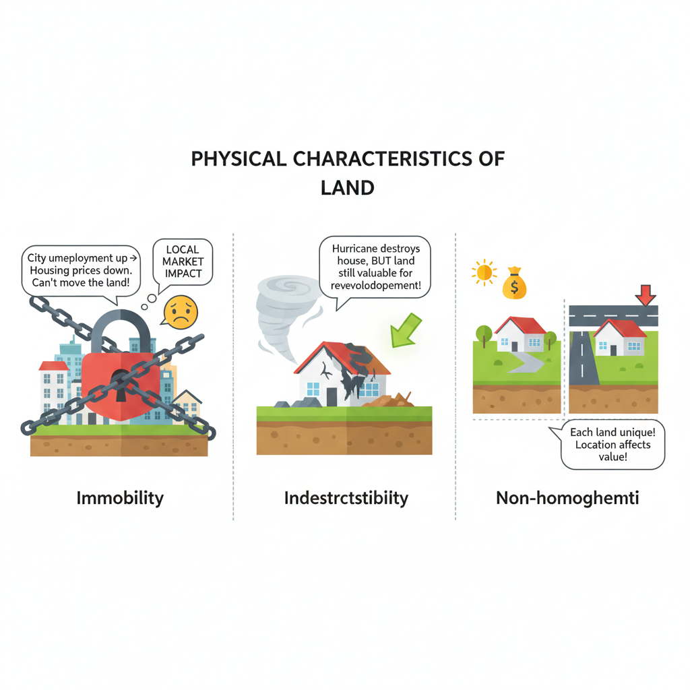

- 不可移动性 (Immobility)：
  - 土地不能被移动，因此房地产市场受本地经济影响大。
  - **🌟 考试示例**：
    - 哪项描述最能反映土地的不可移动性？ (答案可能是“土地无法移动，受地方市场影响”)
    - 如果某城市失业率上升，房价可能下降，因为`居民无法轻易搬迁`土地去其他地区。

- 不可破坏性 (Indestructibility)：
  - 土地不会被完全破坏，尽管建筑可能被毁坏。
  - **🌟 考试示例**：
    - 飓风摧毁了一片住宅区，该土地是否仍有价值？ (答案是“是的，土地仍然存在”)
    - 即使一栋房屋被洪水摧毁，土地本身仍然存在，可以重新开发。

- 非均质性 (Non-homogeneity)：
  - 每块土地都是独一无二的，无法完全复制。
  - **🌟 考试示例**：
    - 为何房地产估价时必须考虑具体地块的位置？ (正确答案：每块土地都是独特的)
    - 即使两座房屋外观相同，但因其`位于不同的街区`，其价值可能完全不同。

---

##### ✅ Land vs Real Estate


**Land** = Natural Attachment + Air + Surface + Subsurface

Real Estate = **Land** + Manmade Attachments

---

##### ✅ Real eEstate as Property


The bundle of rights: **PUTEE**

- Possession
- Use
- Transer
- Execlusion
- Encumberable

---

##### ✅ 法律产权 vs 衡平产权 (Legal Title vs Equitable title)

- 法律产权 (Legal Title)：
  - 指合法所有权，即在法律上被正式认可的产权。
  - 持有法律产权的人拥有财产的正式所有权，可以依法买卖、转让或抵押该财产。

- 衡平产权 (Equitable Title)：
  - 指享有`财产经济利益的权利`，即使没有正式的`法律所有权`。
  - 持有衡平产权的人可能有权使用或占有财产，但并不具备完整的法律所有权。
  - 例如，在房屋贷款期间，买方可能持有衡平产权，而贷款机构持有法律产权，直到贷款还清。

- 财产特征 (Property Characteristics)：
  - 指影响法律产权和衡平产权的因素，如房产用途、所有权结构、法律限制等。

---

##### ✅ 房地产权利（Real Property Rights）


- 空间权 (`Airspace = Air Rights`)
  - 空间权指对房地产上方空气空间的权利。
  - 通常，产权人拥有其土地上方的合理高度空间，但高空部分属于公共领空，受政府管制（如航班飞行）。

- 地表权 (`Surface Rights`)
  - 地表权指对土地表面的使用权。
  - 这包括建筑、耕作、开发等土地使用权利。

- 地下权 (`Subsurface Rights / Mineral Rights`)
  - 地下权指对土地下方资源（如矿产、石油、天然气）的所有权。
  - 在某些情况下，地下权可以单独出售或租赁，比如一个人可以拥有地表权，但另一家公司可以拥有地下矿产开采权。

- 水权 (`Water Rights`)
  - 水权指对水资源的使用权，主要包括先占权 (Doctrine of Prior Appropriation)、河流权 (Riparian Rights) 和海湖权 (Littoral Rights)。

  - 先占权 (Doctrine of `Prior Appropriation`)

    - 适用于干旱或水资源稀缺的州，如美国西部地区。
    - 该原则规定：州政府控制水资源的使用权，个人或企业必须获得州政府颁发的`用水许可证`才能使用水。

  - 河流权 (`Riparian Rights`)（适用于河流和溪流）

    - 若土地毗邻可通航水域（如大型河流）：土地所有者的产权仅延伸至水的边缘，水本身属于公众。
    - 若土地毗邻不可通航水域（如小溪）：土地所有者的产权可延伸至河道的中点。

  - 海湖权 (`Littoral Rights`)（适用于湖泊和海洋）

    - 若土地毗邻湖泊或海洋，土地所有者的产权仅延伸至高潮线 (high water mark)。
    - 高潮线以下的土地归州政府所有，个人不能随意开发或独占。

---

##### ✅ 房地产 (Real Property) vs. 动产 (Personal Property)

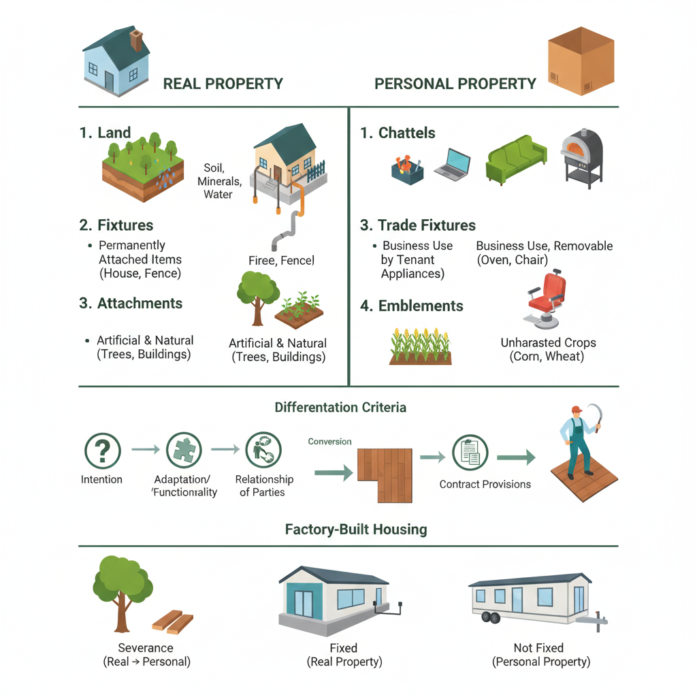

> - 房地产和动产的区别在于**是否与土地永久结合**
> - 房地产通常指与土地固定连接的财产
> - 而动产是可移动的财产

- 房地产 (`Real Property`)
  - 土地 (`Land`)：包括土地本身及其自然资源（如土壤、矿物、水源）。
  - 固定装置 (`Fixtures`)：指永久性附着在土地上的建筑或设备，如房屋、围栏、管道。
  - 附属物 (`Attachments`)：包括人工或自然附着物，如树木、建筑物等。

- 动产 (`Personal Property`)
  - 动产 (`Chattels`)：指可移动的物品，如家具、电器、工具等。
  - 商业固定装置 (`Trade Fixtures`)：指用于商业用途且临时附着于房地产的物品，例如餐馆的烤箱、理发店的椅子。这些通常在租约结束时由租户拆除带走。
  - 农作物 (`Emblements`)：指种植后尚未收获的农作物，尽管它们依附于土地，但被视为种植者的个人财产。

- 区分标准 (Differentiation Criteria)
  - 一个物品是房地产还是动产，取决于以下因素：
  - 所有者的意图 (`Intention`)：物品是否是永久性安装的？
  - 适应性 (`Adaptation`)：物品是否专门设计用于特定的房地产？
  - 功能性 (`Functionality`)：物品是否是房地产不可分割的一部分？
  - 当事人关系 (`Relationship of Parties`)：例如租户 vs. 业主，租户的设备可能被视为动产。
  - 合同条款 (`Contract Provisions`)：合同是否规定了物品的归属？

- 物品的转换 (Conversion)
  - 从房地产转换为动产：称为分离 (Severance)，如砍倒的树变成木材。
  - 从动产转换为房地产：称为固定 (Affixing)，如安装地板或嵌入式橱柜。

- 工厂制造住房 (Factory-Built Housing) - 移动房屋 & 预制房屋
  - 若永久固定在地面（如连接基础）：视为房地产。
  - 若未固定（如可以拖走）：视为动产。

---

##### ✅ 土地的经济特性 (Economic Characteristics of Land)

- 稀缺性 (`Scarcity`)：
  - 土地资源有限，使其价格受供需关系影响。
  - **🌟 考试示例**：
  - 在一线城市，为什么房价远高于乡村？ (正确答案涉及土地稀缺)
  - 纽约市中心的土地有限，所以价格远高于德州乡村地区。

- 改良性 (`Improvements`)：
  - 对土地的开发建设会影响其价值。
  - **🌟 考试示例**：
  - 下列哪种因素会提高房地产价值？ (答案可能包括“公共设施建设”)
  - 某城市建造新地铁站，附近房价随之上涨。

- 永续性 (`Permanence of Investment`)：
  - 房地产投资通常是长期的，资本难以快速回收。
  - **🌟 考试示例**：
  - 为什么房地产不像股票那样容易变现？ (答案涉及房地产的“固定投资”特性)
  - 购买房产通常需要多年才能获得增值回报，而股票可以随时卖出。

- 位置偏好 (`Situs`)：
  - 地理位置和周边环境对房地产价值的影响。
- **🌟 考试示例**：
  - 为何同一城市不同区域房价相差巨大？ (正确答案可能提及“位置偏好”)
  - 同样是100平方米的房子，洛杉矶市中心的价格可能是郊区的三倍。

---

##### ✅ 房地产所有权类型 (Forms of Real Estate Ownership)

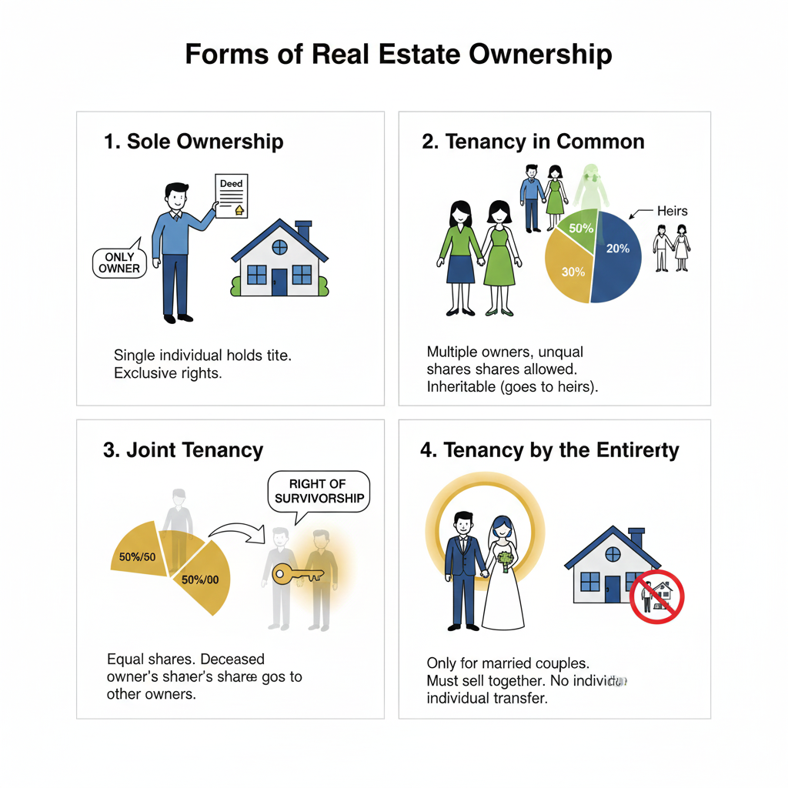

- 个人所有权 (`Sole Ownership`)：
  - 由单个个人持有产权。
  - **🌟 考试示例**：
  - 个人想购买一栋房屋，唯一所有权方式是哪种？ (答案是“Sole Ownership”)
  - 王先生单独买下一套房子，他是唯一的产权人。

- 整体租赁 (`Tenancy by the Entirety`)：
  - 仅适用于夫妻，双方共同持有，任何一方不得单独出售产权。
  - **🌟 考试示例**：
  - 夫妻共同买房，需共同出售的所有权类型是什么？ (答案是“Tenancy by the Entirety”)
  - 夫妻买房时，任何一方都不能单方面出售房产。

- 共同租赁 (`Tenancy in Common`)：
  - 多人共享产权，各自持有不同份额，`死亡后可继承`。
  - **🌟 考试示例**：
  - 如果合伙人之一去世，产权如何分配？ (答案是“传给继承人”)
  - 三人共同买房，各自持有不同比例，去世后权益传给家人。

- 联合租赁 (`Joint Tenancy`)：
  - 具有“生存者权利”，一方去世后产权`归其他合伙人所有`。
  - **🌟 考试示例**：
  - 两个兄弟共同买房，其中一人去世，谁继承产权？ (答案是“另一位合伙人”)
  - A和B共同持有房产，A去世后，产权自动归B所有。

---

##### ✅ 房地产市场特点 (Market Characteristics)

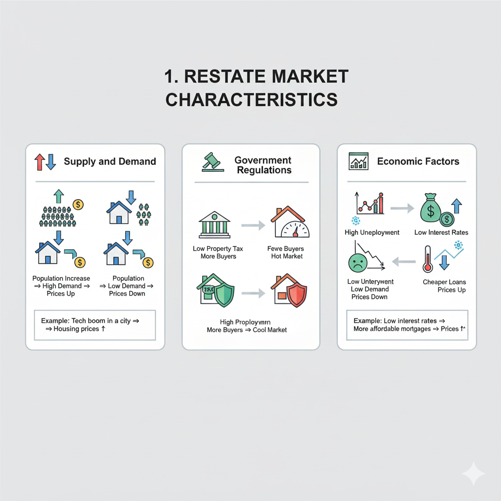

- 供需关系 (`Supply and Demand`)：
  - 需求大于供应时，价格上涨；供应过剩时，价格下降。
  - **🌟 考试示例**：
  - 城市人口增加，住房需求增加，房价上涨。
  - 城市人口减少，住房需求下降，房价可能下降。
  - 科技公司涌入某城市，住房需求激增，房价上涨。

- 政府法规 (`Government Regulations`)：
  - 政府政策 (如税收、贷款利率)对市场的影响。
  - **🌟 考试示例**：
  - 政府推出新政策，减少房产税，购房需求增加，市场热烈。
  - 政府提高房产税后，购房需求下降，市场冷却。

- 经济因素 (`Economic Factors`)：
  - 利率、失业率、通货膨胀等因素影响市场。
  - **🌟 考试示例**：
  - 失业率上升，购房需求下降，房价可能下降。
  - 利率降低后，购房贷款变便宜，房价上涨。

---

#### 📖 权利、权益与地产 (Rights, Interests & Estates)

整体总结

- 财产权利 (Bundle of Rights)：包括使用权、占有权、处置权和排他权等。

- 权益 (Interests)：财产权利的某些部分，可以由不同的个人或组织持有，如租赁权、地役权等。

- 地产类型 (Estates in Land)：
  - 自由地产 (Freehold Estates)
    - 绝对产权地产 (Fee Simple Estate)
    - 生命地产 (Life Estate)
  - 非自由地产 (Leasehold Estates)
    - 年期租赁 (Estate for Years)
    - 定期租赁 (Periodic Estate)
    - 意思自治租赁 (Estate at Will)
    - 非法占有租赁 (Estate at Sufferance)

---

##### ✅ 财产权利 (Bundle of Rights)

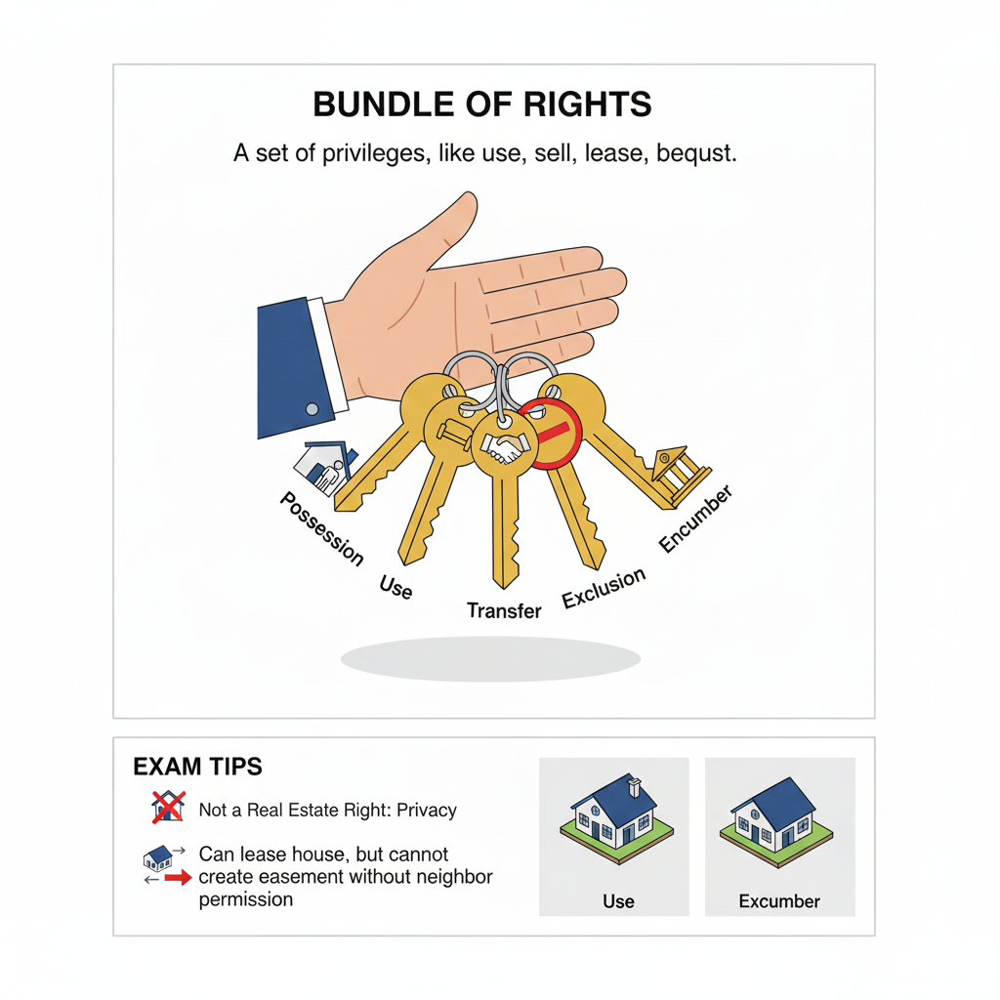

- 所有权包含一系列权利，如使用、出售、出租、遗赠等。
- **🌟 考试示例**：
  - 哪项不是房地产所有权的一部分？ (正确答案可能是“隐私权”)
  - 房主可以出租房屋，但不能私自增加地役权 (easement)而影响邻居的土地使用。

---

##### ✅ 权益 (Interests in Real Estate)

- 某人对房地产的一部分权利，而非完整所有权。
- **🌟 考试示例**：
  - 哪种权益允许他人在你的土地上使用一条通道？ (答案是“地役权 (Easement)”)
  - A拥有一块地，但B有通行权，可以合法使用A的车道。

---

##### ✅ 地产类型 (Estates in Land)

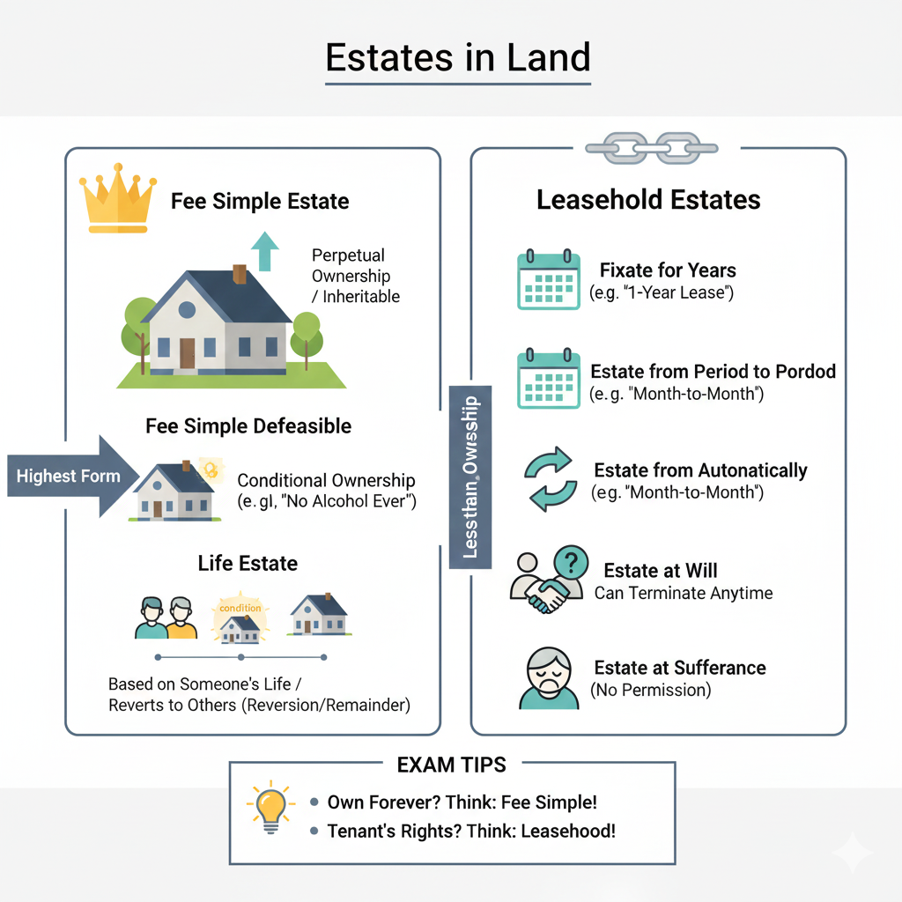

- 对土地的占有权利，包括自由地产和非自由地产。
- **🌟 考试示例**：
  - 哪种地产类型可永久拥有？ (答案是“自由地产”)
  - 买房者拥有房产的“费简单地产 (Fee Simple Estate)”，但租客仅持有“租赁地产 (Leasehold Estate)”。

- 自由地产 (Freehold Estates)

  - 绝对产权地产 (Fee Simple Estate)
    - 最完整的房地产所有权，可永久持有、出售或遗赠。
    - **🌟 考试示例**：
    - 哪种地产类型提供最完整的所有权？ (答案是“Fee Simple”)
    - 小李购买了一栋房子，拥有100%产权，可自由买卖或留给子孙。

  - 生命地产 (Life Estate)
    - 仅在特定人的生命期间拥有地产，生命终止后，地产归另一方所有。
    - **🌟 考试示例**：
    - 生命地产 (Life Estate)在持有者去世后发生什么？ (答案是“归还给指定继承人”)
    - 王奶奶拥有一套房子，只有在她生前拥有产权，她去世后，房子归她的孙子所有。

- 非自由地产 (Leasehold Estates)

  - 年期租赁 (Estate for Years)
    - 固定时间的租赁协议，`无需提前通知即可结束`。
    - **🌟 考试示例**：
      - 哪种租赁类型在合同期满时自动终止？ (答案是“Estate for Years”)
      - 李先生租了一间公寓，合同签了一年，到期后无需通知自动终止。

  - 定期租赁 (Periodic Estate)
    - 自动续期的租赁协议，需`提前通知终止`。
    - **🌟 考试示例**：
      - 哪种租赁类型每月自动续期？ (答案是“Periodic Estate”)
      - 张女士租房，每月缴租，租约无固定到期日，房东需提前通知才能终止合同。

  - 意思自治租赁 (Estate at Will)
    - 没有固定期限的租赁，双方`可随时终止`。
    - **🌟 考试示例**：
      - 哪种租赁类型可随时终止？ (答案是“Estate at Will”)
      - 李先生与房东口头协议租住公寓，未签合同，双方都能随时终止租约。

  - 非法占有租赁 (Estate at Sufferance)
    - 租客合同到期后仍占据房屋，房东`未同意`续租。
    - **🌟 考试示例**：
      - 租约到期后租客拒绝搬出，这属于哪种租赁类型？ (答案是“Estate at Sufferance”)
      - 王先生租房合同到期，但不愿搬走，房东只能通过法律手段驱逐。

---

#### 📖 房地产所有权 (Ownership in Real Estate)

整体总结

- 所有权概念 (Concept of Ownership)：拥有房地产意味着享有 产权束 (Bundle of Rights)。

- 产权类型 (Types of Ownership)：

  - 独立产权 (Sole Ownership) 适用于个人，共有产权 (Co-Ownership) 适用于多人。

  - 共有产权 (Co-Ownership)：两人或以上共享同一财产，分为：
    - 共同租赁 (Tenancy in Common)：产权可继承，各自持份。
    - 联合租赁 (Joint Tenancy)：具有 生存者权利，产权不可继承。
    - 整体租赁 (Tenancy by the Entirety)：专为夫妻设计，需双方同意出售。

  - 特殊所有权 (Special Forms of Ownership)：如
    - 信托 (Trusts)：受托人管理资产，常用于遗产规划。
    - 共有公寓 (Condominium)：个人拥有单元产权，共享公共设施。
    - 合作公寓 (Cooperative)：持有股份而非房地产本身。

---

##### ✅ 所有权概念 (Concept of Ownership)

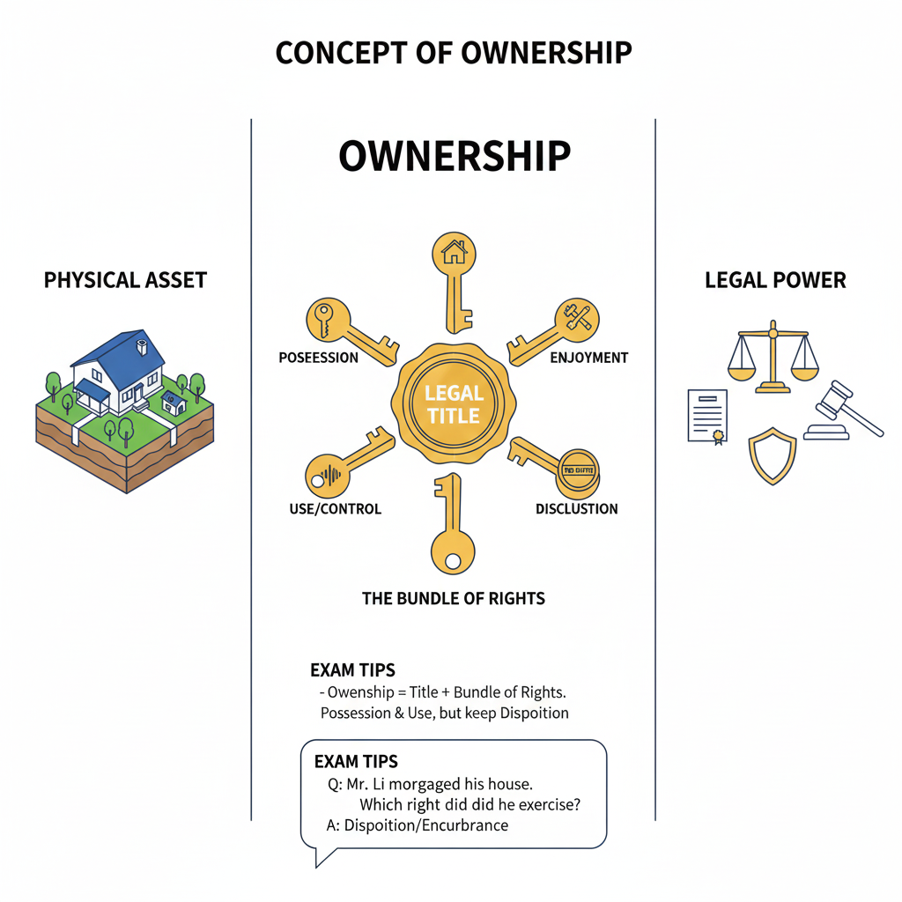

- 拥有房地产意味着拥有 使用、占有、转让、出租 等一系列权利 (产权束，Bundle of Rights)。
- **🌟 考试示例**：
  - 所有权的主要特征是什么？ (正确答案涉及“产权束”)
  - 李先生购买了一栋房子，他可以出租、出售或作为抵押贷款。

---

##### ✅ 产权类型 (Types of Ownership)

- 房地产所有权可以是个人持有，也可以是多方共有。
  - **🌟 考试示例**：
    - 哪种所有权类型适用于单独产权人？ (答案是“独立产权”)
    - 张女士独自购房，只有她拥有产权，无其他共有人。

- 共有产权 (Co-Ownership)

  - 共同租赁 (Tenancy in Common)
    - 多个产权人各自拥有 可继承 的份额，持份人可以自由出售自己的部分。
    - **🌟 考试示例**：
      - 如果共有人之一去世，他的份额会归谁？ (答案是“继承人”)
      - A和B共同买房，A去世后，A的子女继承A的份额，而B的份额不变。

  - 联合租赁 (Joint Tenancy)
    - 具有 生存者权利 (Right of Survivorship)，如果一名共有人去世，产权自动归剩余共有人。
    - **🌟 考试示例**：
      - 哪种共有产权类型具有生存者权利？ (答案是“Joint Tenancy”)
      - A和B是联合租赁人，A去世后，B自动获得全部产权，而A的继承人无权继承。

  - 整体租赁 (Tenancy by the Entirety) (适用于已婚夫妻)
    - 夫妻共同拥有，任何一方未经配偶同意不得出售或转让产权。
    - **🌟 考试示例**：
      - 哪种共有产权形式适用于已婚夫妻？ (答案是“Tenancy by the Entirety”)
      - 王先生和李女士作为夫妻买房，王先生不能单方面出售房产。

- 特殊所有权 (Special Forms of Ownership)

  - 信托 (Trusts)
    - 信托公司或受托人代持房地产，通常用于 资产保护、遗产规划。
    - **🌟 考试示例**：
      - 哪种所有权形式涉及受托人管理房地产？ (答案是“Trust”)
      - 王先生设立房地产信托，以确保他去世后房产由子女继承。

  - 共有公寓 (Condominium)
    - 个人拥有公寓单元产权，但共享 公共区域 (如电梯、游泳池)。
    - **🌟 考试示例**：
      - 购买公寓后，产权人对哪些部分拥有独立产权？ (答案是“公寓单元”)
      - 李先生买了一套公寓，拥有房间产权，但电梯和走廊归全体业主共有。

  - 合作公寓 (Cooperative)
    - 业主不是直接拥有房地产，而是持有 股份 (Shares)，并获得住房使用权。
    - **🌟 考试示例**：
      - 在合作公寓中，业主持有什么？ (答案是“股份”)
      - A购买了一家合作公寓的股份，而不是直接拥有房产。

---

#### 📖 产权负担与留置权 (Encumbrances & Liens)

整体总结

- 产权负担 (`Encumbrances`)：对房地产施加的限制，可能影响其使用或转让。

- 地役权 (`Easements`)：允许他人合法使用你的土地，如公共通行权。

- 私设限制 (`Deed Restrictions`)：由开发商或社区规定的限制，如房屋颜色或建筑风格。

- 政府限制 (`Government Restrictions`)：如土地用途管制 (Zoning)、征用权 (Eminent Domain)。

- 留置权 (`Liens`)：债权人对财产提出的法律索赔，分为自愿留置权和非自愿留置权。

---

##### ✅ 产权负担 (Encumbrances)

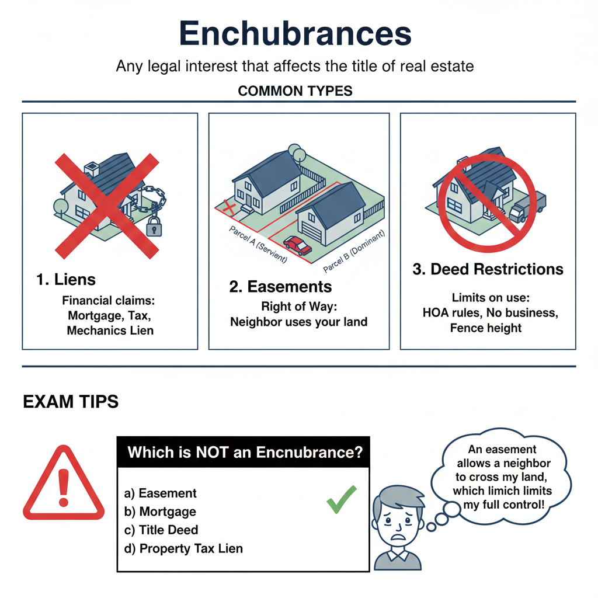

- 任何影响房地产产权的法律权益，如留置权、地役权、使用限制等。
- **🌟 考试示例**：
  - 哪项不属于产权负担？ (正确答案可能是“产权证 (Title Deed)”)
  - 房主发现其房产上有一条地役权，允许邻居通行，这限制了他完全控制该土地。

---

##### ✅ 地役权 (Easements)

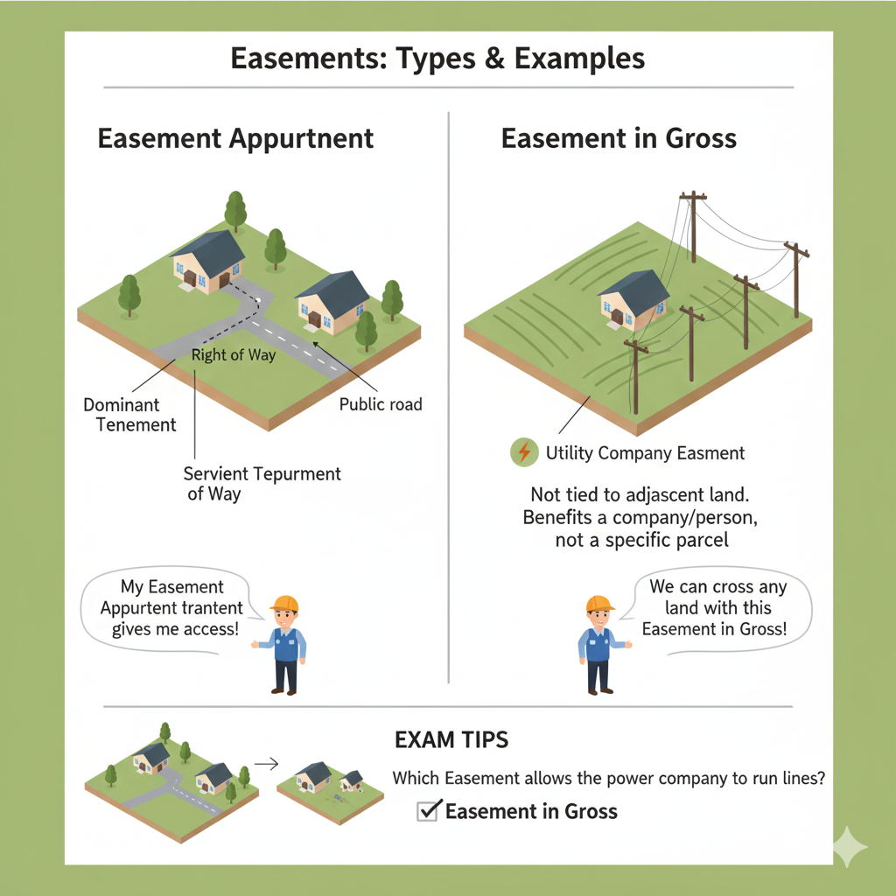

- 给予他人或政府合法使用他人土地的权利，常见于通行权和公用设施。
类型：
  - 地役权附属 (`Easement Appurtenant`)：为邻近土地提供权益，例如后方土地没有公路，前方土地必须提供通道。
  - 地役权个人 (`Easement in Gross`)：如电力公司铺设电线的权利，与特定土地无关。

- **🌟 考试示例**：
  - 哪种地役权允许电力公司在私人土地上架设电线？ (答案是“Easement in Gross”)
  - A的土地被B的房子包围，A获得地役权附属 (Easement Appurtenant)，允许其通过B的土地到达公路。

---

##### ✅ 私设限制 (Deed Restrictions)

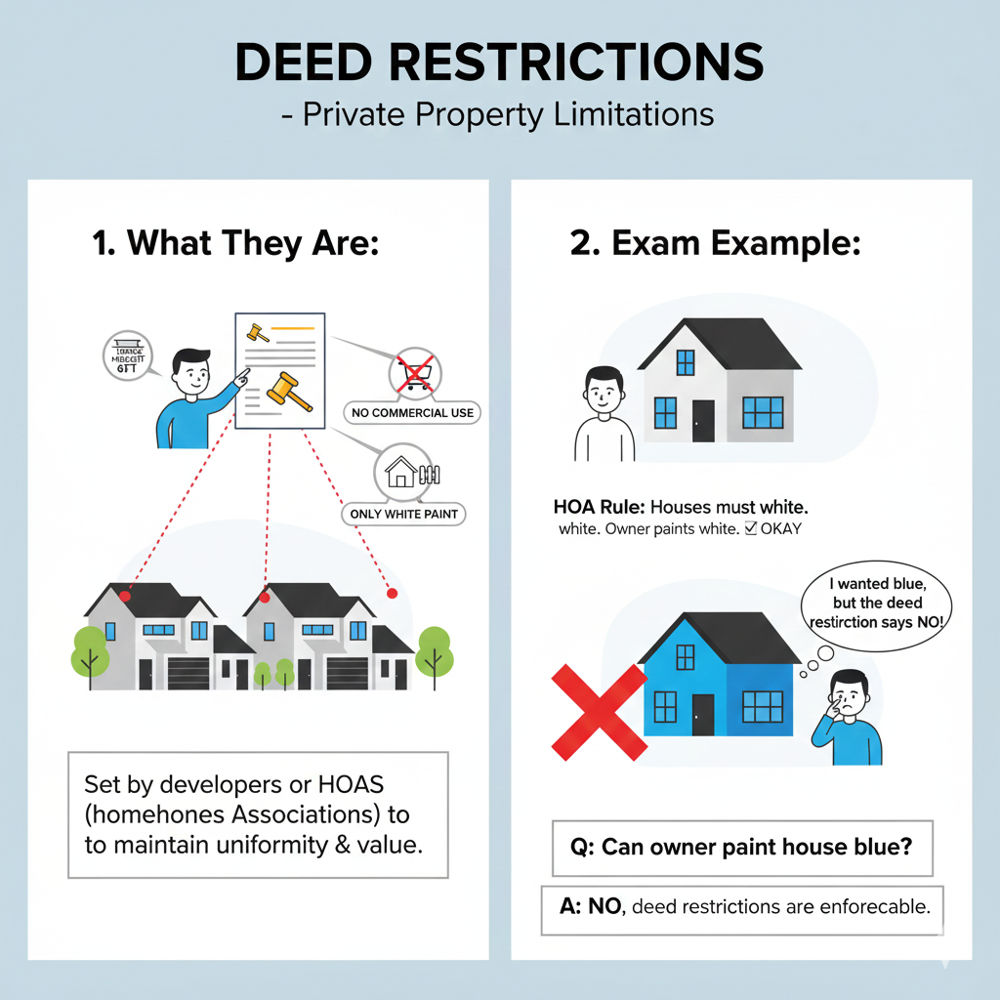

- 由开发商或社区设定的物业限制，例如禁止商业用途或限制建筑风格。
- **🌟 考试示例**：
  - 如果社区规定房屋只能刷白色，房主能否刷蓝色？ (答案是“不能，因私设限制”)
  - 小王买房后发现小区规定所有围栏必须是白色，因此不能换成黑色。

---

##### ✅ 政府限制 (Government Restrictions)

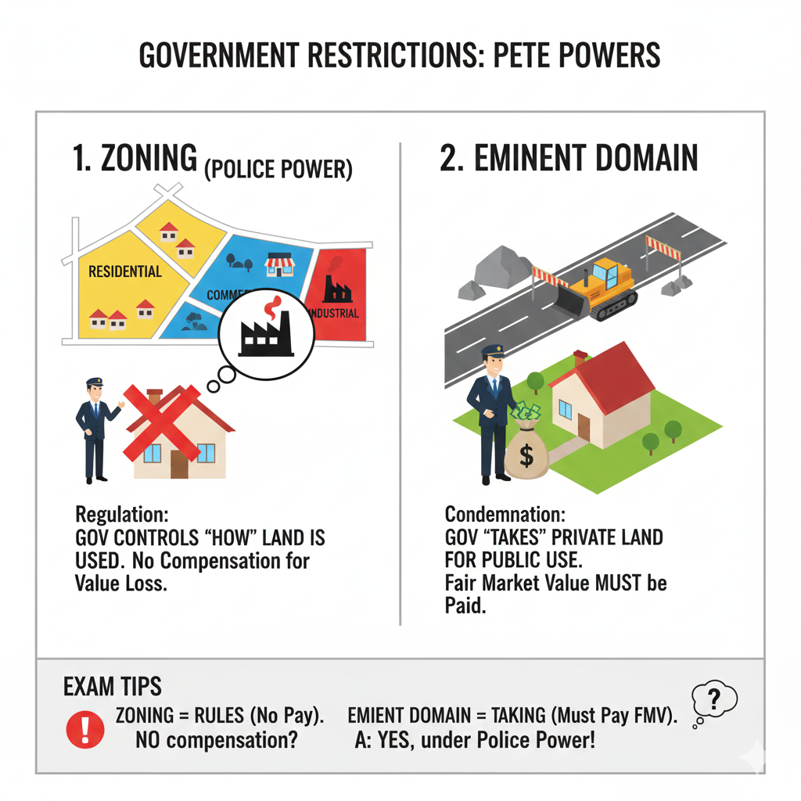

- 土地用途管制 (`Zoning`)：
  - 政府划分不同地区用于住宅、商业或工业用途。
  - **🌟 考试示例**：
    - 住宅区内是否可以开设工厂？ (答案是“不能，因土地用途管制”)
    - A想在住宅区开餐馆，但因土地用途管制受阻，需申请变更。

- 征用权 (`Eminent Domain`)：
  - 政府可强制征收私人土地用于公共用途，需公平补偿。
  - **🌟 考试示例**：
    - 政府如何合法征用私人土地？ (答案是“Eminent Domain，并提供补偿”)
    - 政府修建高速公路，要求B搬迁，并提供市场价格补偿。

---

##### ✅ 留置权 (Liens)

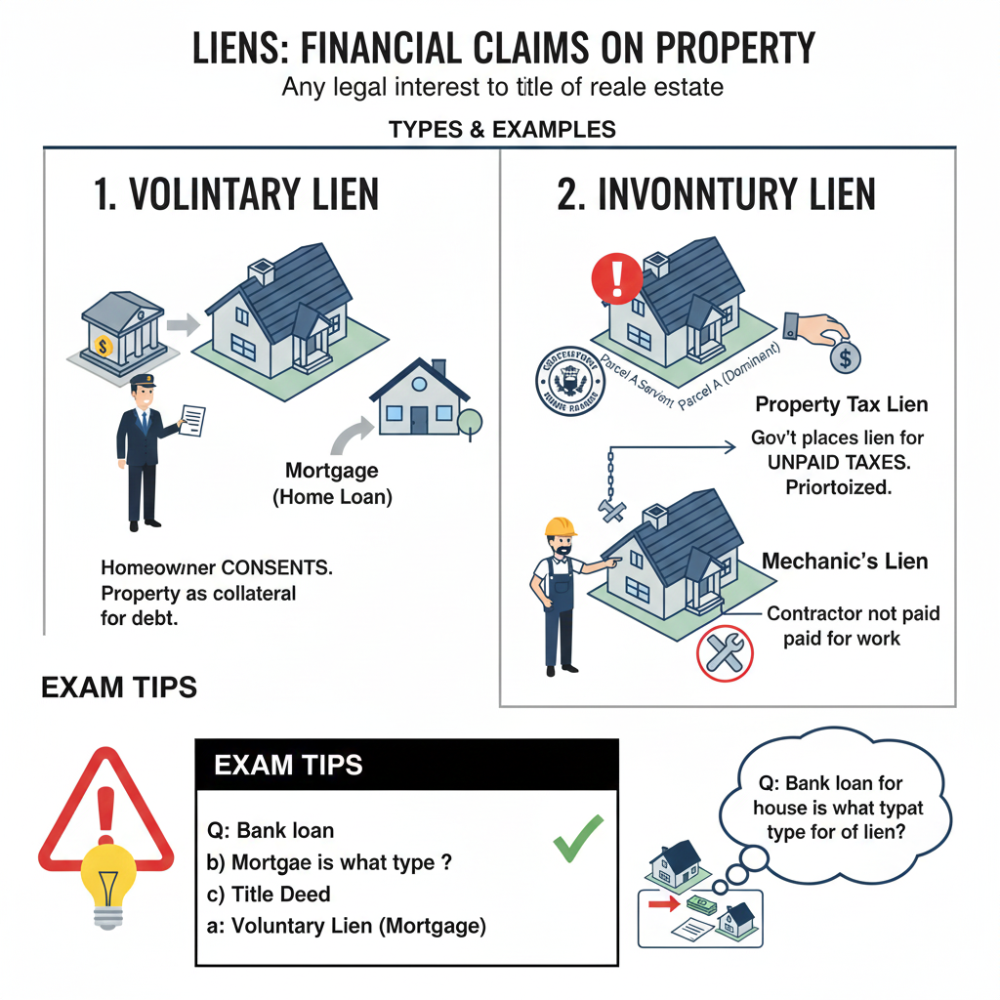

- 债权人对财产提出的法律索赔，若债务未偿还，财产可能被出售以偿还债务。
- 类型：
  - 自愿留置权 (`Voluntary Lien`)：如房屋抵押贷款 (Mortgage)。
  - 非自愿留置权 (`Involuntary Lien`)：如
    - 税务留置权 (Tax Lien): 房主欠税未缴会导致政府强制留置。

- **🌟 考试示例**：
  - 银行贷款的抵押属于哪种留置权？ (答案是“Voluntary Lien”)
  - 李先生按揭买房，但未能按时还贷，银行对其房产设立抵押权，可能最终拍卖房屋清偿贷款。

---

#### 📖 产权转让与记录 (Transferring & Recording Title)

整体总结

- 产权证书 (Title)：定义产权持有人在法律上的所有权。证明房地产所有权，并需正式登记。

- 产权转让 (Conveyance of Title)：
  - 通过不同方式转移房地产产权，
  - 如 契约 (Deeds)、遗嘱 (Wills)、继承法 (Descent)。
    - 一般保证契约 (General Warranty Deed)：提供全面产权保障。
    - 特殊保证契约 (Special Warranty Deed)：仅保证当前卖方的持有期间。

- 产权记录 (Recording Title)：产权交易需在官方登记，以确保法律效力。

- 产权瑕疵 (Title Defects)：产权可能受到未付税款、伪造文件等问题影响。

- 产权保险 (Title Insurance)：为买方和贷款机构提供保障，确保产权无争议。

---

##### ✅ 产权证书 (Title)

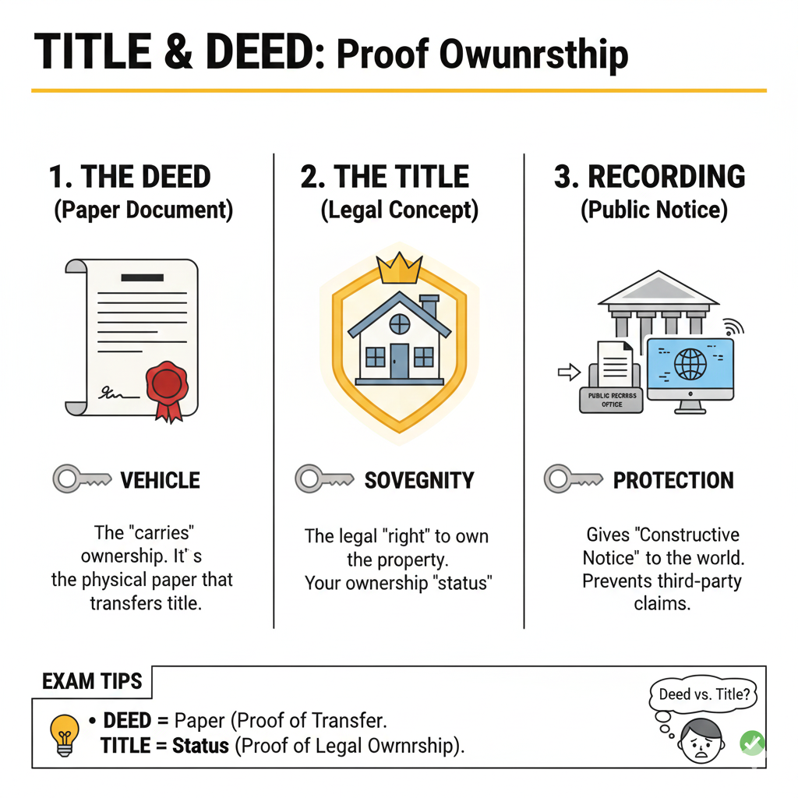

- 产权证书是房地产所有权的法律证明，并记录在官方登记处。
- **🌟 考试示例**：
  - 产权证书 (Title)证明了什么？ (正确答案：证明房地产的法律所有权)
  - 王先生购买了一套房子，只有在产权登记后，他才能成为法律上的正式业主。

---

##### ✅ 产权转让方式 (Methods of Transferring Title)

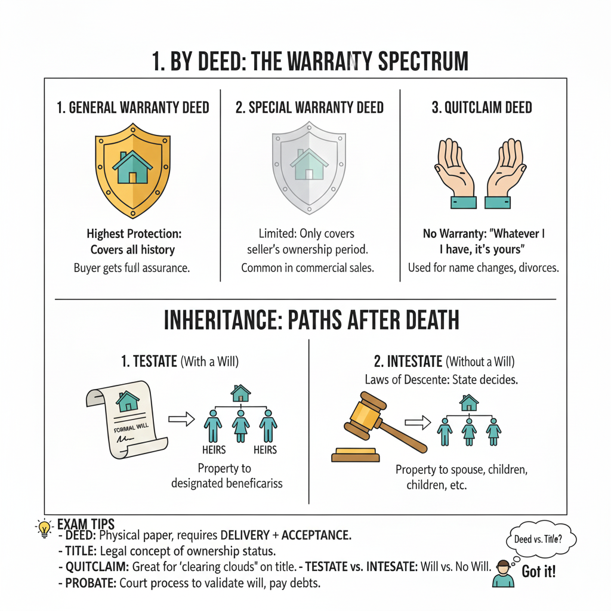

- 契约 (`Deeds`)
  - 契约是转移房地产产权的法律文件，必须由产权人签署并交付给受让人。
  - 主要类型：
    - 一般保证契约 (`General Warranty Deed`)：提供最高级别的产权保障，保证无产权瑕疵。
    - 特殊保证契约 (`Special Warranty Deed`)：仅保证卖方在其持有期间无产权问题。
    - 无保证契约 (`Quitclaim Deed`)：无任何产权担保，常用于家庭成员之间转让财产。
  - **🌟 考试示例**：
    - 哪种契约提供最全面的产权保障？ (答案是“General Warranty Deed”)
    - 小李购买了一套房子，卖方提供了一份一般保证契约，保证房屋产权无历史纠纷。

- 遗嘱 (`Wills`)
  - 产权持有人去世后，可以通过遗嘱指定继承人。
  - 遗嘱类型：
    - 正式遗嘱 (`Formal Will`)：书面文件，经公证或见证。
    - 口头遗嘱 (`Nuncupative Will`)：口头声明，但多数州不认可。
    - 手写遗嘱 (`Holographic Will`)：房主亲笔书写遗嘱，需符合法律要求。
  - **🌟 考试示例**：
    - 哪种遗嘱最有法律效力？ (答案是“Formal Will”)
    - 王先生去世后，他的正式遗嘱明确规定房产由他的儿子继承。

- 继承法 (`Descent and Distribution`)
  - 若无遗嘱，法律会根据 无遗嘱继承法 (Intestate Succession Laws) 分配财产。
  - **🌟 考试示例**：
    - 无遗嘱的财产如何分配？ (答案：根据无遗嘱继承法)
    - 李先生去世，没有遗嘱，法院按照州法律将房产分配给他的妻子和孩子。

---

##### ✅ 产权记录 (Recording Title)

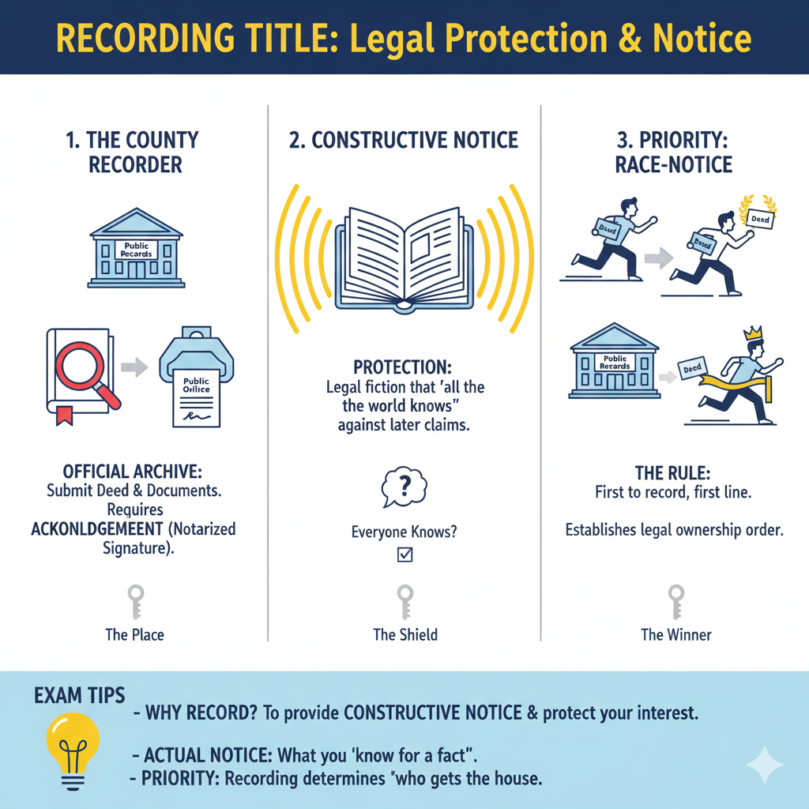

- 房地产交易完成后，产权文件需提交到县记录处 (County Recorder's Office)进行登记，以确保法律保护。
- **🌟 考试示例**：
  - 产权转让后，为何需要登记？ (答案：确保产权具有法律效力，防止纠纷)
  - 张先生购房后，律师建议他立即登记产权，以防未来产生所有权争议。

---

##### ✅ 产权瑕疵 (Title Defects)

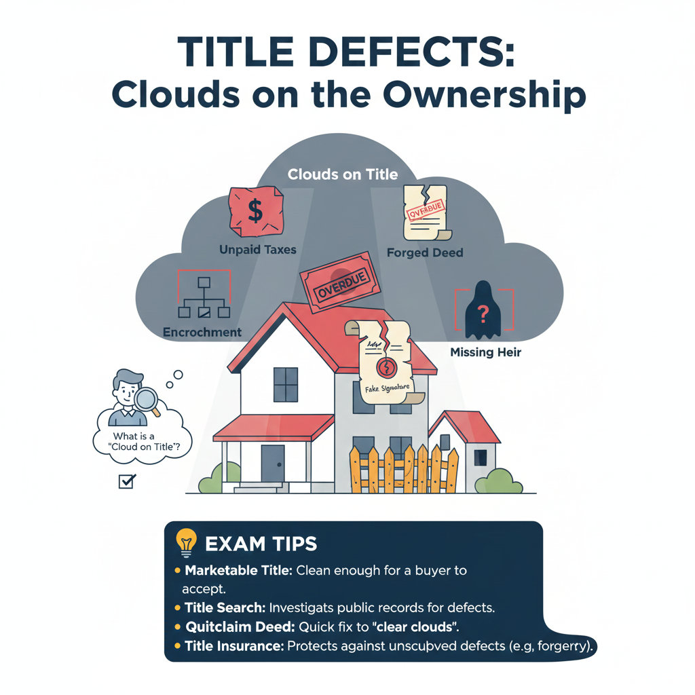

- 影响产权完整性的法律或财务问题，如未付税款、伪造契约、不合法的继承。
- **🌟 考试示例**：
  - 产权调查发现有未付的房产税，这会导致什么？ (答案：产权瑕疵，需支付税款才能清除负担)
  - 李先生购买了一套房，但后来发现原房主欠政府房产税，导致无法顺利过户。

---

##### ✅ 产权保险 (Title Insurance)

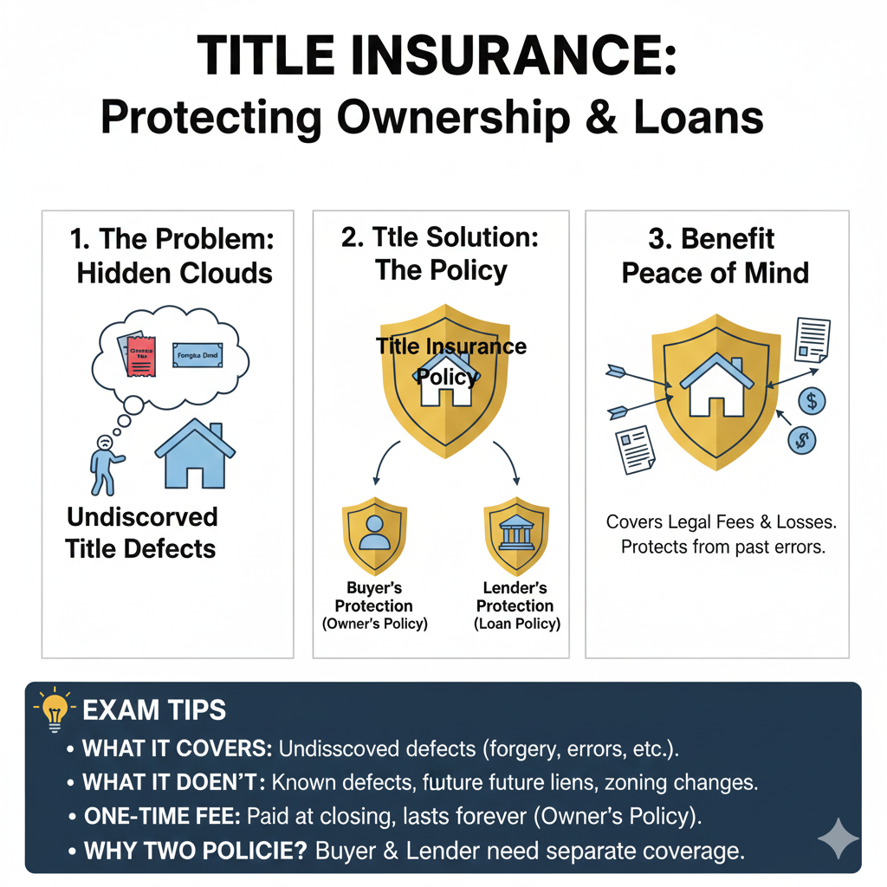

- 为买方和贷款机构提供产权保障，以防止产权纠纷和未发现的产权问题。
- **🌟 考试示例**：
  - 产权保险的主要作用是什么？ (答案：保护买方免受产权争议的损失)
  - 王女士购买了一套房，产权保险公司保证如果未来发现产权问题，保险公司会承担损失。

---

#### 📖 租赁 (Leases)

整体总结

- 租赁概念 (Definition of Lease)：
  - 租赁是一种合约，赋予租客对房产的 占有权 (Possession)，但不赋予 所有权 (Ownership)。
  - 租赁=占有权 (Possession)，但不等于所有权 (Ownership)。

- 租赁条款 (Lease Terms)：包括 租金 (Rent)、租期 (Term)、保证金 (Security Deposit) 以及 租约终止条件 (Termination Clause)。

- 租赁类型 (Types of Leases)：
  - 年期租赁 (Estate for Years)：固定租期，到期自动终止。
  - 定期租赁 (Periodic Tenancy)：租约按月/年自动续约，需通知终止。
  - 意思自治租赁 (Tenancy at Will)：无固定期限，双方可随时终止。
  - 非法占有租赁 (Tenancy at Sufferance)：租客逾期未搬出，房东未采取法律行动。

- 租金结构 (Types of Rent Agreements)：
  - 固定租金租赁 (Gross Lease)
  - 净租金租赁 (Net Lease)
  - 百分比租赁 (Percentage Lease)
  - 可变租金租赁 (Variable Lease)

- 租赁终止方式 (Termination of Lease)：包括
  - 合同到期
  - 提前终止
  - 驱逐 (Eviction)
  - 政府征用 (Eminent Domain)。

---

##### ✅ 租赁概念 (Definition of Lease)

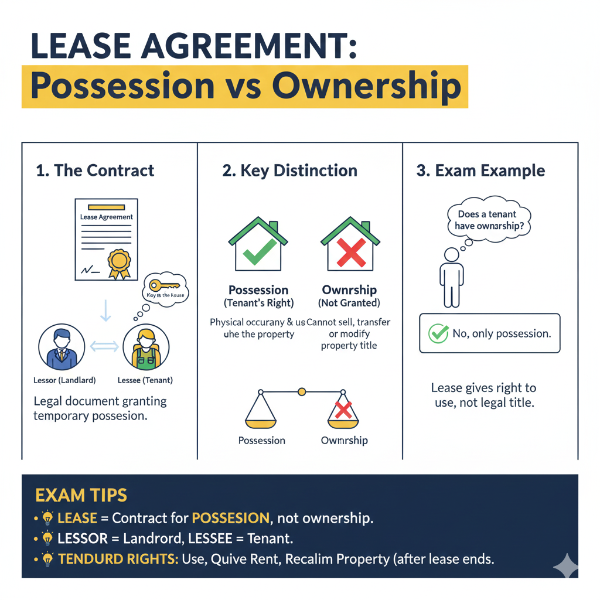

- 租赁是房东 (`Lessor`)与租客 (`Lessee`)之间的合约，租客获得房产 占有权，但不享有 所有权。
- **🌟 考试示例**：
  - 租赁合约中，租客是否拥有所有权？ (正确答案：没有，租客仅有占有权)
  - 李先生签订了一份一年租赁合同，他可以使用该公寓，但不能出售或转让该物业。

---

##### ✅ 租赁条款 (Lease Terms)

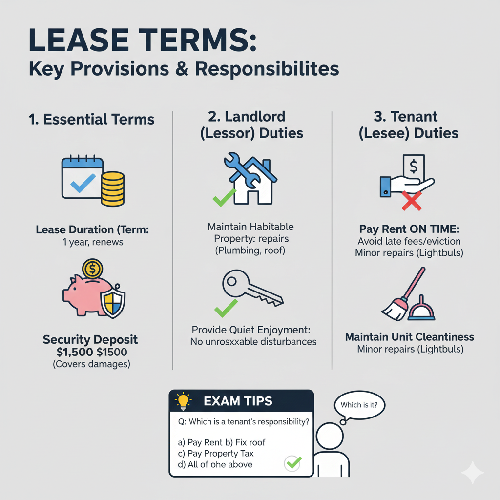

- 租赁合同规定租期、租金、押金、维修责任等条款。
- **🌟 考试示例**：
  - 租赁合同中，哪项通常属于租客的责任？ (正确答案：支付租金)
  - 租客张女士每月支付$1,500租金，并需维护室内设施的整洁。

---

##### ✅ 租赁类型 (Types of Leases)

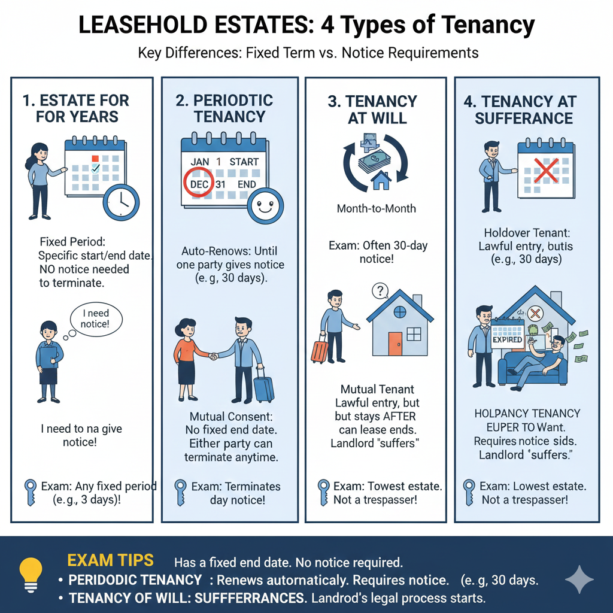

- 年期租赁 (Estate for Years)
  - 租赁期限固定，合同`到期自动终止，无需提前通知`。
  - **🌟 考试示例**：
    - 哪种租赁类型在租期结束时无需提前通知即可终止？ (答案：Estate for Years)
    - 王先生与房东签订了一份12个月的租赁合同，到期后合同自动终止。

- 定期租赁 (Periodic Tenancy)
  - 没有固定到期日，租期按 月、季或年 `自动续约，需提前通知终止`。
  - **🌟 考试示例**：
    - 如果租赁每月自动续约，租客和房东需提前多久通知终止？ (答案：通常是30天)
    - 张先生租住的公寓是按月续租的，他需提前30天通知房东才能结束租约。

- 意思自治租赁 (Tenancy at Will)
  - 租客和房东`可随时终止租约，无固定租期`。
  - **🌟 考试示例**：
    - 哪种租赁类型可随时终止？ (答案：Tenancy at Will)
    - 李先生与房东口头协议租房，未签订正式合同，双方可随时终止租约。

- 非法占有租赁 (Tenancy at Sufferance)
  - 租客 合同到期后 仍 未搬出，但房东尚未采取法律行动驱逐。
  - **🌟 考试示例**：
    - 租客拒绝搬离但房东未驱逐，这种情况属于哪种租赁？ (答案：Tenancy at Sufferance)
    - 王女士的租约到期后，她继续住在房子里，但未支付租金，房东开始法律程序驱逐她。

---

##### ✅ 租金结构 (Types of Rent Agreements)

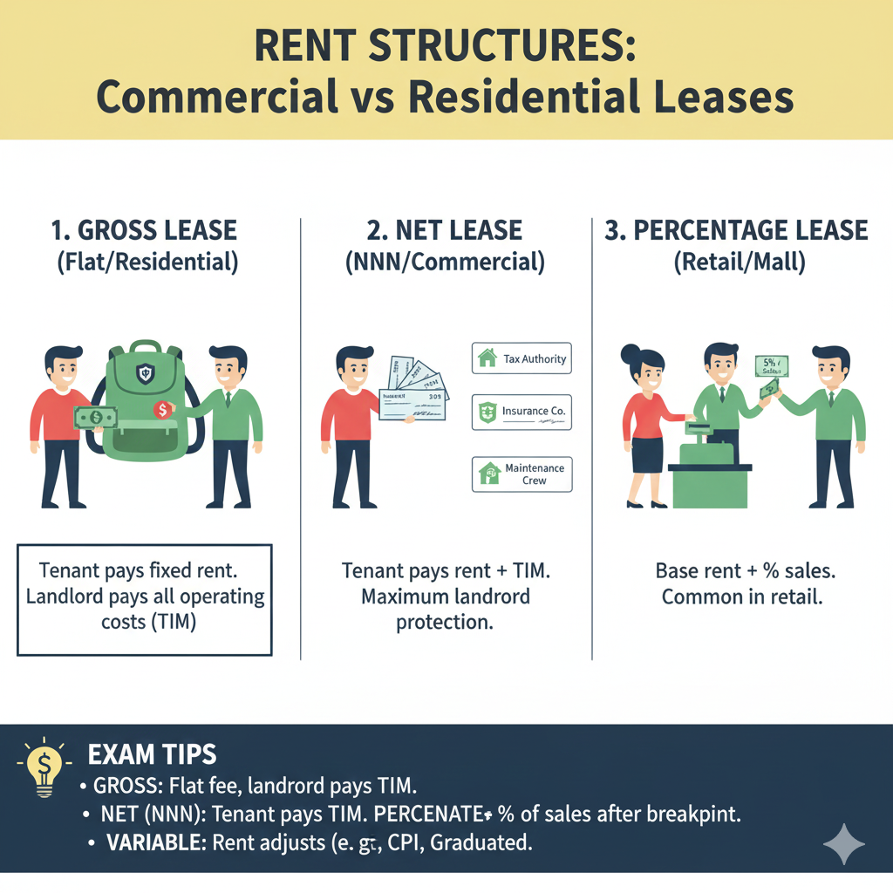

- 固定租金租赁 (`Gross Lease`)
  - 租客支付固定租金，房东承担物业税、保险和维护费用。
  - 甲公司租下办公楼，每月支付$5,000租金，房东负责物业管理费。

- 净租金租赁 (`Net Lease`)
  - 租客除租金外，还需支付 物业税、保险、维护费。
  - 乙公司租赁商业地产，每月租金$4,000，但还需支付物业税和保险费。

- 百分比租赁 (`Percentage Lease`)
  - 租客支付 基础租金+销售额的一定比例，常用于商业租赁。
  - 商场租赁中，某服装店支付基本租金$3,000外，还需支付销售额的5%。

- 可变租金租赁 (`Variable Lease`)
  - 租金随时间调整，如 按通货膨胀或市场情况调整。
  - 李先生签订的租赁合同规定每年租金增长2%。

---

##### ✅ 租赁终止方式 (Termination of Lease)

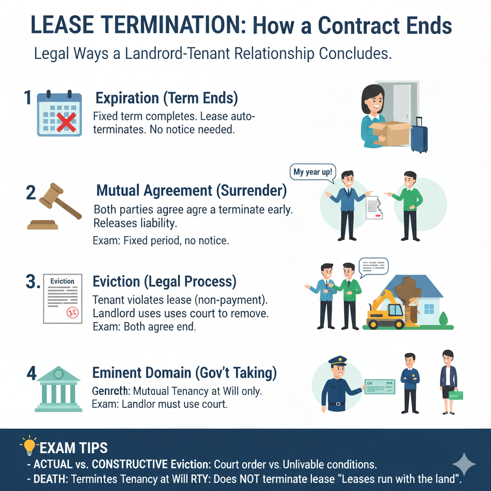

- 合同到期 (`Expiration`)
  - 租赁期限到期，租约自动终止。
  - 张女士的1年租赁合同到期，她决定不续租，合同自动终止。

- 提前终止 (`Mutual Agreement or Breach`)
  - 双方协商终止，或一方违约导致合同终止。
  - 租客未支付租金，房东提前终止租约。

- 驱逐 (`Eviction`)
  - 租客违反租赁条款，房东通过法律手段驱逐租客。
  - 李先生连续3个月未交租金，房东申请法院强制驱逐。

- 政府征用 (`Eminent Domain`)
  - 政府征用土地，租赁合同自动终止，房东和租客获得补偿。
  - 政府计划修建公路，李先生的租赁房产被征收，合同终止。

---

#### 📖 土地使用与管制 (Land Use Control and Regulation)

整体总结

- 土地使用受到公共 (政府)和私人限制 (HOA、契约)，影响开发与交易。

- 土地使用管制的类型 (Types of Land Use Control)：
  - 公共管制 (Public Land Use Control)：由政府实施的法律和法规，如分区法规、建筑规范、环境法规等。
  - 私人限制 (Private Land Use Control)：如房产契约限制 (Deed Restrictions)、业主协会 (HOA)规定等。

- 政府的**土地使用权力 (Government Rights in Land)**：
  - 征用权 (Eminent Domain)：政府可强制征收私人土地用于公共用途，但必须提供补偿。
  - 警察权 (Police Power)：政府可通过法律限制土地用途，如分区法规和建筑规范。
  - 税收权 (Taxation)：政府可对房产征税，业主若不缴税可能会失去财产。

- 土地使用规划 (Zoning and Land Use Planning)：
  - 住宅区 (Residential)、商业区 (Commercial)、工业区 (Industrial) 的划分。
  - 特殊用途分区 (Special Zoning Types)，如历史保护区、农业区等。

- 环境法规 (Environmental Regulations)：联邦和州法规如何影响房地产开发，如污染控制、湿地保护。

---

##### ✅ 土地使用管制的类型 (Types of Land Use Control)

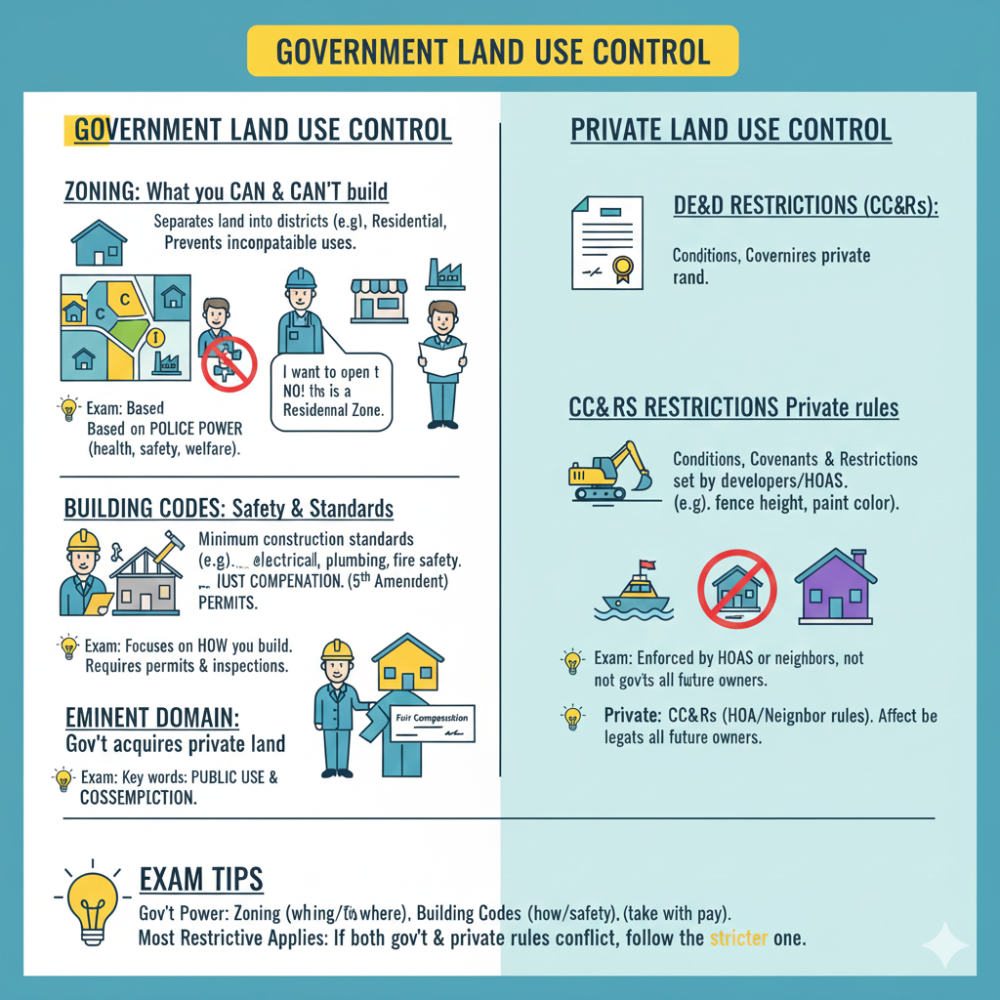

- 政府和私人机构对土地用途的监管。
- **🌟 考试示例**：
  - 房主是否可以随意改变房屋用途？ (正确答案涉及 政府和私人限制)
  - 张先生想把住宅改成餐馆，但由于分区法规规定该地区仅限住宅用途，他无法这样做。

---

##### ✅ 政府的土地使用权力 (Government Rights in Land)

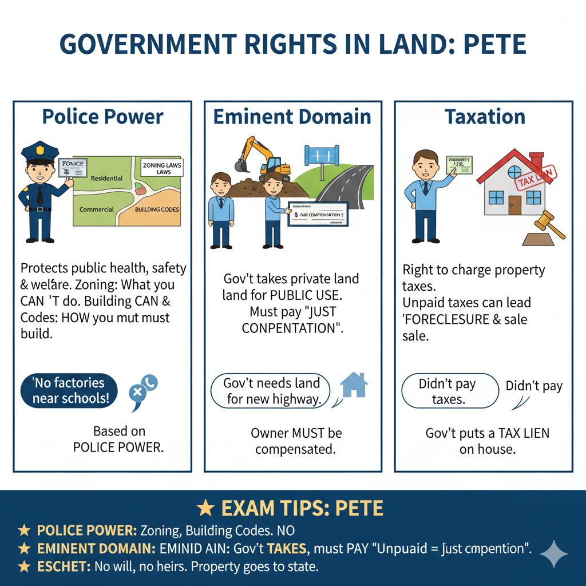

- 征用权 (`Eminent Domain`)：不动产征收权
  - 政府可强制征用私人土地用于公共项目 (如公路建设)，但必须提供公平补偿。
  - **🌟 考试示例**：
    - 政府征收土地用于修建地铁，业主是否可以拒绝？ (答案：不能，政府有征用权，但必须补偿)
    - 李先生的房产被政府征收，用于修建新高速公路，他获得市场价格补偿。

- 警察权 (`Police Power`)：
  - 政府通过分区法规、建筑规范等方式管理土地用途。
  - **🌟 考试示例**：
    - 哪种政府权力允许市政府禁止在住宅区建工厂？ (答案是“Police Power”)
    - 某市政府禁止在学校附近建娱乐场所，以维护社区安全。

- 税收权 (`Taxation`)：
  - 政府可对房产征税，不缴税的业主可能失去财产。
  - **🌟 考试示例**：
  - 如果业主不缴房产税，政府会采取什么措施？ (答案：可能拍卖房产偿还税款)
  - 王先生因未缴房产税，政府对其房屋设立 税务留置权 (Tax Lien)，最终拍卖偿还税款。

---

##### ✅ 土地使用规划 (Zoning and Land Use Planning)

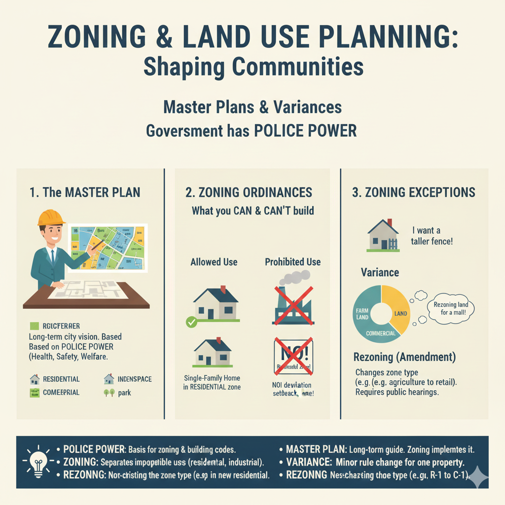

- 分区法规规定土地的用途，如 住宅、商业、工业，并对建筑高度、密度等进行限制。
- **🌟 考试示例**：
  - 某开发商想在住宅区建购物中心，他需要申请哪种变更？ (答案是“分区变更 (Zoning Change)”)
  - A公司希望在一片农田上建办公大楼，需要申请 土地用途变更 (Rezoning)。

---

##### ✅ 特殊用途分区 (Special Zoning Types)

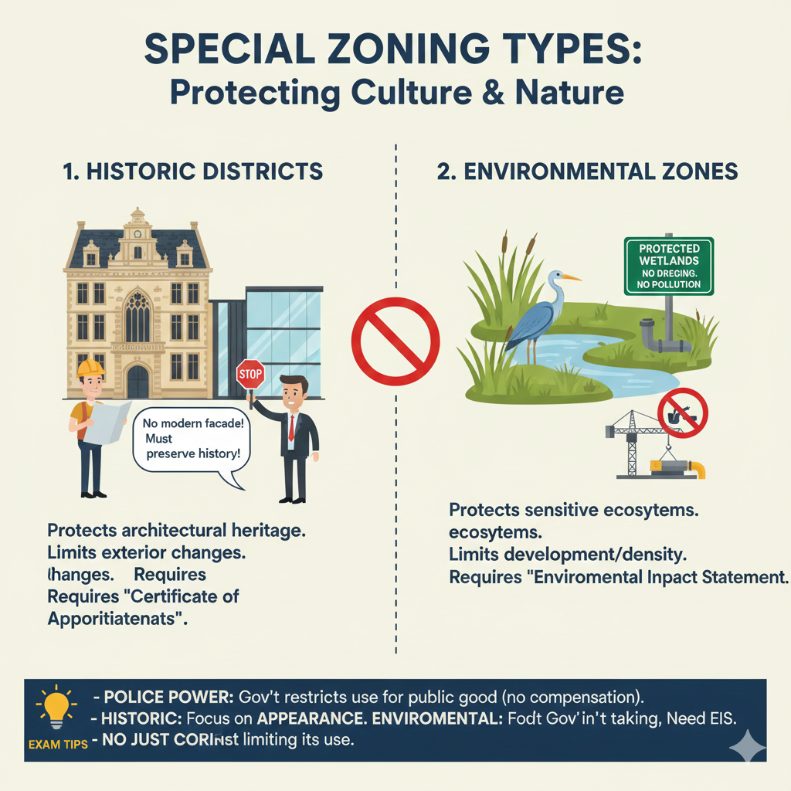

- 历史保护区 (`Historic Districts`)：受法律保护，禁止拆除或大幅改建历史建筑。
- 环境敏感区 (`Environmental Zones`)：如湿地、森林等，受到严格保护。
- **🌟 考试示例**：
  - 哪种分区法规适用于保护古建筑？ (答案是“Historic District Zoning”)
  - 老城区的历史建筑不能随意拆除或改建，以保护其文化价值。

---

##### ✅ 环境法规 (Environmental Regulations)


- 政府通过法律控制土地开发，以防止污染、保护自然资源。
- 常见法规：
  - 清洁水法 (`Clean Water Act`)：限制污水排放，保护水资源。
  - 清洁空气法 (`Clean Air Act`)：控制空气污染，影响工业和商业建筑项目。
- **🌟 考试示例**：
  - 某开发商想填埋湿地建房，他可能违反哪项法规？ (答案是“Clean Water Act”)
  - 某建筑商未遵守环保法规，违规排放有害物质，导致罚款和项目暂停。

---

#### 📖 法律描述 (Legal Descriptions)

整体总结

- 法律描述的目的：确保房地产边界清晰，防止产权纠纷。

- 法律描述的方法：
  - 测量标记与界限法 (Metes and Bounds) 使用 地标、方向、距离 来描述边界。
  - 政府测量法 (Rectangular Survey System) 使用 经纬度网格 划分土地，如 镇区 (Township)和区段 (Section)。
  - 区划法 (Lot and Block System) 适用于城市房地产，标明 地块 (Lots)和街区 (Blocks)。
  - 地籍图 (Plat Map) 详细显示房地产划分，用于产权登记和交易。

- 数据来源：由测量师、政府机构和产权公司提供的正式记录。

---

#### ✅ 法律描述的目的 (Purpose of Legal Descriptions)

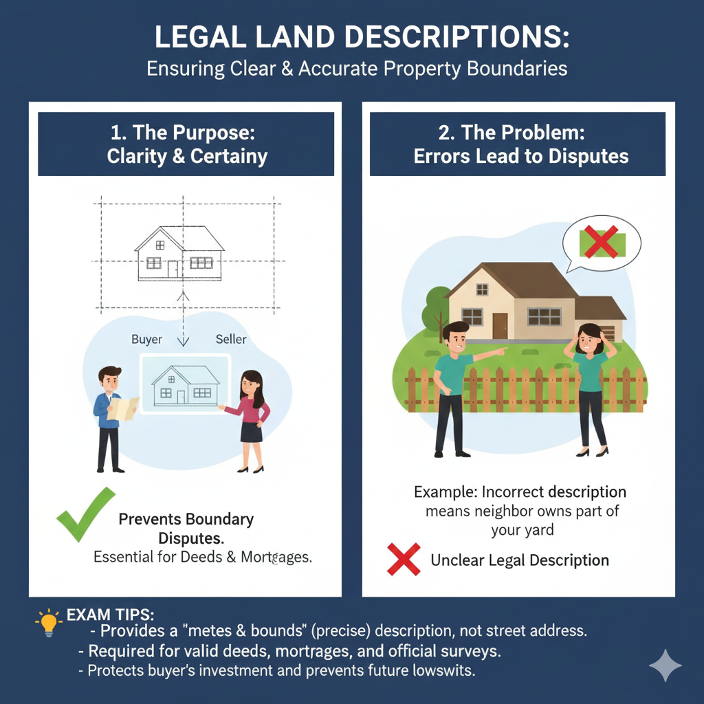

- 法律描述提供 准确、可执行的房地产边界信息，确保买卖双方对土地的认知一致。
- **🌟 考试示例**：
  - 为什么房地产交易需要法律描述？ (正确答案可能是“防止产权纠纷”)
  - 如果买家在购买房屋后发现院子的部分土地属于邻居，这可能是由于法律描述错误。

---

##### ✅ 测量标记与界限法 (Metes and Bounds)

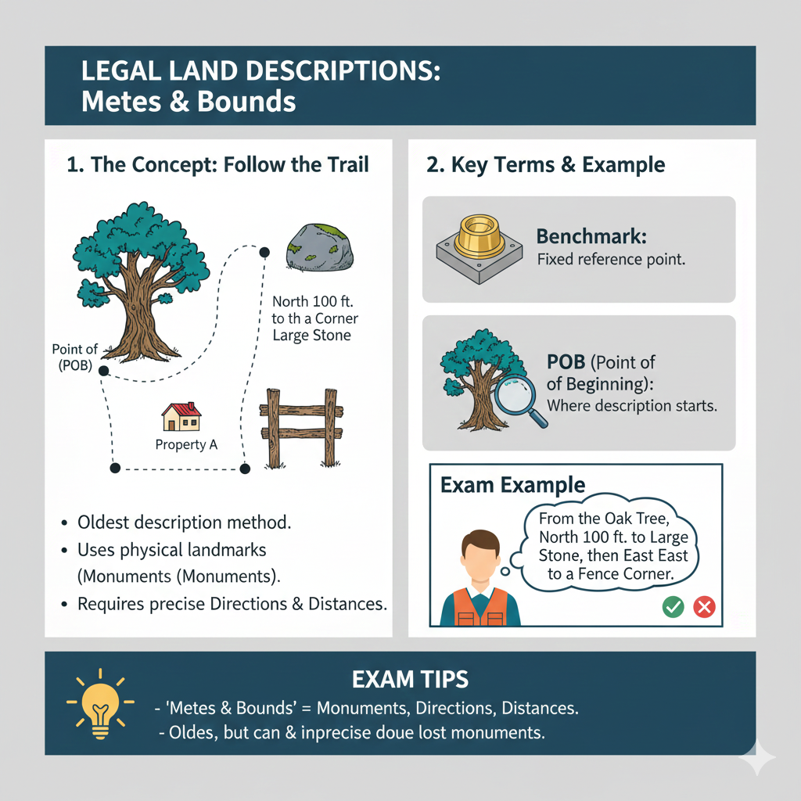

- 使用 地标 (Monuments)、方向 (Direction)、距离 (Distance) 描述土地边界，是最古老的描述方式。
- 术语：
  - 起点 (Point of Beginning, POB)：法律描述的起始点。
  - 基点 (Benchmark)：用于测量的固定参考点。
- **🌟 考试示例**：
  - 哪种描述方法使用物理地标作为参考？ (答案是“Metes and Bounds”)
  - 描述土地边界时，测量员可能会写：“从橡树向北100英尺至大石头，然后向东50英尺至篱笆角落。”

---

##### ✅ 政府测量法 (Rectangular Survey System / Government Survey System)

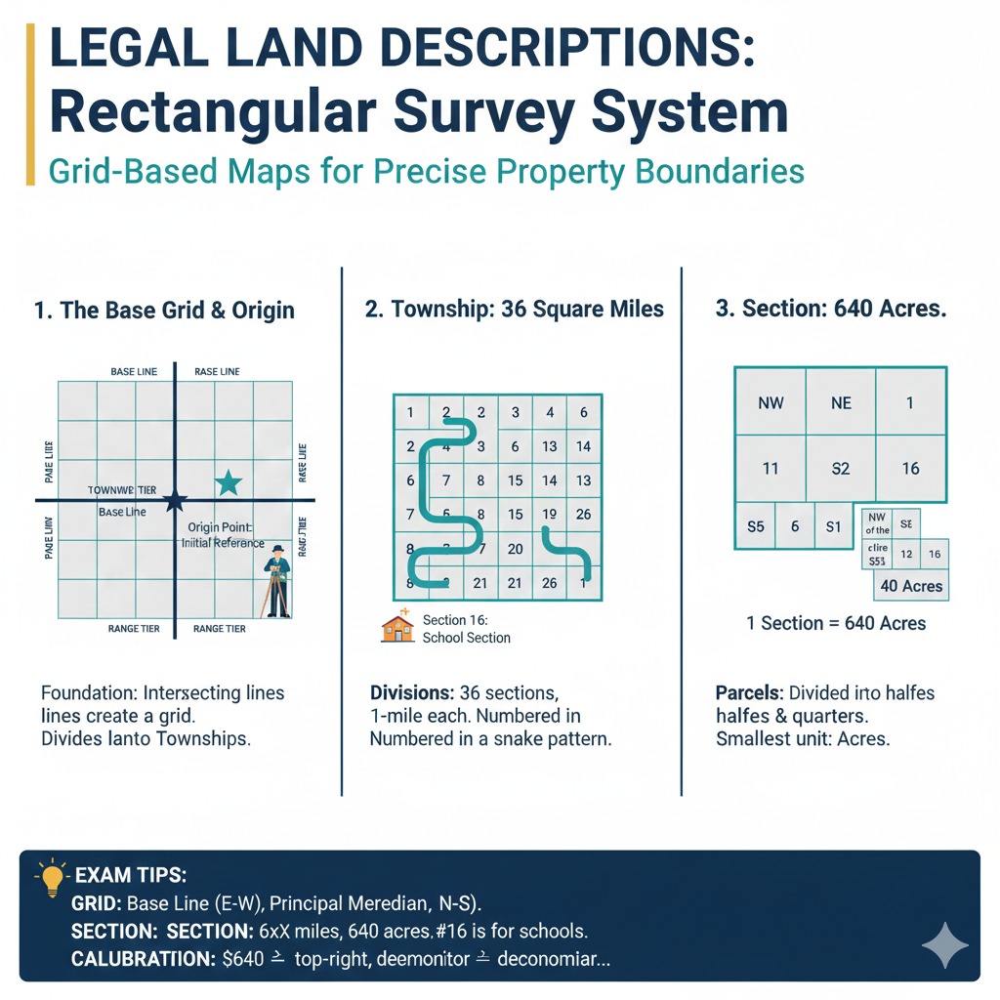

- 采用经纬度坐标，将土地划分为规则网格，以经线 (`Meridians`)和纬线 (`Base Lines`) 为基准。

- 关键单位：
  - 基准线 (Base Line) 和 主子午线 (Principal Meridian)：参考测量的起点。
  - 镇区 (Township)：6×6英里 (36平方英里)的土地单位。
  - 区段 (Section)：镇区被划分为36个1平方英里的区段。

- **🌟 考试示例**：
  - 在政府测量法中，6英里×6英里的土地单位称为何？ (答案是“Township”)
  - 如果某地块位于“第3镇区，第4区段”，它的法律描述可能是：“T3N, R4W, 第4区段。”

---

##### ✅ 区划法 (Lot and Block System / Recorded Plat System)

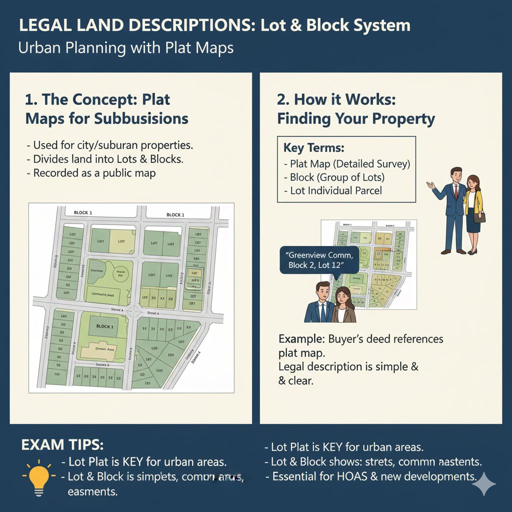

- 主要用于城市房地产，将土地分为 地块 (Lots)、街区 (Blocks)，并登记在 地籍图 (Plat Map) 上。
  - **🌟 考试示例**：
    - 哪种描述方法常用于城市住宅区？ (答案是“Lot and Block System”)
    - 某小区的房屋被标记为：“绿地社区，第2街区，第12号地块。”

- 地籍图 (Plat Map)
  - 详细记录土地的划分，显示道路、公共用地、建筑限制线等。
  - **🌟 考试示例**：
    - 购房者如何知道新住宅的确切边界？ (答案是“查看地籍图”)
    - 张先生购买公寓时，律师通过地籍图确认房屋的合法位置和尺寸。

---

#### 📖 合同法 (Contract Law)

整体总结

- 合同的基本要素 (Essential Elements of a Contract)：包括合法目的、协议、对价、能力等。
- 合同类型 (Types of Contracts)：有效 (Valid)、无效 (Void)、可撤销 (Voidable)、可执行 (Enforceable)。
- 合同的执行 (Performance of Contract)：执行、违约、终止等。
- 合同的补救措施 (Remedies for Breach of Contract)：赔偿损失、特定履行、解除合同等。

---

##### ✅ 合同的基本要素 (Essential Elements of a Contract)

- 一个合法的合同必须包含
  - 协议 (Mutual Agreement)、
  - 对价 (Consideration)、
  - 合法性 (Legality)、
  - 合同能力 (Competent Parties)。

- **🌟 考试示例**：
  - 哪一项不属于合同的必要条件？ (答案可能是“意图 (Intent)”)
  - A承诺卖房给B，B支付定金，这形成了一份具约束力的合同。

---

##### ✅ 合同类型 (Types of Contracts)

- 有效合同 (Valid Contract)：所有要素均满足，具有法律约束力。
- 无效合同 (Void Contract)：缺乏必要要素，无法律效力。
- 可撤销合同 (Voidable Contract)：一方可选择终止，如未成年人签订的合同。
- 可执行合同 (Enforceable Contract) vs 不可执行合同 (Unenforceable Contract)：后者因某些原因 (如未书面化)无法通过法律强制执行。

- **🌟 考试示例**：
  - 如果一个买卖合同因欺诈而被撤销，它属于哪种合同？ (答案是“Voidable Contract”)
  - 如果A谎称房屋没有结构问题并签订合同，B可以因欺诈撤销合同。

---

##### ✅ 合同的执行 (Performance of Contract)

- 执行 (Performance)：合同的各方按照约定履行义务。
- 违约 (Breach of Contract)：一方未能履行合同规定的义务。
- 终止 (Termination of Contract)：合同可以因履行完成、协议终止或法律原因 (如破产)而结束。
- **🌟 考试示例**：
  - 下列哪种情况不属于合同的终止方式？ (答案可能是“新买家提出报价”)
  - A卖房给B，B按时支付款项，合同完成并终止。

---

##### ✅ 合同的补救措施 (Remedies for Breach of Contract)

- 金钱赔偿 (Monetary Damages)：违约方支付损失赔偿。
- 特定履行 (Specific Performance)：法院命令违约方按合同执行，例如卖家必须交付房产。
- 合同解除 (Rescission)：合同被废除，恢复到交易前状态。
- **🌟 考试示例**：
  - 法院要求卖家完成房产交付，这属于哪种补救措施？ (答案是“Specific Performance”)
  - A卖房给B，但拒绝交房，法院要求A完成交易。

---

#### 📖 房地产代理关系 (Agency in Real Estate)

整体总结

- 代理关系 (Agency Relationship)：法律关系，房地产代理人 (Agent)代表委托人 (Principal)行事。
- 代理类型 (Types of Agency)：包括普遍代理 (Universal Agency)、一般代理 (General Agency)、特殊代理 (Special Agency)。
- 代理义务 (Agent’s Fiduciary Duties)：包括忠诚 (Loyalty)、披露 (Disclosure)、合理谨慎 (Reasonable Care)等。
- 代理关系的创建与终止 (Creation & Termination of Agency)：可通过书面协议或行为创建，也可因多种原因终止。

---

##### ✅ 代理关系 (Agency Relationship)

- 一种法律关系，代理人 (Agent)代表委托人 (Principal)行事，并有责任维护其最佳利益。
- **🌟 考试示例**：
- 代理人对委托人的基本义务是什么？ (答案涉及“忠诚和诚信”)
- 房主A聘请代理人B出售房屋，B必须以A的最佳利益为先，不能向买方透露A的底价。

---

##### ✅ 代理类型 (Types of Agency)

1️⃣ 普遍代理 (Universal Agency)：授权代理人处理所有事务，极少见。
- **🌟 考试示例**：
- 哪种代理类型授予代理人最广泛的权限？ (答案是“Universal Agency”)
- A因身体原因授权B全权管理所有财产和投资，B可以代表A处理任何交易。

2️⃣ 一般代理 (General Agency)：代理人有权处理特定领域的事务，如物业管理。
- **🌟 考试示例**：
- 物业管理公司代表业主出租和维护房产，这是什么类型的代理？ (答案是“General Agency”)
- 李先生雇佣一家物业管理公司，每月收租、维修房屋，该公司为一般代理。

3️⃣ 特殊代理 (Special Agency)：代理人仅能执行特定任务，如出售房产。
- **🌟 考试示例**：
- 房地产经纪人受聘出售房屋，他属于哪种代理？ (答案是“Special Agency”)
- 房主A聘请经纪人B卖房，B只能在合同范围内代理，不可擅自做其他决定。

---

##### ✅ 代理义务 (Agent’s Fiduciary Duties)

- 忠诚 (Loyalty)：代理人必须始终以委托人的利益为先。
- 披露 (Disclosure)：必须向委托人披露所有与交易相关的重要信息。
- 合理谨慎 (Reasonable Care)：代理人必须具备专业能力，避免疏忽。
- 会计责任 (Accounting)：代理人必须正确管理委托人的资金。
- 保密 (Confidentiality)：交易结束后，代理人仍需保护客户隐私。
- 顺从 (Obedience)：代理人必须遵守委托人的合法指示。
- **🌟 考试示例**：
- 哪项不是代理人的信托义务？ (答案可能是“利润最大化”，因代理人不能优先考虑自身利益)
- 代理人B发现买家愿意支付更高价格，但未向卖家A透露，这违反了“披露义务”。

---

##### ✅ 代理关系的创建与终止 (Creation & Termination of Agency)

- 创建方式：
  - 明示代理 (Express Agreement)：书面或口头协议建立代理关系。
  - 默示代理 (Implied Agency)：代理人与客户的行为暗示代理关系。
- 终止方式：
  - 完成交易 (Completion)：房屋成功出售，代理关系结束。
  - 违约 (Breach)：任何一方违反合同可导致代理关系终止。
  - 破产或死亡 (Bankruptcy or Death)：任一方去世或破产会自动终止代理关系。
- **🌟 考试示例**：
- 代理关系如何终止？ (答案可能是“合同期满”或“委托人撤销授权”)
- 房主A的房子卖出后，经纪人B的代理合同终止，B无权再代理A的其他事务。

---

##### 📝 总结

- 代理关系 (Agency Relationship)：代理人代表委托人行事，需维护委托人利益。
- 代理类型 (Types of Agency)：
  - 普遍代理 (Universal Agency)：代理人可管理委托人的所有事务。
  - 一般代理 (General Agency)：适用于长期事务，如物业管理。
  - 特殊代理 (Special Agency)：适用于特定交易，如房产买卖。
- 代理义务 (Fiduciary Duties)：代理人必须遵守 忠诚、披露、谨慎、会计责任、保密、顺从。
- 代理关系的创建与终止 (Creation & Termination)：
  - 可通过书面或行为建立，如书面合同或默示代理。
  - 可因完成交易、死亡、违约等终止。

---

#### 📖 挂牌协议 (Listing Agreements)

整体总结

- 挂牌协议的作用 (Purpose of Listing Agreements)：为卖家与经纪人设定明确的销售条款和佣金。
- 挂牌协议的主要类型 (Types of Listing Agreements)：
  - 独家代理挂牌 (Exclusive Agency Listing)
  - 独家出售挂牌 (Exclusive Right to Sell Listing)
  - 开放挂牌 (Open Listing)
  - 净价挂牌 (Net Listing) (部分州不允许)
- 挂牌协议的条款 (Listing Agreement Provisions)：佣金、合同期限、市场推广等。
- 合同终止方式 (Termination of Listing Agreements)：协议完成、期限届满、违约、双方同意等。

---

##### ✅ 挂牌协议的作用 (Purpose of Listing Agreements)

- 挂牌协议是房地产卖方与经纪人之间的合同，规定了房地产销售的条款及佣金。
- **🌟 考试示例**：
- 挂牌协议的主要目的是什么？ (正确答案是“为卖家和经纪人设定销售条款”)
- 房主与某经纪公司签订协议，规定经纪人将在3个月内帮助销售房屋，并获得6%的佣金。

---

##### ✅ 挂牌协议的主要类型 (Types of Listing Agreements)

1️⃣ 独家代理挂牌 (Exclusive Agency Listing)
- 卖家只授权一个经纪人销售房产，但如果卖家自己找到买家，则无需支付佣金。
- **🌟 考试示例**：
- 在独家代理挂牌中，卖家找到买家是否需要支付佣金？ (答案是“不需要”)
- 王先生签约A经纪公司，但如果他自己找到买家，则无需支付佣金。

2️⃣ 独家出售挂牌 (Exclusive Right to Sell Listing)
- 无论谁找到买家，独家经纪人都会获得佣金。
- **🌟 考试示例**：
- 哪种挂牌协议确保经纪人无论如何都会获得佣金？ (答案是“Exclusive Right to Sell”)
- 张女士与B经纪公司签订合同，即使她自己找到买家，B公司仍然可以获得佣金。

3️⃣ 开放挂牌 (Open Listing)
- 卖家可以与多个经纪人合作，谁成功找到买家，谁就能获得佣金。
- **🌟 考试示例**：
- 哪种挂牌允许多个经纪人同时推广房产？ (答案是“Open Listing”)
- 李先生与三家经纪公司签订开放挂牌协议，最终C公司找到买家，因此C公司获得佣金。

4️⃣ 净价挂牌 (Net Listing) (部分州不允许)
- 卖家设定最低净收益，超出部分归经纪人所有。
- **🌟 考试示例**：
- 为何某些州不允许净价挂牌？ (答案是“可能导致经纪人定价过高以获取高额佣金”)
- 王先生希望净赚50万美元，如果房产最终以55万美元售出，经纪人可获得5万美元。

---

##### ✅ 挂牌协议的条款 (Listing Agreement Provisions)

- 佣金 (Commission)：通常为房价的 5%-7%，可协商。
- 合同期限 (Duration of Agreement)：一般为 3-6个月，但可调整。
- 市场推广 (Marketing & Advertising)：经纪人负责 拍照、线上推广、开放日 等。
- 卖方披露 (Seller’s Disclosure)：卖家必须披露房屋缺陷，如 漏水、白蚁 等。
- **🌟 考试示例**：
- 挂牌协议中经纪人通常会做哪些市场推广？ (答案是“广告、拍照、开放日”)
- 李女士与经纪公司签约，允许他们在线上发布广告，并进行开放日活动。

---

##### ✅ 合同终止方式 (Termination of Listing Agreements)

1️⃣ 协议完成 (Performance)：房产成功售出，经纪人获得佣金。
2️⃣ 期限届满 (Expiration)：合同到期后，若未售出，则挂牌无效。
3️⃣ 双方同意 (Mutual Agreement)：双方协商一致终止协议。
4️⃣ 违约 (Breach of Contract)：如卖家拒绝履行协议，可能需支付赔偿。

- **🌟 考试示例**：
- 挂牌协议如何终止？ (答案可能是“协议完成、到期、双方同意、违约”)
- 张先生与经纪公司签订的挂牌合同到期，未成功售出，合同自动终止。

---

##### 📝 总结

- 挂牌协议 (Listing Agreement) 规范经纪人与卖家之间的合同关系，明确佣金、条款和责任。
- 主要挂牌类型：
  - 独家代理挂牌 (Exclusive Agency)：经纪人独家代理，但卖家可自行售房且不付佣金。
  - 独家出售挂牌 (Exclusive Right to Sell)：无论谁找到买家，经纪人都能获得佣金。
  - 开放挂牌 (Open Listing)：多个经纪人竞争，谁成交谁拿佣金。
  - 净价挂牌 (Net Listing) (部分州禁止)：卖家设定底价，经纪人赚取超出部分。
- 挂牌协议条款 包括 佣金比例、合同期限、市场推广、卖方披露 等。
- 合同终止方式：售出、到期、双方同意或违约。

---

#### 📖 经纪业务 (Brokerage)

---

##### 🔹 1. 谁可以成为房地产经纪人 (Who May Broker)

✔ 允许的经纪人类型：
- 独资企业 (Sole proprietorship)
- 营利性公司 (For-profit corporation)
- 普通或有限合伙企业 (General or limited partnership)
- 合资企业 (Joint venture)

❌ 不允许的经纪人类型：
- 非营利性公司 (Non-profit corporation)
- 商业信托 (Business trust)
- 合作协会 (Cooperative association)

📌 **🌟 考试示例**
题: 下列哪种商业实体可以合法经营房地产经纪业务？
A. 非营利公司
B. 营利性公司
C. 商业信托
D. 合作协会
👉 正确答案：B (只有营利性公司可以运营房地产经纪业务)

---

##### 🔹 2. 经纪人-代理人关系 (Broker-Agent Relationship)

✔ 法律关系 (Legal relationship)：
- 销售员 (Salesperson)：
- 代理 (Agent)并受雇于经纪人 (Broker)。
- 只能以经纪人的名义开展业务。
- 是客户的次级代理人 (Subagent of client)。

❌ 销售员不得：
- 不能同时为两个雇主工作。
- 不能接受其他当事人支付的佣金。
- 不能代表客户签订具有法律约束力的合同。

📌 **🌟 考试示例**
题: 以下哪种行为是房地产销售员 (Salesperson)不被允许的？
A. 以经纪人名义开展业务
B. 同时为两家房地产公司工作
C. 代表客户协商合同条款
D. 只接受经纪人支付的佣金
👉 正确答案：B (销售员不能有两个雇主)

---

##### 🔹 3. 代理人的工作职责 (Obligations and Responsibilities)

✔ 代理人对经纪人的责任 (Agent to Broker)：
- 获取并销售房源 (Obtain & sell listings)。
- 遵守经纪人的政策和雇佣协议 (Follow policies & employment provisions)。
- 维护道德标准 (Promote ethics and broker's reputation)。

✔ 经纪人对代理人的责任 (Broker to Agent)：
- 提供市场数据和办公室支持 (Provide data & office support)。
- 支付佣金 (Provide compensation)。
- 提供培训，确保代理人遵守行业道德标准 (Provide training & uphold ethics)。

📌 **🌟 考试示例**
题 ：下列哪项是房地产经纪人 (Broker)对其代理人的责任？
A. 提供市场数据和办公室支持
B. 确保代理人遵守所有合同条款
C. 支付代理人工资而非佣金
D. 在代理人违法时为其提供法律援助
👉 正确答案：A (经纪人需提供数据和支持，但不会承担代理人的违法责任)

---

##### 🔹 4. 代理人的佣金 (Agent Compensation)

✔ 佣金计算方式 (Commission Calculation)：
- 代理人通常通过佣金获得报酬，而非固定工资。
- 佣金通常按照事先与经纪人商定的分成比例 (Split with cooperating brokers)。
- 佣金金额取决于代理人促成的交易情况。

📌 **🌟 考试示例**
题 ：房地产代理人的佣金如何计算？
A. 由买方直接支付给代理人
B. 由房产所有者直接支付给代理人
C. 由经纪人根据合同规定支付给代理人
D. 由国家房地产协会 (NAR)统一规定佣金标准
👉 正确答案：C (代理人的佣金由经纪人支付，而非直接由买家或卖家支付)

---

##### 🔹 5. 混合资金与非法挪用资金 (Commingling & Conversion)

❌ 禁止行为：
- 混合资金 (Commingling)：
  - 个人资金与客户资金混合，如将客户的押金存入个人账户。
  - 这是一种严重的房地产违规行为。
- 非法挪用资金 (Conversion)：
  - 挪用客户的托管资金 (Trust funds)用于个人或业务用途。
  - 例如，代理人用客户的押金支付自己的账单。

📌 **🌟 考试示例**
题 ：以下哪项行为属于混合资金 (Commingling)？
A. 将客户的购房押金存入代理人自己的银行账户
B. 在房产交易完成前退还押金给客户
C. 在经纪公司批准的信托账户中存入客户资金
D. 代理人从自己的存款账户支付办公租金
👉 正确答案：A (客户资金必须存入信托账户，而非个人账户)

---

##### 🔹 6. 房地产广告规定 (Advertising Requirements)

✔ 合法广告要求：
- 不能有误导性内容 (No misleading ads)。
- 广告必须包含经纪人身份信息 (Ads must contain broker’s ID)。
- 经纪人对广告内容负责 (Broker is responsible for content)。
- 不得使用“盲目广告” (Blind ads)，即隐藏经纪公司信息的广告。
- 如果代理人拥有该房产，必须在广告中披露 (Must disclose if agent owns property)。

📌 **🌟 考试示例**
题 ：以下哪项属于违反房地产广告规定的行为？
A. 在广告中不提及经纪公司的名称
B. 在广告中说明房产的市场价格
C. 在广告中使用“绝佳投资机会”作为宣传语
D. 在广告中注明房屋面积
👉 正确答案：A (房地产广告必须包含经纪公司信息)

---

##### 🔹 7. 反垄断法律 (Anti-Trust Laws)

✔ 主要法律：
- 《谢尔曼反垄断法》 (Sherman Antitrust Act)
- 《克莱顿反垄断法》 (Clayton Antitrust Act)

❌ 禁止行为：
- 价格操纵 (Price fixing)：经纪人之间合谋固定佣金比例。
- 市场分割 (Market allocation)：经纪人分区经营以减少竞争。
- 滥用独家协议 (Exclusive dealing)：限制客户只能通过某个经纪人购买房产。

📌 **🌟 考试示例**
题 ：以下哪项违反了《谢尔曼反垄断法》？
A. 两家经纪公司商定相同的佣金标准
B. 经纪公司自由竞争，提供不同佣金比例
C. 经纪公司根据服务质量设定佣金
D. 客户可以自由选择经纪公司
👉 正确答案：A (两家经纪公司不能联合设定佣金标准)

---

#### 📖 销售合同 (Sales Contrats)

---

##### 🔹 1. 什么是销售合同？ (Key Characteristics of Sales Contracts)

- 销售合同 (Sales Contract)
- 本质上是一个具有法律约束力的双边合同 (Binding, bilateral contract)，用于房地产买卖。
- 它是购房交易的蓝图 (Blueprint for closing)，规定了买卖双方的权利和义务。
- 执行性合同 (Executory contract)：在房屋交易完成前，合同一直处于“执行状态” (Executory)。
- 合同有效期：通常在过户 (Closing)时到期。
- 必须是书面形式 (Must be in writing)，否则不具备法律效力 (Statute of Frauds 规定)。

📌 **🌟 考试示例**
题 ：下列关于销售合同的描述，哪一项是正确的？
A. 销售合同是单方面的承诺，不具有法律约束力
B. 只要买卖双方口头同意，合同就有效
C. 销售合同是买卖双方都必须履行的双边合同
D. 合同在双方签署后立刻执行，无需过户
👉 正确答案：C (销售合同是买卖双方的法律协议，具有约束力)

📖 💡 额外解析：为什么必须是书面合同？
在房地产交易中，涉及到大量金钱和权益，为了保护买卖双方，法律要求所有涉及房地产的合同必须书面化 (Statute of Frauds)。如果只是口头承诺，那么一旦发生纠纷，法院将无法执行合同内容！📜

---

##### 🔹 2. 销售合同的创建 (Creation of Sales Contracts)

###### ✅ 创建合同的关键步骤：
- 买方提交要约 (Offer)
- 卖方接受要约 (Acceptance)——此时合同生效，买方获得衡平权益 (Equitable Title)
- 合同必须有法律认可的对价 (Consideration) (通常是购房款或定金)
- 必须有明确的房产描述 (Legal Description)

📌 **🌟 考试示例**
题 ：哪种情况代表销售合同正式成立？
A. 买方提交要约，但卖方未回复
B. 买方支付了定金，但卖方尚未签字
C. 卖方接受要约，并通知买方
D. 买方提出新条件后，卖方立刻接受
👉 正确答案：C (只有当卖方接受要约并通知买方时，合同才生效)

📖 💡 额外解析：为什么买方会获得衡平权益 (Equitable Title)？
衡平权益意味着买方在房产正式过户之前，就已经对房产有了某种“权益”，比如有权要求卖方完成交易。换句话说，买方已经“锁定”了这套房子，而卖方不能随意反悔！🔑

---

##### 🔹 3. 定金 (Earnest Money Deposit)

✔ 定金的作用 (Purpose of Earnest Money)：
- 保证买方认真履行合同，不随意毁约。
- 如果买方违约，卖方可能有权保留定金作为违约赔偿 (Liquidated Damages)。
- 由第三方托管 (Escrow)，确保资金安全。

📌 **🌟 考试示例**
题 ：为什么房地产交易中要支付定金 (Earnest Money Deposit)？
A. 作为房款的一部分，必须全额支付
B. 证明买方有意愿完成交易
C. 定金由卖方保管，交易失败后可以自由支配
D. 任何一方毁约时，定金都会退还给买方
👉 正确答案：B (定金的作用是展示买方的诚意)

📖 💡 额外解析：定金 vs. 购房款？
- 定金 ≠ 购房款，定金是交易前支付的一部分金额，目的是锁定交易，
- 如果交易成功，定金通常会抵扣房款。
- 如果买方无故违约，卖方有可能不退还定金！🔑

---

##### 🔹 4. 附带条件 (Contingencies)

✔ 附带条件 (Contingencies) 是指合同中必须满足某些条件，交易才能继续进行。
✔ 常见的附带条件：
- 贷款审批条件 (Loan Approval Contingency)：如果买方无法获得贷款，合同无效。
- 房屋检查条件 (Inspection Contingency)：如果房屋存在重大缺陷，买方可以取消合同或要求修缮。
- 房屋估价条件 (Appraisal Contingency)：如果房屋估价低于合同价格，买方可取消交易或重新协商价格。

📌 **🌟 考试示例**
题 ：以下哪项是房地产交易中常见的附带条件？
A. 贷款审批
B. 买方无条件支付房款
C. 房产必须由卖方亲自验收
D. 卖方必须接受买方任何还价
👉 正确答案：A (贷款审批失败，买方有权取消合同)

📖 💡 额外解析：为什么附带条件很重要？
- 假设你买了一套房子，但后来发现银行不批准贷款，如果合同没有“贷款审批条件”，你可能会被迫全额付款，否则就算违约！
- 有了这些附带条件，买方可以在合理情况下合法退出交易，避免经济损失。💰

---

##### 🔹 5. 违约责任 (Default & Remedies)

✔ 买方违约 (Buyer Default)：
- 卖方可以取消合同，保留定金作为违约金 (Liquidated Damages)。
- 卖方可以起诉买方，要求履行合同 (Specific Performance)。

✔ 卖方违约 (Seller Default)：
- 买方可以取消合同，取回定金。
- 买方可以起诉卖方，要求过户房产 (Specific Performance)。

📌 **🌟 考试示例**
题 ：如果买方无故毁约，卖方可能获得什么赔偿？
A. 买方的所有资产
B. 买方支付的定金
C. 买方名下的其他房产
D. 卖方无权索赔
👉 正确答案：B (卖方可以保留买方支付的定金作为违约金)

📖 💡 额外解析：卖方可以起诉买方吗？
- 可以！如果卖方坚持出售，买方违约，卖方可以要求法院强制执行合同 (Specific Performance)。
- 但在实际操作中，这种情况很少发生，因为诉讼成本高，通常买方赔付违约金后，交易就终止了。🔍

---

#### 📖 房地产经济学 (Economcs)

整体总结

- 供给 (Supply)：市场上可供买卖、租赁的房地产数量。
- 需求 (Demand)：市场上愿意购买或租赁房地产的数量。
- 价格与市场均衡 (Price & Market Equilibrium)：供需关系决定房地产价格，市场均衡点是供需相等的位置。
- 市场周期 (Market Cycle)：房地产市场经历增长、均衡、过剩、衰退等周期性变化。
- 影响供给的因素 (Factors Affecting Supply)：土地供应、建筑成本、政府法规等。
- 影响需求的因素 (Factors Affecting Demand)：人口变化、就业率、收入水平、利率等。
- 政府对房地产市场的影响 (Government Influence on Real Estate Market)：税收、利率调控、信贷政策等。
- 市场指标 (Market Indicators)：空置率 (Vacancy Rate)、建筑许可 (Building Permits)、房地产价格 (Price Trends)。

---

##### ✅ 供需关系 (Supply & Demand)

- 供给 (Supply)：指市场上可供买卖或出租的房地产数量，通常以**单位数 (dwelling units)、平方英尺 (square feet)、英亩 (acres)**等计量。
- 需求 (Demand)：指市场上愿意购买或租赁房地产的数量，通常以**户数 (households)、平方英尺 (square feet)、英亩 (acres)**计量。
- 市场动态：
  - 供给增加，需求不变 → 价格下降 (Price Decrease)
  - 需求增加，供给不变 → 价格上升 (Price Increase)

**🌟 考试示例**：如
- 果市场上新建了大量房屋，但购房者数量没有增加，会发生什么情况？ (正确答案：房价下降)
某城市由于新开发区建设，大量新房上市，但购房者需求不变，导致房价下降。

###### ✅ 价格与市场均衡 (Price & Market Equilibrium)

- 市场均衡 (Market Equilibrium)：供需相等时，市场处于均衡，价格稳定。
- 市场失衡 (Market Imbalance)：
- 供过于求 (Excess Supply)：导致房价下跌，市场出现空置房增多。
- 供不应求 (Excess Demand)：导致房价上涨，买家争夺有限房源。
**🌟 考试示例**：当
- 市场处于均衡状态时，房价如何变化？ (正确答案：基本稳定)
某城市新建住房数量与购房者增长速度一致，房价保持稳定。

###### ✅ 市场周期 (Market Cycle)

房地产市场遵循周期性变化，一般包括以下阶段：
- 增长 (Expansion)：需求增加，房价上涨，开发商增加供给。
- 均衡 (Equilibrium)：供需相等，市场稳定。
- 过剩 (Oversupply)：供给过多，空置率上升，房价下跌。
- 衰退 (Recession)：需求减少，开发商减少新建房屋，市场修正。
**🌟 考试示例**：房
- 地产市场进入过剩 (Oversupply)阶段后，会发生什么？ (正确答案：房价下降)
经济衰退期间，购房者减少，但大量房屋已建成，导致房价下降。

###### ✅ 影响供给的因素 (Factors Affecting Supply)

- 土地供应 (Land Availability)：可开发土地越多，供给越高。
- 建筑成本 (Construction Costs)：成本高会减少供给，成本低则增加供给。
- 政府法规 (Government Regulations)：
  - 严格的建筑法规可能限制供给。
  - 税收优惠可能鼓励开发。

**🌟 考试示例**：如
- 果建筑成本上升，房地产供给会如何变化？ (正确答案：减少)
由于建筑材料价格上涨，开发商减少新建项目，房屋供给下降。

###### ✅ 影响需求的因素 (Factors Affecting Demand)

- 人口变化 (Population Growth)：人口增长会增加住房需求。
- 就业率 (Employment Rate)：工作机会多的地区需求高。
- 收入水平 (Income Levels)：收入越高，购房能力越强。
- 利率 (Interest Rates)：
  - 利率高 → 贷款成本高 → 需求减少；
  - 利率低 → 贷款成本低 → 需求增加。

**🌟 考试示例**：如
- 果利率上升，购房需求会如何变化？ (正确答案：减少)
银行提高贷款利率后，许多购房者因负担不起月供而放弃购房计划，需求下降。

###### ✅ 政府对房地产市场的影响 (Government Influence on Real Estate Market)

- 政府通过**税收 (Taxation)、信贷政策 (Credit Policy)、利率调控 (Interest Rate Control)**等手段影响市场。
- 地方政府 (Local Government)：通过房产税、土地使用政策影响市场。
- 联邦政府 (Federal Government)：通过利率调整、信贷政策影响购房成本。

**🌟 考试示例**：联
- 邦储备局 (Federal Reserve)提高利率后，会对房地产市场产生什么影响？ (正确答案：房贷利率上升，需求减少)
由于政府提高贷款利率，购房者减少，市场降温。

###### ✅ 市场指标 (Market Indicators)

市场指标用于衡量房地产市场状况，包括：

- 空置率 (Vacancy Rate)：衡量可用房屋数量。
  - 空置率上升 → 供应过剩，房价下降。
  - 空置率下降 → 供应紧张，房价上涨。
- 建筑许可 (Building Permits)：新房建设数量的领先指标。
- 房价趋势 (Price Trends)：上涨表明需求强，下降表明供过于求。

**🌟 考试示例**：如
- 果某地区的空置率下降，房价可能如何变化？ (正确答案：上涨)
由于就业机会增加，某市的租房需求上升，空置率下降，租金上涨。

---

##### 📝 总结

- 供需关系决定房价：
  - 供过于求 → 降价；
  - 供不应求 → 涨价。
- 市场周期包括增长、均衡、过剩、衰退四个阶段。
- 供给受土地供应、建筑成本、政府法规影响。
- 需求受人口、就业、收入、利率等因素影响。
- 政府调控房地产市场，利率变化直接影响购房成本。
- 市场指标 (空置率、建筑许可、房价趋势)可用于预测市场趋势。

---

#### 📖 房地产估价 (Appraisal)

整体总结

估价目的 (Purpose of Appraisal)：用于贷款审批、税务评估、投资分析等。
市场价值 (Market Value)：买卖双方在无压力情况下达成的合理价格。
估价原则 (Principles of Value)：如**替代原则 (Substitution)、最高最佳利用 (Highest and Best Use)、供需 (Supply & Demand)**等。
估价方法 (Approaches to Value)：包括市场比较法 (Sales Comparison Approach)、成本法 (Cost Approach)、收益法 (Income Approach)。
估价流程 (Appraisal Process)：从数据收集到最终估值的完整流程。
折旧 (Depreciation)：影响房地产价值的因素，包括物理折旧、功能性折旧和经济折旧。
市场指标 (Market Indicators)：影响房地产估值的因素，如空置率、租金水平、经济趋势等。

---

##### ✅ 估价目的 (Purpose of Appraisal)

房地产估价的主要用途包括：

抵押贷款 (Mortgage Lending)：银行需要估价来评估贷款风险。
税务评估 (Tax Assessment)：政府使用估价来计算房产税。
投资分析 (Investment Analysis)：投资者依赖估价来判断收益潜力。
财产分配 (Estate Settlement)：遗产继承、离婚财产分割等需要估值。
**🌟 考试示例**：银
- 行为何需要房地产估价？ (正确答案：评估抵押贷款风险)
张先生向银行申请贷款，银行要求对他的房产进行估价，以确保贷款金额不会超过房产价值。
##### ✅ 市场价值与估价原则 (Market Value & Principles of Value)

📌 市场价值 (Market Value)：在公平交易条件下，买卖双方都充分了解市场信息，并愿意交易的合理价格。

📌 估价原则 (Principles of Value)：

替代原则 (Substitution)：买家不会支付超过类似房产的市场价格。
最高最佳利用 (Highest and Best Use)：房产的最优用途决定其最高价值。
供需原则 (Supply & Demand)：供不应求 → 价格上涨；供过于求 → 价格下降。
贡献原则 (Contribution)：某项改进的价值取决于其对整体房产价值的影响，而非成本。
预期原则 (Anticipation)：市场预期会影响房产价值，例如即将修建地铁站的房产价格可能会上涨。
一致性原则 (Conformity)：房产的价值会受到周边房产的一致性影响，过度装修可能不会增加价值。
**🌟 考试示例**：哪
- 项原则表明房产的最优用途决定其最高价值？ (正确答案：最高最佳利用)
A地块当前用作农业用地，但如果改为商业用途，其价值将大幅提升，符合最高最佳利用原则。
##### ✅ 估价方法 (Approaches to Value)

估价师使用三种主要方法确定房地产价值：

📌 市场比较法 (Sales Comparison Approach) (适用于住宅)

基于**最近成交的类似房产 (Comparables, Comps)**的价格进行估值。
调整因素包括位置、面积、装修、设施等。
"如果比较房产比目标房产好，减去价值；如果比较房产比目标房产差，增加价值" (Subtract if Superior, Add if Inferior)。
📌 成本法 (Cost Approach) (适用于新建或特殊用途建筑，如教堂、学校)

计算重建成本 (Reproduction Cost)或替代成本 (Replacement Cost)，减去折旧，最终加上土地价值。
适用于市场数据不足或建筑独特的情况。
📌 收益法 (Income Approach) (适用于投资型物业，如公寓、写字楼)

基于未来收益计算价值，采用**资本化率 (Capitalization Rate, Cap Rate)或租金倍数 (Gross Rent Multiplier, GRM)**进行估算。
公式：
资本化率法：价值 = 净运营收入 (NOI)/ 资本化率
租金倍数法：价值 = 月租金 × GRM
**🌟 考试示例**：哪
- 种估价方法适用于公寓楼？ (正确答案：收益法)
某写字楼的年净运营收入为$100,000，市场资本化率为10%，则该写字楼的价值为$1,000,000 (100,000 ÷ 10%)。
##### ✅ 折旧与房产价值 (Depreciation & Property Value)

折旧指房地产因时间或环境因素导致的价值下降，分为三种类型：

物理折旧 (Physical Deterioration)：因磨损、老化导致的价值下降，如屋顶损坏、管道老化。
功能性折旧 (Functional Obsolescence)：因设计过时或布局不合理导致的贬值，如没有中央空调、过时的厨房设计。
经济折旧 (Economic Obsolescence)：因外部因素导致的价值下降，如附近工厂污染、犯罪率上升。
**🌟 考试示例**：房
- 产因周边工厂污染而贬值属于哪种折旧？ (正确答案：经济折旧)
某房产靠近一条繁忙的高速公路，噪音污染降低了其市场价值，属于经济折旧。
##### ✅ 估价流程 (Appraisal Process)

确定估价目的 (Identify Purpose)：如贷款审批、投资分析等。
收集市场数据 (Collect Data)：包括市场趋势、成交记录、成本信息等。
分析最高最佳利用 (Analyze Highest and Best Use)：确定房产的最佳用途。
应用估价方法 (Apply Approaches to Value)：使用市场比较法、成本法或收益法进行估值。
得出最终估值 (Reconcile Values)：整合各方法的结果，得出最终估值。
编写估价报告 (Compile Report)：提供详细的估价说明和数据支持。
**🌟 考试示例**：估
- 价师得出最终估值前，需要做什么？ (正确答案：整合不同估价方法的结果)
估价师对某房产进行了市场比较法和收益法估值，并结合两者得出了最终价值。

📝 总结

市场价值 (Market Value) 是房产在无压力情况下的公平市场价格。
估价原则 如替代原则、最高最佳利用原则决定房产价值。
三种估价方法：市场比较法 (住宅)、成本法 (新建/特殊用途)、收益法 (投资型物业)。
折旧影响房产价值，包括物理折旧、功能性折旧和经济折旧。
估价流程 包括数据收集、分析、应用估价方法和最终整合。

---

#### 📖 房地产金融 (Finance)

整体总结

抵押贷款 (Mortgage Loan)：买家向银行借款购买房产，以房产作为抵押。
贷款组成部分 (Loan Elements)：包括**本金 (Principal)、利息 (Interest)、贷款期限 (Term)、首付 (Down Payment)、贷款价值比 (LTV)**等。
贷款类型 (Types of Mortgages)：包括**常规贷款 (Conventional Loans)、政府支持贷款 (FHA & VA Loans)、可调利率贷款 (Adjustable Rate Mortgage, ARM)**等。
贷款审批 (Loan Qualification)：银行根据**收入 (Income)、信用记录 (Credit Score)、负债比率 (Debt Ratio)**决定是否批准贷款。
政府对房地产贷款的监管 (Government Regulations)：包括**真实贷款披露法 (Truth in Lending Act)、房地产结算程序法 (RESPA)、平等信贷机会法 (ECOA)**等。
抵押市场 (Mortgage Market)：分为一级抵押市场 (Primary Mortgage Market)和二级抵押市场 (Secondary Mortgage Market)。

---

##### ✅ 抵押贷款 (Mortgage Loan)

📌 抵押贷款 (Mortgage Loan)：买家向银行借款购买房产，并以房产作为抵押品，直到贷款还清。

📌 贷款组成部分 (Loan Elements)：

本金 (Principal)：借款的原始金额。
利息 (Interest)：借款人支付给银行的借贷成本。
贷款期限 (Term)：贷款的还款时间 (如30年、15年)。
首付 (Down Payment)：购房者自己支付的部分，通常是房价的3%-20%。
贷款价值比 (LTV, Loan-to-Value)：贷款金额与房产价值的比例，LTV越高，贷款风险越大。
**🌟 考试示例**：如
- 果一位购房者支付了房价的20%作为首付，贷款价值比 (LTV)是多少？ (正确答案：80%)
王先生购买了一套价值$200,000的房屋，并支付$40,000的首付，LTV为 80% (160,000 ÷ 200,000)。
##### ✅ 贷款类型 (Types of Mortgages)

📌 1. 常规贷款 (Conventional Loans)

由私人银行和金融机构提供，无政府保险或担保。
通常要求 20% 首付，低于20%可能需要 私人抵押保险 (PMI, Private Mortgage Insurance)。
**🌟 考试示例**：如
- 果购房者申请了一笔无政府支持的贷款，这属于哪种贷款？ (正确答案：常规贷款)
李先生申请了一笔由银行提供的房贷，没有联邦住房管理局 (FHA)或退伍军人事务部 (VA)的支持。
📌 2. FHA 贷款 (FHA Loans, Federal Housing Administration)

政府保险，减少银行贷款风险。
适用于信用分数较低、首付较少的购房者，最低首付3.5%。
**🌟 考试示例**：哪
- 种贷款适用于低首付购房者？ (正确答案：FHA 贷款)
张女士信用评分较低，但通过 FHA 贷款，仅支付3.5%的首付即可购房。
📌 3. VA 贷款 (VA Loans, Veterans Affairs)

退伍军人专用贷款，由 VA 提供担保。
无需首付，无私人抵押保险 (PMI)。
**🌟 考试示例**：哪
- 种贷款适用于退伍军人？ (正确答案：VA 贷款)
刘先生是美国退伍军人，他申请了一笔 VA 贷款，无需支付首付即可购房。
📌 4. 可调利率贷款 (ARM, Adjustable Rate Mortgage)

贷款利率根据市场变化调整，初期较低，之后可能上涨。
适用于短期持有房产的投资者，但存在利率上涨的风险。
**🌟 考试示例**：哪
- 种贷款的利率会随市场变化？ (正确答案：可调利率贷款)
王先生选择 ARM 贷款，前5年固定利率，之后利率随市场调整。
##### ✅ 贷款审批 (Loan Qualification)

银行审批贷款时会考虑以下因素：

📌 1. 收入 (Income Qualification)

计算收入比率 (Income Ratio)，通常要求月供不超过收入的28%-31%。
📌 2. 负债比率 (Debt-to-Income Ratio, DTI)

计算购房者的总债务支出 (包括房贷、信用卡、车贷等)占收入的比例，通常要求不超过36%-43%。
📌 3. 信用记录 (Credit Score)

银行查看信用评分 (FICO Score)，一般要求620分以上。
**🌟 考试示例**：如
- 果购房者的月收入为$5,000，银行通常允许的最高月供是多少？ (正确答案：$1,550-$1,650，即收入的31%)
李先生月收入$6,000，银行要求 DTI 不超过 36%，则所有债务支出应不超过 $2,160。
##### ✅ 政府对房地产贷款的监管 (Government Regulations)

📌 1. 真实贷款披露法 (Truth in Lending Act, TILA)

要求银行提前披露所有贷款成本，包括年利率 (APR)和所有费用。
📌 2. 房地产结算程序法 (RESPA, Real Estate Settlement Procedures Act)

防止不合理的贷款费用，要求提供贷款估算 (Loan Estimate)和最终结算清单 (Closing Disclosure)。
📌 3. 平等信贷机会法 (ECOA, Equal Credit Opportunity Act)

禁止银行基于种族、性别、年龄、婚姻状况等拒绝贷款。
**🌟 考试示例**：哪
- 项法律要求银行公平对待所有借款人？ (正确答案：ECOA)
某银行拒绝为单身女性提供贷款，违反了 ECOA。
##### ✅ 抵押市场 (Mortgage Market)

📌 一级抵押市场 (Primary Mortgage Market)

银行、信用合作社、抵押贷款公司直接向购房者提供贷款。
📌 二级抵押市场 (Secondary Mortgage Market)

房利美 (Fannie Mae)、房地美 (Freddie Mac)等机构购买已发放的贷款，为银行提供流动资金。
**🌟 考试示例**：F
- annie Mae 和 Freddie Mac 属于哪个市场？ (正确答案：二级抵押市场)
银行将已发放的房贷卖给 Fannie Mae，以便获取资金发放更多贷款。

---

#### 📖 房地产投资 (Investment)

整体总结

房地产投资类型 (Types of Investment Properties)：包括住宅 (Residential)、商业 (Commercial)、工业 (Industrial)、土地 (Land)。
投资收益计算 (Investment Returns)：关键指标包括资本化率 (Cap Rate)、现金流 (Cash Flow)、投资回报率 (ROI)。
杠杆 (Leverage)：利用贷款投资房地产，提高投资回报，但也增加风险。
房地产市场分析 (Market Analysis)：包括供需、市场周期、经济指标等。
投资策略 (Investment Strategies)：如买入持有 (Buy & Hold)、翻新转售 (Fix & Flip)、短租 (Short-term Rental)。
税收影响 (Tax Implications)：涉及**折旧 (Depreciation)、资本利得税 (Capital Gains Tax)、1031 交换 (1031 Exchange)**等。
风险管理 (Risk Management)：包括市场风险、利率风险、管理风险等。


##### ✅ 房地产投资类型 (Types of Investment Properties)

📌 1. 住宅投资 (Residential Investment)

包括单户住宅 (Single-Family Homes)、多户公寓 (Multifamily Properties)。
适合长期持有 (Buy & Hold)或短租 (Airbnb)。
📌 2. 商业地产 (Commercial Real Estate)

包括办公楼 (Office Buildings)、零售商铺 (Retail Stores)、购物中心 (Shopping Centers)。
长期租赁合同，现金流稳定，但初始投资较大。
📌 3. 工业地产 (Industrial Real Estate)

包括仓库 (Warehouses)、制造工厂 (Manufacturing Facilities)。
适用于企业长期租赁，维护成本低，但市场需求较窄。
📌 4. 土地投资 (Land Investment)

包括未开发土地 (Raw Land)和可开发土地 (Developed Land)。
适合长期投资，升值潜力大，但无直接现金流。
**🌟 考试示例**：哪
- 种房地产投资类型通常具有长期稳定现金流？ (正确答案：商业地产)
王先生购买了一座写字楼，并与租户签订10年租约，保证长期现金流。

##### ✅ 投资收益计算 (Investment Returns)

📌 1. 资本化率 (Capitalization Rate, Cap Rate)

计算投资回报率 (不考虑贷款)，公式：
资本化率
=
净运营收入 (NOI)
房产价值
资本化率=
房产价值
净运营收入 (NOI)
​

适用于商业地产估值，Cap Rate 越高，回报越高，但风险也较大。
📌 2. 现金流 (Cash Flow)

计算方法：
现金流
=
租金收入
−
运营成本
−
贷款支出
现金流=租金收入−运营成本−贷款支出
现金流为正 (Positive Cash Flow) → 投资获利
现金流为负 (Negative Cash Flow) → 需补贴支出
📌 3. 投资回报率 (Return on Investment, ROI)

计算方法：
ROI
=
年度收益
总投资额
ROI=
总投资额
年度收益
​

ROI 越高，投资回报越好。
**🌟 考试示例**：某
- 物业的净运营收入为$50,000，市场价值为$500,000，资本化率是多少？ (正确答案：10%)
张先生购买了一栋商业物业，每年租金收入$100,000，扣除费用后净收入$50,000，市场估值$500,000，计算得出资本化率为 10% (50,000 ÷ 500,000)。
##### ✅ 杠杆与房地产投资 (Leverage & Real Estate Investment)

📌 1. 杠杆 (Leverage)

利用贷款投资房地产，以少量自有资金获取更高回报。
优点：提高投资回报率，增加购买力。
缺点：杠杆过高可能导致贷款风险和市场波动风险。
📌 2. 贷款价值比 (Loan-to-Value, LTV)

LTV 越高，杠杆越大，但风险也越高。
📌 3. 杠杆计算示例

自有资金投资 (无杠杆)：投资$100,000，租金收入$10,000，ROI = 10%。
贷款投资 (80%杠杆)：投资$20,000 (自有资金)，贷款$80,000，总收入仍为$10,000，但 ROI = 50%。
**🌟 考试示例**：杠
- 杆作用如何影响房地产投资回报？ (正确答案：适当杠杆可以提高 ROI，但也增加风险)
李先生用20%的自有资金购买了一套公寓，通过贷款杠杆，他的 ROI 从 10% 提高到 50%。
##### ✅ 房地产市场分析 (Market Analysis)

📌 1. 市场周期 (Real Estate Market Cycle)

增长 (Expansion) → 需求旺盛，房价上涨
高峰 (Peak) → 价格稳定，市场趋于饱和
收缩 (Contraction) → 需求减少，房价下跌
低谷 (Trough) → 市场调整，投资机会增加
📌 2. 影响房地产市场的经济因素 (Economic Factors)

利率 (Interest Rates)：利率上升 → 贷款成本增加，需求下降
就业 (Employment)：就业市场良好 → 住房需求增加
人口变化 (Demographics)：年轻人增加 → 住房需求上升
**🌟 考试示例**：当
- 市场进入收缩期，房地产投资者应该如何应对？ (正确答案：寻找折价房产，等待市场回暖)
经济衰退时，房价下降，投资者低价购房，等待市场复苏后出售获利。
##### ✅ 税收影响与风险管理 (Tax Implications & Risk Management)

📌 1. 税收优惠 (Tax Benefits)

折旧 (Depreciation)：允许投资者在税务上扣除房产折旧成本。
1031 交换 (1031 Exchange)：投资者可延期支付资本利得税，通过换购新房产延长投资。
📌 2. 投资风险管理 (Investment Risk Management)

市场风险 (Market Risk)：市场下行可能导致房价下跌。
利率风险 (Interest Rate Risk)：利率上升可能增加贷款成本。
租赁风险 (Tenant Risk)：租户违约可能影响现金流。
**🌟 考试示例**：1
- 031 交换的主要好处是什么？ (正确答案：延迟缴纳资本利得税)
张先生卖掉一套投资房产，并利用 1031 交换购买另一套房产，避免立即缴纳资本利得税。

---

#### 📖 房地产税收 (Taxation)

整体总结

房地产税种 (Types of Real Estate Taxes)：包括**房产税 (Property Tax)、资本利得税 (Capital Gains Tax)、转让税 (Transfer Tax)**等。
房产税 (Property Tax)：基于房产估值计算，由地方政府征收。
资本利得税 (Capital Gains Tax)：出售房产时，盈利部分可能需缴纳资本利得税，短期资本利得税较高，长期资本利得税较低。
税收减免 (Tax Deductions)：房贷利息、房产折旧、运营费用等可抵税。
1031 交换 (1031 Exchange)：通过购买新投资房产延期支付资本利得税，适用于投资性房地产。
房产税计算方法 (Property Tax Calculation)：房产估值 × 税率 = 房产税金额。
税收影响房地产投资 (Tax Implications on Investment)：合理规划税务可优化现金流，提高投资回报率 (ROI)。

---

##### ✅ 房地产税种 (Types of Real Estate Taxes)

📌 1. 房产税 (Property Tax)

由地方政府 (Local Government)征收，用于学校、道路、公共设施等。
计算公式：房产税=房产估值×税率
税率因地区而异，通常在 1%-3% 之间。
📌 2. 资本利得税 (Capital Gains Tax)

出售房产的盈利部分 (销售价格 - 购买价格 - 相关成本)需缴税。
短期资本利得税 (Short-term Capital Gains Tax)：持有房产 1 年以内，按**普通所得税率 (10%-37%)**征收。
长期资本利得税 (Long-term Capital Gains Tax)：持有 1 年以上，按 15%-20% 税率征收。
📌 3. 转让税 (Transfer Tax)

房产买卖时，政府收取的交易税，通常由卖方支付，按房产价值的一定比例计算。
**🌟 考试示例**：如
- 果房产税税率为 2%，房产估值为 $500,000，房产税是多少？ (正确答案：$10,000)
李先生的房产估值 $300,000，税率 1.5%，则房产税为 $4,500 (300,000 × 1.5%)。

##### ✅ 资本利得税 (Capital Gains Tax)

📌 1. 短期 vs. 长期资本利得税 (Short-term vs. Long-term Capital Gains Tax)

持有 ≤ 1 年：按普通所得税率 (最高 37%)缴税。
持有 > 1 年：适用较低的长期资本利得税 (15%-20%)。
📌 2. 资本利得计算 (Capital Gains Calculation)

计算公式：资本利得=销售价格−购买价格−相关费用
📌 3. 主要税收减免 (Tax Exemptions)

主要住所出售豁免 (Primary Residence Exemption)：
单身业主可免税 $250,000，夫妻共同申报可免税 $500,000 (必须居住 ≥2 年)。
**🌟 考试示例**：一
- 位房主以 $600,000 购房，5 年后以 $800,000 出售，属于长期资本利得。已婚夫妻适用免税政策，他们需缴纳多少资本利得税？ (正确答案：$50,000，计算方式：$200,000 - $500,000 = 0，无需缴税)
张先生持有房产 3 年后出售，获利 $150,000，由于他是单身，低于 $250,000 免税额度，因此无需缴纳资本利得税。
##### ✅ 1031 交换 (1031 Exchange)

📌 1. 1031 交换概念

允许投资者用出售房产的收益购买类似新投资房产，延期支付资本利得税。
适用于投资性房地产，不适用于自住房。
📌 2. 1031 交换的规则

45 天规则 (45-Day Rule)：出售后 45 天内 确定新的投资房产。
180 天规则 (180-Day Rule)：必须在 180 天内完成交易，否则需缴税。
相同类型 (Like-Kind Property)：新房产必须与旧房产为相似类型 (如住宅换住宅，商业换商业)。
**🌟 考试示例**：房
- 主出售一处投资房产后，多久内必须找到新房产才能符合 1031 交换规则？ (正确答案：45 天)
王先生出售了一栋公寓大楼，获利 $300,000。他在 45 天内找到新的公寓，并在 180 天内完成交易，成功延期缴税。

##### ✅ 房产税计算方法 (Property Tax Calculation)

📌 1. 评估价值 vs. 应税价值 (Assessed Value vs. Taxable Value)

评估价值 (Assessed Value)：政府对房产的市场估值。
应税价值 (Taxable Value)：评估价值 × 评估比例 (Assessment Ratio)。
📌 2. 房产税计算示例

计算公式：房产税=应税价值×税率
**🌟 考试示例**：某
- 房产的评估价值为 $500,000，评估比例 80%，税率 2%，房产税是多少？ (正确答案：$8,000)
李女士的房产评估价值 $400,000，评估比例 90%，税率 1.5%，则房产税为 $5,400 (400,000 × 90% × 1.5%)。
##### ✅ 税收影响房地产投资 (Tax Implications on Investment)

📌 1. 折旧 (Depreciation)

IRS 允许投资者对投资房产进行折旧抵税，住宅折旧期为 27.5 年，商业地产折旧期为 39 年。
计算公式 (住宅)：
年度折旧
=
房产价值
−
土地价值
27.5
年度折旧=
27.5
房产价值−土地价值
​

📌 2. 资本利得 vs. 运营收益

资本利得 → 一次性税收 (房产出售时征税)。
运营收益 → 年度收入税 (房产租金收入每年缴税)。
**🌟 考试示例**：住
- 宅投资的折旧周期是多少年？ (正确答案：27.5 年)
张先生的投资房产价值 $275,000 (不含土地)，每年可折旧 $10,000 (275,000 ÷ 27.5)，减少应税收入。

---

#### 📖 专业实践 (Professional Practices)

整体总结

道德规范 (Ethics)：房地产经纪人应遵守行业道德，维护客户利益。
公平住房法 (Fair Housing Laws)：禁止基于种族、宗教、性别、残疾等歧视购房者或租户。
反垄断法 (Antitrust Laws)：禁止房地产经纪人进行**价格操纵 (Price Fixing)、市场分割 (Market Allocation)、串通 (Collusion)**等反竞争行为。
代理责任 (Agency Responsibilities)：房地产经纪人对客户负有信托责任 (Fiduciary Duties)，包括忠诚、保密、合理照顾等。
广告合规 (Advertising Compliance)：所有广告必须真实、透明，禁止虚假宣传或误导性信息。
合同义务 (Contractual Obligations)：房地产交易涉及合同，需确保所有协议符合州法律规定。
风险管理 (Risk Management)：包括错误与遗漏保险 (E&O Insurance)、数据隐私保护等。

---

##### ✅ 道德规范 (Ethics in Real Estate)

📌 1. 房地产行业道德原则 (Real Estate Ethics Principles)

诚信 (Honesty)
公平 (Fairness)
透明 (Transparency)
专业 (Professionalism)
📌 2. 全国房地产经纪人协会 (National Association of REALTORS®, NAR)道德准则

经纪人必须优先考虑客户利益 (客户利益高于自身利益)。
不得误导或欺骗客户 (禁止虚假陈述或隐瞒重要信息)。
公正对待所有交易各方 (不得歧视任何客户)。
**🌟 考试示例**：如
- 果一名房地产经纪人故意隐瞒房屋存在结构性问题，这违反了哪项道德原则？ (正确答案：诚信)
王先生是一名房地产经纪人，他在交易中始终确保买卖双方获得真实信息，避免任何误导性言论。
##### ✅ 公平住房法 (Fair Housing Laws)

📌 1. 1968年公平住房法 (Fair Housing Act of 1968)

禁止基于以下因素歧视购房者或租户：
种族 (Race)
颜色 (Color)
宗教 (Religion)
性别 (Sex)
国籍 (National Origin)
残疾 (Disability)
家庭状况 (Familial Status)
📌 2. 违反公平住房法的行为

拒绝出售或出租房产 (Refusing to Sell or Rent)
提供不同贷款条件 (Discriminatory Lending Terms)
误导买家 (Steering)——引导特定人群进入或避免某个社区
红线划区 (Redlining)——银行或保险公司基于种族等因素拒绝提供贷款或服务
**🌟 考试示例**：如
- 果一名房地产经纪人建议客户避免某个地区，因为那里大部分居民是某一特定种族，这属于什么违规行为？ (正确答案：误导买家 Steering)
张女士是一名房产经纪人，她向所有客户提供相同的房源信息，确保没有任何歧视性行为。
##### ✅ 反垄断法 (Antitrust Laws)

📌 1. 反垄断法的目的 (Purpose of Antitrust Laws)

防止房地产行业的价格操纵和市场垄断，保护消费者利益。
📌 2. 主要违规行为 (Common Violations)

价格操纵 (Price Fixing)：两家或以上的房地产公司合谋制定统一的佣金比例，限制市场竞争。
市场分割 (Market Allocation)：房地产经纪公司私下达成协议划分服务区域，不与其他公司竞争。
串通 (Collusion)：不同公司之间联合排斥竞争对手，操控市场。
排他性协议 (Tie-in Agreements)：要求客户在使用某项服务时必须接受另一项额外服务。
**🌟 考试示例**：如
- 果两个房地产经纪公司商定不在对方的市场区域开展业务，这属于哪种反垄断行为？ (正确答案：市场分割 Market Allocation)
两家大型房产经纪公司商定分别控制某城市的东西两个区域，不在对方区域内竞争，违反了反垄断法。
##### ✅ 代理责任 (Agency Responsibilities)

📌 1. 代理关系中的信托责任 (Fiduciary Duties in Agency)

忠诚 (Loyalty)：经纪人必须优先考虑客户利益，避免利益冲突。
保密 (Confidentiality)：不得泄露客户的个人信息或交易计划。
合理照顾 (Reasonable Care & Skill)：确保交易流程符合法律要求。
诚实披露 (Full Disclosure)：必须向客户提供所有重要信息，如房屋缺陷、市场状况等。
📌 2. 代理关系类型 (Types of Agency Relationships)

单代理 (Single Agency)：经纪人只代表买方或卖方，不同时代理双方。
双重代理 (Dual Agency)：经纪人同时代表买方和卖方，必须获得双方书面同意。
无代理 (Transaction Broker)：经纪人仅提供交易服务，不对任何一方承担信托责任。
**🌟 考试示例**：哪
- 种代理关系允许经纪人同时代表买方和卖方？ (正确答案：双重代理 Dual Agency)
李先生代表买家和卖家进行交易，他必须获得双方书面同意才能合法进行双重代理。
##### ✅ 广告合规 (Advertising Compliance)

📌 1. 房地产广告的法律要求

禁止误导或虚假宣传 (如夸大房屋状况、虚报价格)。
广告必须披露房地产经纪人身份，不得发布匿名广告 (Blind Ads)。
必须真实反映房屋信息，包括面积、设施、价格等。
**🌟 考试示例**：如
- 果一名房地产经纪人在广告中谎称某房产“靠近地铁”，但实际上距离 5 英里，这违反了哪项规定？ (正确答案：虚假宣传 False Advertising)
张先生在广告中如实描述房屋情况，并确保所有信息准确无误。
##### ✅ 风险管理 (Risk Management)

📌 1. 主要风险类别 (Types of Risks)

法律风险 (Legal Risk)：违反公平住房法、反垄断法、合同义务等。
财务风险 (Financial Risk)：资金管理不当、未能支付税款等。
职业责任风险 (Professional Liability)：因错误信息或疏忽导致客户损失，可能被起诉。
📌 2. 解决方案 (Risk Mitigation Strategies)

购买错误与遗漏保险 (Errors & Omissions Insurance, E&O)。
确保所有交易记录和合同文件妥善保存。

----

#### 📖 房地产交易结算 (Closings)

整体总结

产权过户 (Title Transfer)：房屋所有权正式从卖方转移至买方。
成交流程 (Closing Process)：包括签署合同、产权调查、房屋检查、资金结算等步骤。
结算成本 (Closing Costs)：买卖双方需支付的费用，如产权保险、贷款费用、税款等。
托管账户 (Escrow)：由第三方持有资金或文件，确保买卖双方履行合同义务。
房地产结算程序法 (RESPA, Real Estate Settlement Procedures Act)：确保结算流程透明，防止不合理收费。
产权保险 (Title Insurance)：保障买方免受产权纠纷或产权缺陷影响。
最终结算声明 (Closing Disclosure)：详细列出所有结算费用，确保买卖双方知情。

---

##### ✅ 产权过户 (Title Transfer)

📌 1. 产权转让方式 (Methods of Title Transfer)

法定产权转让 (Voluntary Alienation)：通过买卖、赠与、遗嘱等方式自愿转让产权。
非自愿产权转让 (Involuntary Alienation)：因法院判决、税收扣押、政府征收 (Eminent Domain)等导致产权转让。
📌 2. 产权契约类型 (Types of Deeds)

一般保证契约 (General Warranty Deed)：提供最全面的产权保障，卖方承诺对产权无任何历史问题。
特别保证契约 (Special Warranty Deed)：仅对卖方持有期间的产权问题负责。
授予契约 (Grant Deed)：确认卖方未出售给他人，但不保证产权无争议。
免责契约 (Quitclaim Deed)：无产权保证，仅转让卖方在该房产中的权益。
**🌟 考试示例**：哪
- 种契约提供最全面的产权保障？ (正确答案：一般保证契约 General Warranty Deed)
张先生在购房时要求卖方提供一般保证契约，以确保产权无历史遗留问题。
##### ✅ 成交流程 (Closing Process)

📌 1. 主要步骤 (Key Steps in Closing)

签订购房合同 (Contract Signing)：买卖双方同意交易条款。
托管账户 (Escrow Opening)：由第三方 (托管公司或律师)管理资金和合同。
产权调查 (Title Search)：确保产权无抵押、债务、诉讼等问题。
房屋检查 (Home Inspection)：检查房屋结构、设施，确保无重大缺陷。
贷款审批 (Loan Approval)：银行确认买方符合贷款条件。
最终结算声明 (Closing Disclosure)：在结算前三天提供，列出所有交易费用。
正式结算 (Final Closing)：买卖双方签署文件，资金和产权正式交割。
📌 2. 资金支付方式 (Funding Methods)

买方支付首付款 (Down Payment)。
银行支付贷款金额 (若有贷款)。
卖方收到资金后，产权过户。
**🌟 考试示例**：在
- 结算前，买方通常会收到什么文件列出所有交易费用？ (正确答案：最终结算声明 Closing Disclosure)
李先生在正式结算前三天收到了Closing Disclosure，确保对所有费用清楚了解。

##### ✅ 结算成本 (Closing Costs)

📌 1. 主要结算费用 (Common Closing Costs)

产权调查费 (Title Search Fee)：支付给产权公司，确保产权无问题。
产权保险 (Title Insurance)：买方购买，以防未来产权纠纷。
贷款费用 (Loan Fees)：银行收取的贷款申请费、评估费等。
房产税与预付款 (Property Taxes & Prepaid Items)：买方需支付未来几个月的房产税和保险费用。
托管费用 (Escrow Fees)：支付给托管公司，管理交易资金。
房地产经纪人佣金 (Real Estate Commission)：通常由卖方支付，约房价的5%-6%。
📌 2. 结算成本的分摊 (Who Pays What)

买方支付：贷款费用、产权保险、托管费用、房产税预付款。
卖方支付：房地产经纪人佣金、转让税 (Transfer Tax)。
**🌟 考试示例**：通
- 常谁支付房地产经纪人佣金？ (正确答案：卖方)
张女士出售房产，房价 $500,000，她需支付 5% 的佣金，即 $25,000 (500,000 × 5%)。
##### ✅ 托管账户 (Escrow)

📌 1. 托管账户的作用 (Purpose of Escrow)

确保交易资金和文件安全，避免买卖双方违约。
托管公司持有房款、产权文件、保险等，确保所有条件达成后完成交割。
📌 2. 托管公司责任 (Responsibilities of Escrow Agent)

持有和管理资金。
确保买卖双方满足合同要求。
处理产权转让和税务缴纳。
**🌟 考试示例**：托
- 管公司 (Escrow Agent)在交易中扮演什么角色？ (正确答案：持有资金，确保交易按合同执行)
王先生购房时，首付款存入托管账户，直到交易完成后才转给卖方。
##### ✅ 房地产结算程序法 (RESPA)

📌 1. RESPA 的主要规定 (Key Rules of RESPA)

防止不合理费用和隐性收费。
要求银行提前披露所有贷款和结算费用。
禁止"回扣" (Kickbacks)，即经纪人或贷款公司私下收受非法佣金。
📌 2. RESPA 规定的关键文件 (Required Documents)

贷款估算 (Loan Estimate, LE)：贷款申请后 3 天内 提供，列出预计费用。
最终结算声明 (Closing Disclosure, CD)：结算前 3 天提供，列出最终交易费用。
**🌟 考试示例**：R
- ESPA 主要用于规范哪一方面？ (正确答案：房地产交易结算流程)
李先生在签贷款合同时，银行必须提供 Loan Estimate，确保他了解贷款费用。
##### ✅ 产权保险 (Title Insurance)

📌 1. 产权保险的作用 (Purpose of Title Insurance)

保障买方免受产权纠纷或产权缺陷影响。
📌 2. 产权保险类型 (Types of Title Insurance)

业主产权保险 (Owner's Title Insurance)：保护买方。
贷款机构产权保险 (Lender's Title Insurance)：保护贷款银行。
**🌟 考试示例**：哪
- 种保险保护买方免受产权纠纷影响？ (正确答案：业主产权保险 Owner’s Title Insurance)
张先生购买房产后发现产权纠纷，幸亏他购买了业主产权保险，保障了权益。

---

#### 📖 风险管理 (Risk Management)

整体总结

法律风险 (Legal Risks)：包括合同纠纷、欺诈行为、违反公平住房法等。
财务风险 (Financial Risks)：涉及贷款违约、现金流不足、投资失败等问题。
市场风险 (Market Risks)：受经济衰退、利率上升、供需变化影响，可能导致房产贬值。
运营风险 (Operational Risks)：房地产管理过程中可能发生租客违约、物业损坏、保险不足等问题。
职业责任 (Professional Liability)：房地产经纪人需遵守道德规范，防止因失职或虚假陈述被起诉。
保险 (Insurance)：如错误与遗漏保险 (E&O Insurance)、责任保险 (Liability Insurance)、房产保险 (Property Insurance)，帮助减少经济损失。
合规管理 (Regulatory Compliance)：房地产行业需遵守法律法规，如公平住房法 (Fair Housing Act)、反垄断法 (Antitrust Laws)、RESPA 规定等。

---

##### ✅ 法律风险 (Legal Risks)

📌 1. 常见法律风险 (Common Legal Risks)

合同纠纷 (Contract Disputes)：因合同条款不明确、违约或欺诈引发诉讼。
欺诈行为 (Fraudulent Acts)：包括伪造文件、误导客户、虚假广告等。
违反公平住房法 (Fair Housing Violations)：歧视购房者或租户可能导致法律诉讼。
房地产侵权 (Real Estate Liabilities)：未披露房屋缺陷或环境污染可能引发索赔。
📌 2. 预防法律风险的方法 (Ways to Mitigate Legal Risks)

确保所有合同条款清晰，避免歧义。
遵守公平住房法，避免歧视或误导性营销。
咨询房地产律师，确保交易符合法律要求。
**🌟 考试示例**：如
- 果房地产经纪人因未披露房屋严重结构问题被起诉，这属于哪种法律风险？ (正确答案：房地产侵权 Real Estate Liabilities)
李先生在出售房屋时未告知买家房屋有重大白蚁问题，导致买家起诉他违反披露义务。
##### ✅ 财务风险 (Financial Risks)

📌 1. 常见财务风险 (Common Financial Risks)

贷款违约 (Loan Default)：买方无力偿还贷款，可能导致房屋被银行收回 (Foreclosure)。
现金流问题 (Cash Flow Issues)：投资房产的租金收入不足以覆盖贷款和运营成本。
市场波动 (Market Fluctuation)：房价下跌可能导致投资亏损。
📌 2. 预防财务风险的方法 (Ways to Mitigate Financial Risks)

确保贷款支付能力，合理控制贷款价值比 (LTV)。
购买租金保险 (Rent Loss Insurance)，防止租户违约造成收入损失。
分散投资 (Diversification)，减少市场单一性风险。
**🌟 考试示例**：哪种方法可以帮助投资者减少房价下跌带来的损失？ (正确答案：分散投资 Diversification)
张女士购买了多个不同类型的房地产 (住宅、商业、土地)，即使市场波动也能降低整体损失风险。
##### ✅ 市场风险 (Market Risks)

📌 1. 影响市场风险的因素 (Factors Affecting Market Risks)

经济衰退 (Economic Recession)：可能导致房产需求下降、价格下跌。
利率上升 (Rising Interest Rates)：贷款成本增加，购房需求减少。
政府政策 (Government Policies)：税收变化、租赁法规调整可能影响投资回报。
📌 2. 预防市场风险的方法 (Ways to Mitigate Market Risks)

持续关注市场趋势，适时调整投资策略。
选择稳定增长的市场，而非短期投机。
在市场低迷时购买房产，以较低成本获得长期收益。
**🌟 考试示例**：如
- 果市场利率上升，房产投资者可能面临什么风险？ (正确答案：贷款成本上升，购房需求下降)
王先生在低利率时购买房产，但当利率上升，他的投资成本增加，租户需求下降，影响收益。
##### ✅ 运营风险 (Operational Risks)

📌 1. 常见运营风险 (Common Operational Risks)

租客违约 (Tenant Default)：租户无法支付租金或损坏房产。
物业管理问题 (Property Management Issues)：维护不善导致房产贬值或法律诉讼。
保险不足 (Inadequate Insurance)：火灾、自然灾害、盗窃等造成经济损失。
📌 2. 预防运营风险的方法 (Ways to Mitigate Operational Risks)

租前筛选 (Tenant Screening)，确保租户有稳定收入和良好信用记录。
定期维护房产，预防结构损坏或安全隐患。
购买房产保险 (Property Insurance)，覆盖火灾、盗窃、自然灾害损失。
**🌟 考试示例**：哪
- 种方法可以减少租客违约的风险？ (正确答案：租前筛选 Tenant Screening)
李先生要求租客提供信用报告和收入证明，以确保其有足够能力支付租金。
##### ✅ 职业责任与保险 (Professional Liability & Insurance)

📌 1. 错误与遗漏保险 (Errors & Omissions Insurance, E&O)

保护房地产经纪人免受因专业错误或遗漏信息导致的诉讼。
如未正确披露房产缺陷、合同填写错误等情况，E&O 保险可提供法律费用支持。
📌 2. 责任保险 (General Liability Insurance)

保护房东或经纪人免受因访客受伤或财产损坏的索赔。
📌 3. 房产保险 (Property Insurance)

保障投资房产免受火灾、自然灾害、盗窃等损失。
**🌟 考试示例**：哪
- 种保险可以保护房地产经纪人免受因专业错误导致的诉讼？ (正确答案：错误与遗漏保险 E&O Insurance)
某经纪人未告知买家房屋曾有严重水损，买家起诉他，但 E&O 保险帮助支付法律费用。
##### ✅ 合规管理 (Regulatory Compliance)

📌 1. 关键房地产法律 (Key Real Estate Laws)

公平住房法 (Fair Housing Act)：禁止房地产交易中的歧视行为。
反垄断法 (Antitrust Laws)：防止经纪人之间价格操纵或市场分割。
房地产结算程序法 (RESPA)：要求透明披露所有交易费用，防止非法佣金。
📌 2. 如何确保合规 (How to Ensure Compliance)

遵循所有房地产法律，接受专业培训。
维护完整的交易记录，确保透明性。
**🌟 考试示例**：R
- ESPA 主要用于规范哪方面？ (正确答案：房地产交易结算流程)
某经纪公司严格遵守 RESPA，确保客户清楚了解所有结算费用，避免法律问题。

---

#### 📖 物业管理 (Property Management)

整体总结

物业管理的目标 (Goals of Property Management)：保持物业价值、确保稳定现金流、遵守法律规定、提供良好租户服务。
物业管理者的职责 (Responsibilities of Property Managers)：包括租户筛选、租金收取、房屋维护、财务管理等。
租赁类型 (Types of Lease Agreements)：包括**固定租赁 (Gross Lease)、净租赁 (Net Lease)、百分比租赁 (Percentage Lease)**等。
租户管理 (Tenant Management)：包括**租前筛选 (Tenant Screening)、租金收缴 (Rent Collection)、租客驱逐 (Eviction)**等。
维护与维修 (Maintenance & Repairs)：涉及日常维护、紧急维修、资本改善等。
财务管理 (Financial Management)：包括租金管理、运营成本控制、资产评估等。
法律合规 (Legal Responsibilities)：物业管理者必须遵守**公平住房法 (Fair Housing Act)、租赁法规 (Landlord-Tenant Laws)、合同义务 (Contractual Obligations)**等。

---

##### ✅ 物业管理的目标 (Goals of Property Management)

📌 1. 物业管理的核心目标

保持物业价值 (Preserve Property Value)：定期维护房产，防止价值下降。
确保稳定现金流 (Ensure Steady Cash Flow)：通过租金管理、租户筛选、降低空置率来提高投资回报。
遵守法律法规 (Legal Compliance)：遵循租赁法规、公平住房法、租户权利法等法律要求。
提高租户满意度 (Enhance Tenant Satisfaction)：提供良好服务，减少租客投诉，提高续租率。
**🌟 考试示例**：物
- 业管理的首要目标是什么？ (正确答案：保持物业价值并确保稳定现金流)
王先生是一名物业管理者，他定期检查房屋维护情况，确保房产长期保持良好状态，并优化租金策略，提高收益。
##### ✅ 物业管理者的职责 (Responsibilities of Property Managers)

📌 1. 物业管理者的主要任务

租赁管理 (Leasing Management)：寻找租户、签订租约、处理续租或租户更换。
租金管理 (Rent Collection & Accounting)：确保按时收取租金，管理财务记录。
房屋维护 (Property Maintenance)：定期检查房屋，及时维修，保持物业良好状态。
法律合规 (Legal Compliance)：确保所有租赁协议、租客驱逐程序符合法律规定。
📌 2. 物业管理合同 (Property Management Agreement)

业主与物业管理公司签订合同，明确物业管理职责、佣金比例、租赁管理条款等。
**🌟 考试示例**：物
- 业管理者的主要职责包括哪些？ (正确答案：租赁管理、租金管理、房屋维护、法律合规)
张女士是一名物业经理，她负责一栋公寓的租户管理、租金收缴和维修安排，确保房东的收益最大化。
##### ✅ 租赁类型 (Types of Lease Agreements)

📌 1. 常见租赁类型

固定租赁 (Gross Lease)：租客支付固定租金，房东承担所有物业开支 (如税收、保险、维护)。
净租赁 (Net Lease)：租客需额外支付物业税、保险、维护费等。
单净租赁 (Single Net Lease)：租客支付物业税。
双净租赁 (Double Net Lease)：租客支付物业税和保险费。
三净租赁 (Triple Net Lease, NNN)：租客支付物业税、保险费和维护费 (最常见于商业地产)。
百分比租赁 (Percentage Lease)：租金包括固定金额 + 租客营业额的一定比例 (通常用于商场租赁)。
**🌟 考试示例**：在
- 哪种租赁类型中，租客需支付所有运营费用？ (正确答案：三净租赁 Triple Net Lease)
某餐厅租用商铺，除了基本租金外，还需支付商铺的税收、保险和维护费，属于三净租赁。
##### ✅ 租户管理 (Tenant Management)

📌 1. 租前筛选 (Tenant Screening)

检查信用评分、收入证明、租赁历史、犯罪记录等。
目标是找到可靠、长期稳定的租户，减少空置率和违约风险。
📌 2. 租金管理 (Rent Collection & Late Fees)

规定租金支付期限、逾期罚款、支付方式等。
逾期未付可发出正式催款通知 (Notice to Pay or Quit)。
📌 3. 租客驱逐 (Eviction Process)

若租户违约 (如不付租金、损坏房屋)，房东可向法院申请驱逐令。
必须遵循州法律规定的驱逐程序，不可非法驱逐 (如断水断电)。
**🌟 考试示例**：租
- 户违约未支付租金，房东可以采取的第一步措施是什么？ (正确答案：发出催款通知 Notice to Pay or Quit)
李先生的租户连续两个月未付租金，他首先发出正式催款通知，然后依法向法院申请驱逐令。
##### ✅ 维护与维修 (Maintenance & Repairs)

📌 1. 物业维护类型

预防性维护 (Preventive Maintenance)：定期检查设备，防止问题发生。
紧急维修 (Emergency Repairs)：如水管爆裂、电力故障，需立即处理。
资本改善 (Capital Improvements)：如屋顶更换、暖气升级，提高房产价值。
📌 2. 维修责任分配

房东责任：结构维修、大型设备更换等。
租客责任：日常清洁、小型维修 (如灯泡更换)。
**🌟 考试示例**：房
- 东负责的物业维护通常包括哪些？ (正确答案：结构维修、大型设备更换)
王先生定期检查公寓的管道和电力系统，确保长期稳定运营。
##### ✅ 法律合规 (Legal Responsibilities)

📌 1. 关键法律规定

公平住房法 (Fair Housing Act)：禁止租赁歧视。
租赁法规 (Landlord-Tenant Laws)：规定租客权利、租金控制、驱逐程序等。
房东责任 (Landlord Responsibilities)：确保房屋安全、遵守合同义务。
📌 2. 避免法律纠纷的方法

租赁合同需清晰完整，包括租金、押金、维修责任等条款。
严格遵守驱逐流程，避免非法驱逐行为。
**🌟 考试示例**：房
- 东在租赁时拒绝某位残疾租户，可能违反哪项法律？ (正确答案：公平住房法 Fair Housing Act)
某房东试图以“无宠物政策”拒绝导盲犬使用者，被判违反公平住房法。

---

### Section 2: REAL ESTATE MATH REVIEW

---

#### 📖 基础数学 (Basic Math)

整体总结

百分比计算 (Percentage Calculations)：用于计算佣金、贷款利率、首付等。
房地产面积换算 (Measurement Conversions)：平方英尺、英亩等单位的换算。
贷款计算 (Loan Calculations)：包括**贷款价值比 (LTV)、月供计算 (PITI)、年利率计算 (APR)**等。
收益计算 (Investment Returns)：包括资本化率 (Cap Rate)、投资回报率 (ROI)、现金流 (Cash Flow)。
税收计算 (Tax Calculations)：计算房产税、转让税、折旧等。
平方英尺与英亩换算 (Square Footage & Acreage Conversions)：1 英亩 = 43,560 平方英尺。

---

##### ✅ 百分比计算 (Percentage Calculations)

📌 1. 佣金计算 (Commission Calculation)

计算公式：佣金=房价×佣金率
示例：某房产售价 $300,000，佣金率为 6%，则佣金 = $18,000 (300,000 × 6%)。
📌 2. 贷款价值比 (LTV, Loan-to-Value Ratio)

计算公式：
LTV
=
贷款金额
房产价值
×
100
%
LTV=
房产价值
贷款金额
​
 ×100%
示例：房屋价值 $400,000，贷款金额 $320,000，则 LTV = 80% (320,000 ÷ 400,000)。
**🌟 考试示例**：房
- 价 $500,000，LTV 80%，贷款金额是多少？ (正确答案：$400,000)
张先生购买房屋，支付 20% 首付，剩余 80% 贷款，符合 LTV 计算标准。
##### ✅ 房地产面积换算 (Measurement Conversions)

📌 1. 常见面积换算 (Common Measurement Conversions)

1 英亩 (Acre) = 43,560 平方英尺 (Square Feet)
1 平方码 (Square Yard) = 9 平方英尺 (Square Feet)
1 英里 (Mile) = 5,280 英尺 (Feet)
📌 2. 房屋面积计算 (Area Calculation)

长方形面积计算：面积=长×宽
示例：长 50 英尺，宽 30 英尺，则总面积 = 1,500 平方英尺。
**🌟 考试示例**：一
- 块地长 200 英尺，宽 100 英尺，总面积是多少？ (正确答案：20,000 平方英尺)
王先生要计算一栋公寓的总面积，他将各房间面积相加，确保计算准确。
##### ✅ 贷款计算 (Loan Calculations)

📌 1. 贷款月供计算 (PITI, Principal, Interest, Taxes & Insurance)

计算公式 (简单版)：
月供
=
贷款金额
×
月利率
1
−
(
1
+
月利率
)
−
贷款期数
月供=
1−(1+月利率)
−贷款期数

贷款金额×月利率
​

示例：贷款 $200,000，年利率 6%，30 年期，则月供约 $1,199 (使用贷款计算器得出)。
📌 2. 年利率计算 (Annual Percentage Rate, APR)

计算公式：
APR
=
总利息
贷款金额
×
贷款年限
APR=
贷款金额×贷款年限
总利息
​

**🌟 考试示例**：贷
- 款 $250,000，年利率 5%，30 年期，月供是多少？ (正确答案：$1,342，计算器计算)
李先生申请房贷，银行提供利率 5.5%，他使用贷款计算器估算月供，以确定是否能负担。
##### ✅ 收益计算 (Investment Returns)

📌 1. 资本化率 (Cap Rate, Capitalization Rate)

计算公式：
资本化率
=
净运营收入 (NOI)
房产价值
×
100
%
资本化率=
房产价值
净运营收入 (NOI)
​
 ×100%
示例：租金收入 $50,000，运营成本 $10,000，房产价值 $500,000，则资本化率 = 8% (40,000 ÷ 500,000)。
📌 2. 投资回报率 (ROI, Return on Investment)

计算公式：
ROI
=
年度收益
总投资额
×
100
%
ROI=
总投资额
年度收益
​
 ×100%
示例：投资 $100,000，年收益 $10,000，则 ROI = 10%。
**🌟 考试示例**：某
- 房产 NOI 为 $60,000，市场价值 $600,000，资本化率是多少？ (正确答案：10%)
张先生计算自己投资公寓的 ROI，确保其回报率高于银行存款利率。
##### ✅ 税收计算 (Tax Calculations)

📌 1. 房产税计算 (Property Tax Calculation)

计算公式：
房产税
=
评估价值
×
税率
房产税=评估价值×税率
示例：房产评估价值 $300,000，税率 2%，则房产税 = $6,000 (300,000 × 2%)。
📌 2. 折旧计算 (Depreciation Calculation)

住宅折旧年限：27.5 年
计算公式：
年度折旧
=
建筑价值
27.5
年度折旧=
27.5
建筑价值
​

示例：房产建筑价值 $275,000，则年度折旧 = $10,000 (275,000 ÷ 27.5)。
**🌟 考试示例**：评
- 估价值 $500,000，税率 1.5%，房产税是多少？ (正确答案：$7,500)
王先生的房屋被评估为 $400,000，他计算房产税，以确保财务预算合理。

---

#### 📖 租赁 (Leases)

整体总结

租赁合同 (Lease Contract)：房东 (Lessor)与租户 (Lessee)签订的法律协议，规定租赁条款。
租赁类型 (Types of Leases)：包括**固定租赁 (Gross Lease)、净租赁 (Net Lease)、百分比租赁 (Percentage Lease)、可变租赁 (Variable Lease)**等。
租赁条款 (Lease Terms)：涉及租期、租金、押金、维护责任、驱逐条款等内容。
租户与房东的权利与责任 (Tenant & Landlord Rights and Responsibilities)：租户享有安居权，房东必须提供安全住房。
租赁终止 (Lease Termination)：包括**合约到期、违约终止、双方协商解约、驱逐 (Eviction)**等方式。
公平住房法 (Fair Housing Act)适用于租赁，禁止基于种族、性别、宗教、国籍、残疾等歧视租户。
安全押金 (Security Deposit)：房东可收取押金以防损坏，法律规定必须合理退还。

---

##### ✅ 租赁合同 (Lease Contract)

📌 1. 租赁合同的核心要素 (Key Elements of a Lease)

双方信息 (Lessor = 房东，Lessee = 租户)
租赁期限 (Term of Lease)
租金 (Rent Payment)：金额、支付方式、逾期罚款
押金 (Security Deposit)：房东可收取一定押金，防止租客损坏房屋
维护责任 (Maintenance Responsibilities)：明确房东与租客的维修义务
提前终止条款 (Early Termination Clause)
驱逐条款 (Eviction Terms)
📌 2. 可执行性 (Enforceability of a Lease)

书面租赁合同：通常一年或以上的租赁必须书面签订，短期租赁可口头约定。
合法用途 (Legal Purpose)：租赁必须符合法律，不能用于非法活动。
**🌟 考试示例**：租
- 赁合同必须包含哪些关键条款？ (正确答案：租期、租金、押金、维护责任等)
李先生租房时，合同明确规定租金$1,500/月，押金$3,000，租期一年，符合标准租赁合同要素。
##### ✅ 租赁类型 (Types of Leases)

📌 1. 住宅租赁 (Residential Lease)

适用于公寓、独立屋、合租房，租期通常为6 个月到 1 年。
房东负责大部分维护和保险，租客只需支付租金和部分公用事业费。
📌 2. 商业租赁 (Commercial Lease)

适用于办公室、零售店、工厂等商业用途。
租期通常较长 (3-10 年)，租户可能需要支付额外成本。
📌 3. 主要租赁类型 (Major Lease Types)

租赁类型	特点
固定租赁 (Gross Lease)	租户支付固定租金，房东承担税费、保险、维护等开支 (适用于住宅)。
净租赁 (Net Lease)	租户除了租金外，还需支付部分运营成本，如物业税、保险、维修费 (适用于商业地产)。
百分比租赁 (Percentage Lease)	租户支付固定租金 + 营业额一定比例 (常用于商场租赁)。
可变租赁 (Variable Lease)	租金随着市场或特定条件变化，如 CPI 调整租金 (通胀调整租赁)。
地租 (Ground Lease)	只租土地，租户负责建造和维护建筑物 (如麦当劳租地建店)。
**🌟 考试示例**：哪
- 种租赁类型适用于购物中心租户？ (正确答案：百分比租赁 Percentage Lease)
某餐厅与商场签订百分比租赁协议，每月支付$5,000 固定租金 + 月营业额的 5%。
##### ✅ 租赁条款 (Lease Terms)

📌 1. 租金与支付 (Rent and Payment Terms)

规定租金金额、支付日期、允许的支付方式 (支票、转账等)。
逾期付款可能会有滞纳金 (Late Fees)。
📌 2. 维修责任 (Maintenance Responsibilities)

房东 (Landlord)：负责主要结构维修 (如屋顶、供暖系统)。
租户 (Tenant)：负责日常小修 (如更换灯泡、清洁)。
📌 3. 租赁续约 (Lease Renewal)

自动续约 (Automatic Renewal)：若未提前通知，则自动续约。
固定期限 (Fixed-Term Lease)：租约到期后需重新签订合同。
**🌟 考试示例**：租
- 户通常负责哪些维修项目？ (正确答案：小型维修，如更换灯泡)
张女士的租赁合同规定房东负责暖气维护，而租户负责定期清洁和小型维修。
##### ✅ 租户与房东的权利与责任 (Tenant & Landlord Rights and Responsibilities)

📌 1. 租户的权利 (Tenant Rights)

安居权 (Right to Habitability)：房东必须提供安全、可居住的环境。
隐私权 (Right to Privacy)：房东不可随意进入租户房屋，必须提前通知。
📌 2. 房东的权利 (Landlord Rights)

按时收取租金，如租户违约，可启动驱逐程序。
检查房屋状态 (Routine Inspections)，但必须提前通知租户。
**🌟 考试示例**：房
- 东是否可以未经租户同意进入房屋？ (正确答案：不可以，必须提前通知)
王先生想检查房屋状况，他提前 24 小时书面通知租客，符合法律规定。
##### ✅ 租赁终止 (Lease Termination)

📌 1. 主要租赁终止方式 (Ways to Terminate a Lease)

租赁到期 (Expiration of Lease Term)：租约正常结束。
双方协商解约 (Mutual Agreement)：房东与租客同意提前解约。
租户违约 (Tenant Default)：如未支付租金，房东可终止租约。
不可抗力 (Force Majeure)：房屋因灾害或政府征收而无法继续租赁。
📌 2. 驱逐程序 (Eviction Process)

房东可因租金未付、租客违反合同、违法行为等原因提出驱逐。
必须遵循法律程序，不得使用非法手段 (如断水断电)。
**🌟 考试示例**：房
- 东可以因租户未支付租金而终止租赁吗？ (正确答案：可以，但必须遵循驱逐程序)
李先生的租客连续 3 个月未付租金，他通过法院申请驱逐令，合法终止租约。

---

#### 📖 房地产买卖合同 (Contracts for Sale)

整体总结

合同要素 (Essential Elements of a Contract)：有效合同必须包括**要约 (Offer)、接受 (Acceptance)、对价 (Consideration)、合同能力 (Legal Capacity)、合法目的 (Legal Purpose)**等。
合同类型 (Types of Contracts)：包括**有效合同 (Valid Contract)、可撤销合同 (Voidable Contract)、无效合同 (Void Contract)、可执行合同 (Enforceable Contract)**等。
合同条款 (Contract Terms)：包括**价格 (Price)、支付条款 (Payment Terms)、产权条款 (Title Clause)、检查与披露 (Inspections & Disclosures)、违约条款 (Default Clause)**等。
合同终止 (Contract Termination)：合同可以通过**履行 (Performance)、互相解除 (Mutual Rescission)、违约 (Breach)**等方式终止。
违约与补救措施 (Breach & Remedies)：如果一方违约，另一方可以选择**金钱赔偿 (Monetary Damages)、强制履行 (Specific Performance)、合同解除 (Rescission)**等补救措施。
或有合同 (Contingency Contracts)：合同可能包含**融资条件 (Financing Contingency)、检查条件 (Inspection Contingency)、房产销售条件 (Sale of Existing Home Contingency)**等，确保买方有保障。

---

##### ✅ 合同要素 (Essential Elements of a Contract)

📌 1. 房地产合同的关键要素

要约 (Offer)：买方提出购买房产的正式提议。
接受 (Acceptance)：卖方同意要约，合同成立。
对价 (Consideration)：通常是金钱，但也可以是其他资产或承诺。
合同能力 (Legal Capacity)：双方必须具有法律行为能力，如成年人、精神健全。
合法目的 (Legal Purpose)：合同内容必须合法，例如不能用于洗钱或欺诈。
📌 2. 真实同意 (Genuine Consent)

合同不能受到欺诈、胁迫、错误或虚假陈述影响，否则可能无效。
**🌟 考试示例**：买
- 卖合同的核心要素是什么？ (正确答案：要约、接受、对价、合同能力、合法目的)
王先生向李先生提出$500,000 的购房要约，李先生同意并签署合同，交易正式成立。
##### ✅ 合同类型 (Types of Contracts)

📌 1. 常见合同类型

合同类型	特点
有效合同 (Valid Contract)	符合法律要求，具有法律约束力。
可撤销合同 (Voidable Contract)	一方当事人有权撤销 (如因欺诈、未成年签订)。
无效合同 (Void Contract)	从法律上无效，如违反法律的合同。
可执行合同 (Enforceable Contract)	法院可以执行合同，如符合书面要求的房地产合同。
📌 2. 或有合同 (Contingency Contracts)

融资条件 (Financing Contingency)：如果买家无法获得贷款，则可以解除合同。
房屋检查条件 (Inspection Contingency)：如果房屋检查发现重大缺陷，买家可以取消交易或要求修复。
房产销售条件 (Sale of Existing Home Contingency)：买方需先卖掉自己的房产后才能完成购买。
**🌟 考试示例**：哪
- 种合同允许一方当事人在某些情况下撤销合同？ (正确答案：可撤销合同 Voidable Contract)
张女士 17 岁时签订购房合同，因未成年，该合同属于可撤销合同。
##### ✅ 合同条款 (Contract Terms)

📌 1. 重要合同条款 (Key Terms of a Real Estate Contract)

价格 (Price)：房屋成交价格。
支付条款 (Payment Terms)：首付款、贷款金额、付款时间等。
产权条款 (Title Clause)：卖方必须提供清晰产权，无抵押纠纷。
检查与披露 (Inspections & Disclosures)：卖方必须披露房产缺陷，如漏水、白蚁等。
违约条款 (Default Clause)：如果一方未履行合同，可能承担的法律责任。
**🌟 考试示例**：买
- 卖合同中，卖方必须提供的产权类型是什么？ (正确答案：清晰产权 Marketable Title)
李先生购买二手房，合同规定卖方提供产权保险，确保产权无纠纷。
##### ✅ 合同终止 (Contract Termination)

📌 1. 合同终止方式 (Ways to Terminate a Contract)

履行 (Performance)：合同按约定执行完毕，交易完成。
互相解除 (Mutual Rescission)：买卖双方同意取消合同。
违约 (Breach of Contract)：一方未履行合同义务。
不可抗力 (Force Majeure)：如自然灾害、政府接管，导致合同无法执行。
📌 2. 逾期履行 (Time is of the Essence Clause)

合同可能规定交易必须在特定日期前完成，否则合同自动终止。
**🌟 考试示例**：合
- 同因房屋被洪水摧毁而无法执行，这属于哪种合同终止方式？ (正确答案：不可抗力)
张先生的房产在交易完成前被地震摧毁，买卖合同因此终止。
##### ✅ 违约与补救措施 (Breach & Remedies)

📌 1. 违约类型 (Types of Breach)

买方违约 (Buyer Breach)：未按时支付款项。
卖方违约 (Seller Breach)：未按合同交付房屋或产权不清。
📌 2. 补救措施 (Remedies for Breach of Contract)

金钱赔偿 (Monetary Damages)：违约方赔偿损失。
强制履行 (Specific Performance)：法院命令违约方履行合同 (通常适用于卖方违约)。
合同解除 (Rescission)：合同无效，恢复原状。
**🌟 考试示例**：如
- 果卖方违约，买方可以要求法院强制卖方完成交易，这属于哪种补救措施？ (正确答案：强制履行 Specific Performance)
买方签订合同后，卖方拒绝出售房产，买方向法院申请强制履行，迫使卖方按合同出售房屋。

---

#### 📖 估价与价值 (Appraisal & Value)

整体总结

估价 (Appraisal)：对房产进行专业评估，确定其市场价值 (Market Value)。
价值类型 (Types of Value)：包括**市场价值 (Market Value)、投资价值 (Investment Value)、保险价值 (Insurable Value)**等。
估价方法 (Approaches to Value)：包括市场比较法 (Sales Comparison Approach)、成本法 (Cost Approach)、收益法 (Income Approach)。
市场价值原则 (Principles of Value)：如**替代原则 (Substitution)、供需原则 (Supply & Demand)、一致性原则 (Conformity)**等。
影响价值的因素 (Factors Affecting Value)：位置、经济、市场需求、政府政策等。
折旧 (Depreciation)：影响房产价值的下降因素，包括物理折旧 (Physical Deterioration)、功能性折旧 (Functional Obsolescence)、经济折旧 (Economic Obsolescence)。
评估报告 (Appraisal Report)：正式估价结果，常用于贷款审批、投资决策。

---

##### ✅ 估价与价值类型 (Appraisal & Types of Value)

📌 1. 估价 (Appraisal)与市场价值 (Market Value)

估价 (Appraisal)：专业估价师 (Appraiser)根据市场数据、房产特点等因素进行价值评估。
市场价值 (Market Value)：在公平市场条件下，买卖双方均愿意交易的合理价格。
📌 2. 主要价值类型 (Types of Value)

价值类型	特点
市场价值 (Market Value)	房地产在公开市场上的最可能成交价格。
投资价值 (Investment Value)	个人投资者愿意支付的价值，可能高于或低于市场价值。
保险价值 (Insurable Value)	保险公司认可的房产重建或修复价值。
评税价值 (Assessed Value)	政府用于计算房产税的价值。
**🌟 考试示例**：哪
- 种价值类型用于计算房产税？ (正确答案：评税价值 Assessed Value)
张先生的房屋评估价值为$400,000，但评税价值仅为$350,000，因此他的房产税基于$350,000 计算。
##### ✅ 估价方法 (Approaches to Value)

📌 1. 市场比较法 (Sales Comparison Approach)【适用于住宅房产】

基于最近成交的类似房产 (Comparable Sales, Comps)进行比较。
调整差异，如**位置、面积、装修、附加设施 (游泳池、车库)**等。
调整规则：
如果比较房产比目标房产好，减去价值 (Subtract if Superior)。
如果比较房产比目标房产差，增加价值 (Add if Inferior)。
📌 2. 成本法 (Cost Approach)【适用于新建房产、特殊用途建筑 (教堂、医院)】

计算房屋的重建成本或替代成本，然后减去折旧，加上土地价值。
计算公式：
房产价值
=
重建成本
−
折旧
+
土地价值
房产价值=重建成本−折旧+土地价值
📌 3. 收益法 (Income Approach)【适用于投资房产，如公寓、写字楼】

基于房产的未来收益计算价值，使用资本化率 (Cap Rate)或租金倍数 (GRM)。
资本化率公式：
房产价值
=
净运营收入 (NOI)
资本化率 (Cap Rate)
房产价值=
资本化率 (Cap Rate)
净运营收入 (NOI)
​

租金倍数公式 (GRM)：
房产价值
=
月租金
×
GRM
房产价值=月租金×GRM
**🌟 考试示例**：哪
- 种估价方法最适用于写字楼？ (正确答案：收益法 Income Approach)
某商业大楼的 NOI 为$100,000，市场资本化率为 10%，则该大楼估价为 $1,000,000 (100,000 ÷ 10%)。
##### ✅ 市场价值原则 (Principles of Value)

📌 1. 关键市场价值原则

价值原则	定义
替代原则 (Substitution)	买家不会支付高于类似房产的市场价格。
供需原则 (Supply & Demand)	供不应求 → 价格上涨；供过于求 → 价格下降。
一致性原则 (Conformity)	房产价值受周边房产影响，风格相似的房产更保值。
贡献原则 (Contribution)	房屋改进的价值取决于它对整体房产的影响，而不是成本。
**🌟 考试示例**：哪
- 种原则解释了买家不会支付高于市场价格？ (正确答案：替代原则 Substitution)
张先生看中一套房，但发现附近类似房屋价格更低，他最终选择价格更合理的房产。
##### ✅ 折旧与房产价值 (Depreciation & Property Value)

📌 1. 三种折旧类型 (Types of Depreciation)

折旧类型	定义	是否可修复
物理折旧 (Physical Deterioration)	由于自然磨损或缺乏维护导致的贬值 (如屋顶老化)。	##### ✅ 可修复
功能性折旧 (Functional Obsolescence)	由于设计过时或布局不合理导致的贬值 (如无中央空调)。	##### ✅ 可修复
经济折旧 (Economic Obsolescence)	由于外部环境变化导致的贬值 (如工厂搬迁导致房价下跌)。	❌ 不可修复
**🌟 考试示例**：如
- 果房屋因附近高速公路建设导致贬值，这属于哪种折旧？ (正确答案：经济折旧 Economic Obsolescence)
某社区旁边建了一座垃圾处理厂，房价因此大幅下跌，属于经济折旧。
##### ✅ 评估报告 (Appraisal Report)

📌 1. 估价报告的内容 (Contents of an Appraisal Report)

房产描述 (Property Description)
市场分析 (Market Analysis)
估价方法 (Approach to Value)
估价结果 (Final Valuation)
📌 2. 估价用途 (Purposes of Appraisal)

银行贷款 (Mortgage Lending)
房产税评估 (Tax Assessment)
投资分析 (Investment Analysis)
**🌟 考试示例**：银
- 行为何需要房地产估价？ (正确答案：评估抵押贷款风险)
李先生向银行申请房贷，银行要求进行估价，以确保贷款金额不超过房产价值。

---

#### 📖 房地产金融 (Finance)

整体总结

抵押贷款 (Mortgage Loan)：买家向银行借款购买房产，以房产作为抵押。
贷款组成部分 (Loan Elements)：包括**本金 (Principal)、利息 (Interest)、贷款期限 (Term)、首付 (Down Payment)、贷款价值比 (LTV, Loan-to-Value Ratio)**等。
贷款类型 (Types of Mortgages)：包括**常规贷款 (Conventional Loans)、政府支持贷款 (FHA & VA Loans)、可调利率贷款 (Adjustable Rate Mortgage, ARM)**等。
贷款审批流程 (Loan Qualification)：银行根据**收入 (Income)、信用记录 (Credit Score)、负债比率 (Debt-to-Income Ratio, DTI)**决定是否批准贷款。
政府对房地产贷款的支持 (Government-Backed Loans)：包括**FHA (联邦住房管理局贷款)、VA (退伍军人贷款)、USDA (农业部贷款)**等。
二级抵押市场 (Secondary Mortgage Market)：房利美 (Fannie Mae)、房地美 (Freddie Mac)等机构购买贷款，使银行有更多资金发放新贷款。
抵押市场 (Mortgage Market)：分为一级抵押市场 (Primary Mortgage Market)和二级抵押市场 (Secondary Mortgage Market)。

---

##### ✅ 抵押贷款 (Mortgage Loan)

📌 1. 贷款组成部分 (Loan Elements)

本金 (Principal)：借款的原始金额。
利息 (Interest)：借款人支付给银行的借贷成本。
贷款期限 (Term)：贷款的还款时间 (如30年、15年)。
首付 (Down Payment)：购房者自己支付的部分，通常是房价的3%-20%。
贷款价值比 (LTV, Loan-to-Value)：贷款金额与房产价值的比例，LTV越高，贷款风险越大。
📌 2. 贷款计算示例

LTV 计算公式：
LTV
=
贷款金额
房产价值
×
100
%
LTV=
房产价值
贷款金额
​
 ×100%
示例：房价 $500,000，贷款 $400,000，LTV = 80% (400,000 ÷ 500,000)。
**🌟 考试示例**：如
- 果房产价值 $300,000，贷款金额 $240,000，LTV 多少？ (正确答案：80%)
李先生购房时支付 20% 首付，其余 80% 通过贷款支付，LTV 为 80%。
##### ✅ 贷款类型 (Types of Mortgages)

📌 1. 主要贷款类型

贷款类型	特点
常规贷款 (Conventional Loan)	无政府担保，通常要求20%首付，低于20%需购买私人抵押保险 (PMI)。
FHA 贷款 (FHA Loan)	由政府保险，首付最低3.5%，适用于信用分较低的购房者。
VA 贷款 (VA Loan)	适用于退伍军人，无需首付，无私人抵押保险 (PMI)。
USDA 贷款 (USDA Loan)	适用于农村地区购房者，提供低首付或零首付贷款。
可调利率贷款 (Adjustable Rate Mortgage, ARM)	贷款利率会随市场调整，适合短期购房者。
📌 2. 固定利率 vs. 可调利率贷款

固定利率贷款 (Fixed-Rate Mortgage)：利率固定不变，适合长期持有房产的购房者。
可调利率贷款 (ARM, Adjustable Rate Mortgage)：初期利率较低，后续会调整，适合短期投资者。
**🌟 考试示例**：哪
- 种贷款适用于信用分较低的购房者？ (正确答案：FHA 贷款)
张女士信用评分较低，但通过 FHA 贷款，仅支付3.5%的首付即可购房。
##### ✅ 贷款审批流程 (Loan Qualification)

📌 1. 银行审批贷款时考虑的因素

收入要求 (Income Qualification)：月供通常不得超过收入的28%-31%。
负债比率 (Debt-to-Income Ratio, DTI)：总债务不得超过收入的36%-43%。
信用评分 (Credit Score)：通常620 分以上才能获得常规贷款。
📌 2. 贷款计算示例

计算公式：
DTI
=
月债务支出
月收入
×
100
%
DTI=
月收入
月债务支出
​
 ×100%
示例：月收入 $6,000，总债务 $2,160，则 DTI = 36% (2,160 ÷ 6,000)。
**🌟 考试示例**：如
- 果购房者的月收入为 $5,000，银行通常允许的最高月供是多少？ (正确答案：$1,550-$1,650，即收入的31%)
王先生的月收入 $7,000，他的银行贷款批准上限是 $2,170 (7,000 × 31%)。
##### ✅ 政府对房地产贷款的支持 (Government-Backed Loans)

📌 1. 主要政府支持贷款

贷款类型	特点
FHA 贷款 (FHA Loan)	由联邦住房管理局 (FHA)担保，首付低至 3.5%。
VA 贷款 (VA Loan)	适用于退伍军人，无需首付，无PMI。
USDA 贷款 (USDA Loan)	适用于农村住房，低首付或零首付。
📌 2. 贷款担保机构

FHA (Federal Housing Administration)：提供贷款保险，降低银行风险。
VA (Veterans Affairs)：为退伍军人提供贷款担保。
USDA (United States Department of Agriculture)：帮助低收入购房者购买农村住房。
**🌟 考试示例**：哪
- 种政府贷款允许零首付？ (正确答案：VA 贷款或 USDA 贷款)
刘先生是一名退伍军人，他申请 VA 贷款，无需首付即可购房。
##### ✅ 二级抵押市场 (Secondary Mortgage Market)

📌 1. 一级 vs. 二级抵押市场

一级市场 (Primary Mortgage Market)：银行直接向购房者提供贷款。
二级市场 (Secondary Mortgage Market)：银行将贷款卖给机构，如Fannie Mae (房利美)、Freddie Mac (房地美)，为市场提供流动性。
📌 2. 主要二级市场机构

Fannie Mae (房利美)
Freddie Mac (房地美)
Ginnie Mae (吉利美)
**🌟 考试示例**：F
- annie Mae 和 Freddie Mac 属于哪个市场？ (正确答案：二级抵押市场)
银行将已发放的房贷卖给 Fannie Mae，以便获取资金发放更多贷款。

---

#### 📖 全国执业考试：测试 2 - 产权负担（Encumbrances）；留置权（Liens）；产权转移与记录（Title Transfer and Recording）；租赁（Leases）

整体总结


- 产权负担（Encumbrances）：任何限制房地产使用或价值的权利，包括抵押、地役权、租赁等。

- 留置权（Liens）：财产债务的法律权益，分为自愿（如抵押贷款）和非自愿（如税收留置权）。

- 产权转移（Title Transfer）：包括通过契约（Deeds）、遗嘱
（Wills）或- 法院裁决（Court Order）等方式转让产权。

- 产权记录（Recording）：通过县级记录办公室进行产权文件备案，以保障产权和优先权。

- 租赁（Leases）：房东与租客之间的法律协议，包括租赁类型、双方权利义务和终止方式。

---

##### ✅ 产权负担（Encumbrances）

📌 1. 定义

产权负担是任何限制业主完全使用或转让房地产的权利。
📌 2. 主要类型

地役权（Easement）：允许他人使用土地的一部分，如公共通行权。
租赁（Lease）：租户在租期内拥有使用权。
限制性契约（Restrictive Covenants）：对房产使用方式的限制，如禁止商业用途。
📌 3. 考试示例

哪种产权负担允许他人合法使用土地的一部分？（正确答案：Easement）
市政府获得 A 先生土地上的地役权，用于铺设电缆。

##### 留置权（Liens）

📌 1. 定义

赋予债权人对房产的法律权益，以确保债务支付。
📌 2. 主要类型

自愿留置权（Voluntary Liens）：业主主动设立，如抵押贷款（Mortgage）。
非自愿留置权（Involuntary Liens）：因未支付债务而设立，如物业税留置权（Property Tax Lien）。
一般留置权（General Liens）：影响债务人所有资产，如法院判决（Judgment Lien）。
特定留置权（Specific Liens）：仅针对特定房产，如机械师留置权（Mechanic’s Lien）。
📌 3. 考试示例

业主未支付物业税会导致什么类型的留置权？（正确答案：Property Tax Lien）
张先生未支付房产修缮费用，承包商申请机械师留置权，限制张先生出售房产。

##### 产权转移（Title Transfer）

📌 1. 产权转移方式

契约（Deeds）：买卖或赠与房产的法律文件。
遗嘱（Wills）：业主去世后财产继承的法律文件。
法院裁决（Court Order）：法院命令变更产权，如抵押赎回权丧失（Foreclosure）。
📌 2. 契约类型（Types of Deeds）

保证契约（General Warranty Deed）：提供最高级别的产权保护。
特别保证契约（Special Warranty Deed）：仅对卖方持有期间提供产权担保。
无保函契约（Quitclaim Deed）：无产权保证，仅转让当前权益。
📌 3. 考试示例

哪种契约提供最全面的产权保护？（正确答案：General Warranty Deed）
李先生购买房产，卖方向他提供保证契约，确保产权无争议。

##### 产权记录（Recording）

📌 1. 产权记录的目的

确保房地产交易的合法性和可追溯性。
确保产权优先级，先记录的权益优先。
📌 2. 产权保险（Title Insurance）

保障产权清晰，无隐藏留置权或产权纠纷。
📌 3. 考试示例

为什么要进行产权记录？（正确答案：保护产权并确保优先权）
张先生购买房产后立即进行产权记录，以防止未来产权争议。

##### 租赁（Leases）

📌 1. 租赁类型（Types of Leases）

定期租赁（Estate for Years）：固定期限租约，期满自动终止。
周期性租赁（Periodic Tenancy）：无需新合同，按周期自动续约。
意愿租赁（Tenancy at Will）：无固定期限，房东或租客可随时终止。
侵占租赁（Tenancy at Sufferance）：租客无合法权利但仍占用房产。
📌 2. 租赁条款（Lease Provisions）

租赁责任（Landlord & Tenant Obligations）：房东负责房产维护，租客按期支付租金。
转租（Subleasing）：租客将租赁权转让给他人。
解除租赁（Termination of Lease）：合同期满、双方同意、或法律原因导致终止。
📌 3. 考试示例

哪种租赁合同在期满后自动终止？（正确答案：Estate for Years）
张先生签订 1 年租约，到期后合同自动终止，无需额外通知。

📝 总结
产权负担（Encumbrances） 影响房产使用权，包括地役权、租赁和契约限制。
留置权（Liens） 分为自愿（抵押）和非自愿（物业税留置权）。
产权转移（Title Transfer） 主要通过契约、遗嘱和法院裁决进行。
产权记录（Recording） 确保交易合法，并确定权益优先顺序。
租赁（Leases） 包括固定期限租约、周期性租约等，影响房东和租客权利。

---

#### 📖 全国执业考试：测试 3 - 土地使用（Land Use）；法律描述（Legal Descriptions）；合同法（Contract Law）

整体总结
土地使用（Land Use）：政府如何管理土地用途，包括分区（Zoning）、建筑规范（Building Codes）和环境法规（Environmental Regulations）。
法律描述（Legal Descriptions）：正式界定房地产的边界，主要方式包括测量与界标法（Metes and Bounds）、政府矩形测量法（Rectangular Survey System）和区划法（Lot and Block System）。
合同法（Contract Law）：房地产交易的法律框架，包括合同要素、法律效力、合同履行和终止。


##### 土地使用（Land Use）

📌 1. 土地使用管制（Land Use Controls）

政府管理（Public Controls）：
分区（Zoning）：规定土地用途，如住宅区、商业区、工业区。
建筑规范（Building Codes）：要求建筑符合安全标准，如防火、卫生和电力规范。
环境法规（Environmental Regulations）：如湿地保护法（Wetlands Protection）和污染控制。
私人限制（Private Controls）：
契约限制（Restrictive Covenants）：房地产开发商或业主协会规定房产使用方式。
📌 2. 考试示例

哪种政府法规规定了土地的允许用途？（正确答案：Zoning）
李先生希望在住宅区开设商店，但当地分区法不允许商业用途，因此需要申请分区变更（Zoning Variance）。

##### 法律描述（Legal Descriptions）

📌 1. 主要描述方式

测量与界标法（Metes and Bounds）：以地标和方向描述房地产边界。
政府矩形测量法（Rectangular Survey System）：使用经纬线划分土地，适用于大面积土地。
区划法（Lot and Block System）：在城市和郊区使用，基于已规划社区的地块编号。
📌 2. 考试示例

哪种法律描述方式通常用于城市房地产？（正确答案：Lot and Block System）
张女士购买了一套位于“阳光社区，第 5 号地块”的房产，该描述方式属于 区划法。

##### 合同法（Contract Law）

📌 1. 合同的基本要素（Essential Elements of a Contract）

要约（Offer）：一方提出具体条款。
承诺（Acceptance）：另一方接受条款。
对价（Consideration）：双方交换有价值的东西，如金钱或服务。
合法目的（Lawful Purpose）：合同必须符合法律规定。
合同能力（Competent Parties）：签约方必须有法律行为能力。
📌 2. 合同的法律效力（Contract Validity）

有效合同（Valid Contract）：符合所有法律要素的合同。
可撤销合同（Voidable Contract）：一方可因欺诈或胁迫而撤销。
无效合同（Void Contract）：因违反法律无效。
📌 3. 合同履行与终止（Performance and Termination）

完全履行（Complete Performance）：双方履行合同义务，合同终止。
违约（Breach of Contract）：一方未履行义务，另一方可提起诉讼或终止合同。
双方协议终止（Mutual Agreement to Terminate）：双方同意取消合同。
📌 4. 考试示例

甲方提出房产购买要约，乙方接受并签署合同，该合同有效吗？（正确答案：Yes，有效合同）
王先生签订购房合同后发现卖方隐瞒房屋结构问题，他可通过法律途径撤销合同。

📝 总结
土地使用管制（Land Use Controls） 通过 分区、建筑规范和环境法规 管理房地产开发和用途。
法律描述（Legal Descriptions） 确定房产边界，主要方法包括 测量与界标法、政府矩形测量法和区划法。
合同法（Contract Law） 规定房地产交易的法律框架，合同必须具有 要约、承诺、对价、合法目的和签约能力。
合同有效性 取决于其是否符合法律要求，合同可能是 有效、可撤销或无效。
合同终止 可能因 完全履行、违约或双方协议 而发生。

---

#### 📖 全国执业考试：测试 4 - 代理关系（Agency）；挂牌协议（Listing Agreements）

整体总结
代理关系（Agency）：房地产经纪人代表客户行事，具有受信责任（Fiduciary Duty）。
代理类型（Types of Agency）：包括单一代理（Single Agency）、双重代理（Dual Agency）和交易经纪（Transaction Broker）。
挂牌协议（Listing Agreements）：业主与经纪公司签订的合同，授权其出售房产。


##### 代理关系（Agency）

📌 1. 代理关系的基本概念

代理人（Agent）：代表委托人（Principal）执行交易的专业人士。
客户（Client）：雇佣代理人处理房地产事务的人。
客户 vs. 顾客（Client vs. Customer）：
客户（Client）：与代理人建立了正式合同关系。
顾客（Customer）：未与代理人签约，仅获得一般性帮助。
📌 2. 代理人的受信责任（Fiduciary Duties） （OLD CAR 原则）

服从（Obedience）：按照客户的合法指示行事。
忠诚（Loyalty）：优先考虑客户的利益。
披露（Disclosure）：提供所有相关信息。
保密（Confidentiality）：保护客户的敏感信息。
会计（Accounting）：妥善管理客户的资金。
合理谨慎（Reasonable Care）：尽职尽责地履行职责。
📌 3. 代理类型（Types of Agency）

单一代理（Single Agency）：经纪人只代表买方或卖方，不能同时代表双方。
双重代理（Dual Agency）：经纪人同时代表买卖双方，需获得双方同意。
交易经纪（Transaction Broker）：不代表任何一方，仅提供交易协助。
📌 4. 考试示例

代理人向客户隐瞒房屋缺陷是否违法？（正确答案：是，违反“披露”义务）
王先生委托张经纪人出售房产，张经纪人必须忠实地维护王先生的利益，并如实告知潜在买家房屋信息。

##### 挂牌协议（Listing Agreements）

📌 1. 挂牌协议的基本概念

定义：房产所有者与房地产公司签订的合同，授权经纪人出售房屋。
必须包含的内容：
房产描述（Property Description）
挂牌价格（Listing Price）
经纪人佣金（Broker’s Commission）
协议有效期（Duration of Agreement）
📌 2. 挂牌协议的类型

独家授权出售（Exclusive Right-to-Sell Listing）：
只授权一个经纪人，出售成功后，不论谁找到买家，经纪人都可获得佣金。
考试重点：哪种挂牌协议保证经纪人获得佣金？（正确答案：Exclusive Right-to-Sell Listing）
独家代理（Exclusive Agency Listing）：
只授权一个经纪人，但如果房主自己找到买家，则无需支付佣金。
考试重点：如果卖方自己找到买家，哪种挂牌协议经纪人不会拿到佣金？（正确答案：Exclusive Agency Listing）
开放式挂牌（Open Listing）：
多个经纪人可以推广房产，谁促成交易谁拿佣金。
考试重点：哪种挂牌协议允许多个经纪人竞争？（正确答案：Open Listing）
📌 3. 挂牌协议的终止方式（Termination of Listing Agreements）

协议到期（Expiration of Agreement）：合同期限到期未成交。
双方同意终止（Mutual Agreement）：卖方和经纪人达成一致终止合同。
房产售出（Completion of Sale）：交易成功后合同自动终止。
合同违约（Breach of Contract）：一方未履行合同义务，另一方可终止合同。
📌 4. 考试示例

卖方委托A经纪人挂牌房产，但卖方自行找到买家，A经纪人仍可拿佣金，属于哪种挂牌合同？（正确答案：Exclusive Right-to-Sell Listing）
李女士与某经纪公司签订独家代理挂牌（Exclusive Agency Listing），后来她自己找到买家，所以无需支付佣金。

📝 总结
代理关系（Agency） 规定经纪人如何代表客户行事，代理人必须履行 受信责任（Fiduciary Duties），如忠诚、保密、披露等。
代理类型（Types of Agency） 包括 单一代理、双重代理、交易经纪，双重代理必须获得双方书面同意。
挂牌协议（Listing Agreements） 是卖方与经纪人之间的合同，主要类型包括：
独家授权出售（Exclusive Right-to-Sell Listing） → 不管谁找到买家，经纪人都有佣金。
独家代理（Exclusive Agency Listing） → 若卖方自己找到买家，经纪人无佣金。
开放式挂牌（Open Listing） → 多个经纪人竞争，谁卖出房子谁拿佣金。
挂牌协议终止方式 包括合同到期、交易完成、双方同意或违约等。
考试常见考点 涉及 代理责任、挂牌协议类型及佣金规则，务必熟记。

---

#### 📖 全国执业考试：测试 5 - 经纪业务（Brokerage Business）；销售合同（Sale Contracts）

整体总结
经纪业务（Brokerage Business）：房地产公司如何运作、佣金如何分配、经纪人与代理人的责任。
销售合同（Sale Contracts）：买卖双方在房地产交易中签订的正式协议，包括合同条款、有效性及终止方式。


##### 房地产经纪业务（Brokerage Business）

📌 1. 房地产经纪公司的基本架构

主经纪人（Principal Broker）：公司负责人，监督所有房地产交易，确保合规。
代理人（Sales Associate）：受雇于主经纪人，从事买卖租赁业务。
独立经纪人（Independent Broker）：可自行运营，但仍需持牌。
📌 2. 佣金与报酬（Commission & Compensation）

佣金支付：通常基于销售价格的 一定百分比，由卖方支付，经纪人与代理人之间按照协议分成。
独立合同工 vs. 雇员（Independent Contractor vs. Employee）：
独立合同工（Independent Contractor）：不受雇佣法约束，不享受固定工资，仅靠佣金赚取收入。
雇员（Employee）：由公司支付工资，可享受福利。
佣金支付规则：
必须有有效的房地产执照。
必须是促成交易的原因（Procuring Cause）。
佣金支付需基于双方同意的书面合同。
反垄断法（Antitrust Laws）：
禁止佣金固定（Price Fixing）：不同公司不得协商固定佣金比例。
禁止市场分割（Market Allocation）：公司不得划分市场区域，限制竞争。
串通拒绝（Group Boycotting）：联合抵制某家经纪公司违法。
📌 3. 考试示例

房地产经纪人能否自行决定佣金费率？（正确答案：不能，必须通过双方合同约定）
张先生为独立房地产经纪人，他不能与其他公司串通固定佣金比例，否则违反反垄断法。

##### 销售合同（Sale Contracts）

📌 1. 销售合同的核心概念

定义：买卖双方签署的正式协议，规定房地产交易的条款。
有效合同的四要素（Essential Elements of a Valid Contract）：
要约与接受（Offer & Acceptance）：一方提出要约，另一方接受。
对价（Consideration）：合同必须涉及有价值的交换，例如房产或资金。
法律能力（Legal Capacity）：双方必须具备签订合同的法律能力。
合法目的（Lawful Purpose）：合同内容不得违法。
📌 2. 主要合同类型（Types of Sale Contracts）

双边合同（Bilateral Contract）：双方均需履行承诺（如购房合同）。
单边合同（Unilateral Contract）：只有一方作出承诺（如选购权合同）。
明确合同（Express Contract）：以书面或口头形式明确表达协议内容。
默示合同（Implied Contract）：通过行为推断出的合同关系。
📌 3. 买卖合同的条款（Key Terms of a Sale Contract）

产权保证（Title Warranties）：卖方保证所出售房产无产权纠纷。
不可抗力条款（Force Majeure Clause）：如遇自然灾害，可解除合同。
违约赔偿（Liquidated Damages）：一方违约时应支付的预定赔偿金额。
不可转让条款（Non-Assignable Clause）：禁止将合同转让给他人。
📌 4. 合同的终止（Termination of Sale Contracts）

履行完成（Performance）：合同所有条款履行完毕，交易完成。
双方协商终止（Mutual Agreement）：买卖双方同意解除合同。
一方违约（Breach of Contract）：一方未履行合同义务，另一方可提起诉讼。
不可抗力（Impossibility of Performance）：因法律或外部因素导致合同无法执行。
📌 5. 考试示例

哪个要素不属于有效合同的必备条件？（正确答案：购房贷款批准，并非合同必需）
李先生签署购房合同，但卖方因产权纠纷无法交付房产，李先生可要求合同解除并获得赔偿。

📝 总结
房地产经纪业务（Brokerage Business） 主要涉及公司结构、佣金支付、法律责任以及反垄断法。
佣金支付规则：代理人需持牌、促成交易，并通过书面合同明确佣金比例。
反垄断法 禁止固定佣金、市场分割和联合抵制竞争对手。
销售合同（Sale Contracts） 需具备 要约与接受、对价、法律能力、合法目的 四个有效要素。
合同类型 包括 双边合同、单边合同、明确合同、默示合同。
合同终止方式 包括 履行完成、双方同意终止、一方违约、不可抗力。
买卖合同的关键条款 如 产权保证、不可抗力条款、违约赔偿 是考试重点。
考试可能出现的题目 重点围绕 佣金支付规则、合同有效性及终止方式，务必熟练掌握。

---

#### 📖 全国执业考试：测试 6 - 经济学（Economics）；评估（Appraisal）

整体总结
房地产经济学（Real Estate Economics）：探讨房地产市场供需、经济趋势、政府政策对房价的影响。
房地产评估（Appraisal）：介绍估值原则、评估方法、市场分析及影响因素。


##### 房地产经济学（Real Estate Economics）

📌 1. 供需关系（Supply & Demand）

供给（Supply）：市场上的可用房产数量，由土地、建筑成本、融资可得性等因素影响。
需求（Demand）：潜在买家对房地产的需求，受收入、利率、人口增长等影响。
均衡价格（Equilibrium Price）：供需平衡时的市场价格。
供需变化影响：
需求上升，供给不变 → 房价上涨 📈
供给增加，需求不变 → 房价下降 📉
📌 2. 影响房地产市场的经济因素

利率（Interest Rates）：低利率使购房成本降低，刺激需求，推高房价。
通货膨胀（Inflation）：导致建筑成本增加，进而推高房价。
就业与收入（Employment & Income）：收入提高，购房能力增强，需求增加。
政府政策（Government Policies）：
税收政策：降低房地产税可能增加需求。
信贷政策：银行贷款门槛降低时，更多人可购房，需求上升。
📌 3. 房地产市场周期（Real Estate Market Cycles）

扩张期（Expansion）：需求旺盛，房价上涨，建设增加。
顶峰期（Peak）：供需趋于饱和，价格达到最高点。
收缩期（Contraction）：需求减少，房价下降，市场进入调整。
萧条期（Trough）：市场低迷，房价处于谷底，投资者开始回流。
📌 4. 考试示例

房地产市场受哪种因素影响最大？（正确答案：供需关系）
由于利率下降，购房成本减少，市场需求增加，房价随之上涨。

##### 房地产评估（Appraisal）

📌 1. 评估的定义与目的

定义：房地产评估是通过专业分析确定房产价值的过程。
目的：
贷款抵押（Mortgage Lending）
交易定价（Sales & Purchases）
保险与税务（Insurance & Taxation）
投资分析（Investment Analysis）
📌 2. 价值类型（Types of Value）

市场价值（Market Value）：房产在自由市场上最可能的成交价格。
投资价值（Investment Value）：特定投资者愿意支付的价格。
保险价值（Insurance Value）：房产重建成本，不包括土地价值。
税务评估价值（Assessed Value）：用于计算房地产税的估值。
📌 3. 评估原则（Principles of Valuation）

最高最佳利用（Highest & Best Use）：房产应用于经济效益最大化的用途。
替代原则（Principle of Substitution）：买家不会支付超过类似房产的价格。
贡献原则（Principle of Contribution）：房产的某部分价值取决于其对整体价值的贡献。
竞争原则（Principle of Competition）：供给过剩会导致价格下降。
📌 4. 三大评估方法（Three Approaches to Appraisal）
1️⃣ 市场比较法（Sales Comparison Approach）

通过比较 最近出售的类似房产（comps） 估算价值。
适用于住宅和常见商业地产。
调整因素（Adjustments）：
位置（Location）
规模（Size）
设施（Amenities）
2️⃣ 成本法（Cost Approach）

计算 土地价值 + 复制或重建成本 - 折旧 来确定价值。
适用于 新建筑或独特物业（如教堂、学校）。
3️⃣ 收益法（Income Approach）

通过 房产的未来收入 确定价值，适用于 投资型房产（如出租公寓、商铺）。
计算方式：
净营业收入（NOI） ÷ 资本化率（Cap Rate） = 估计价值
📌 5. 评估报告（Appraisal Report）

评估师必须提供书面报告，包含 估值方法、市场分析、计算细节。
USPAP（统一标准） 规定评估师需保持客观、公正、合规。
📌 6. 考试示例

哪种评估方法最适合评估出租公寓？（正确答案：收益法）
李先生想评估一座写字楼，他采用收益法计算房产的未来收入价值。

📝 总结
房地产市场的供需关系 直接影响房价，需求增加 → 价格上涨，供给增加 → 价格下降。
主要经济因素 如 利率、通胀、就业、政府政策 影响房地产市场。
市场周期包括 扩张、顶峰、收缩、萧条 四个阶段。
房地产评估 旨在确定房产价值，适用于交易、贷款、税务、投资等用途。
价值类型 包括 市场价值、投资价值、保险价值、税务评估价值。
评估原则 如 最高最佳利用、替代原则、贡献原则、竞争原则 决定估值方式。
三大评估方法：
市场比较法（适用于住宅）
成本法（适用于新建筑、独特物业）
收益法（适用于投资房产）
USPAP 标准 规定评估师必须保持公正、提供详细报告。
考试题目重点 涉及 经济因素对房地产的影响、三种评估方法的适用场景。
房价受市场供需决定，但政府政策也可影响房产价值。

---

#### 📖 全国执业考试：测试 7 - 房地产金融（Finance）

整体总结
房地产融资（Real Estate Finance）：理解房产融资流程及主要贷款产品。
贷款类型（Types of Loans）：包括 固定利率贷款、浮动利率贷款、政府支持贷款等。
抵押贷款（Mortgage Loans）：详细介绍抵押贷款结构、利率计算、还款方式。
政府角色（Government Involvement）：探讨 FHA、VA、Fannie Mae、Freddie Mac 在融资中的作用。
融资法规（Finance Regulations）：包括 RESPA、TILA、ECOA 等保护借款人权益的法律。

---


##### 1. 抵押贷款基础（Mortgage Basics）

📌 定义：

抵押贷款（Mortgage Loan）：借款人（买家）向银行或贷款机构借款，并用房产作为抵押品，按期偿还贷款。
贷款期限（Loan Term）：通常为 15 年、20 年或 30 年。
贷款利率（Interest Rate）：决定借款人需要支付的利息，受市场情况、信用评分、贷款类型影响。
📌 重要概念：

本金（Principal）：贷款的初始金额。
利息（Interest）：银行向借款人收取的费用，以 贷款余额的百分比 计算。
贷款-价值比（LTV, Loan-to-Value Ratio）：贷款金额与房产价值的比率，影响贷款审批和利率。
贷款违约（Default）：借款人无法按期偿还贷款，可能导致止赎（Foreclosure）。
📌 考试示例：

什么是 LTV？（正确答案：贷款金额与房产价值的比率）
王先生购房价格 $200,000，首付 $40,000，他的 LTV = 80%。

##### 2. 主要贷款类型（Types of Mortgage Loans）

📌 传统贷款（Conventional Loans）

由私人银行或金融机构提供，不受政府担保。
LTV 超过 80% 需要私人抵押保险（PMI, Private Mortgage Insurance）。
📌 FHA 贷款（FHA Loans）

由 联邦住房管理局（FHA） 保险，适用于低首付借款人（最低 3.5% 首付）。
适用于信用评分较低的购房者，但要求支付抵押保险费（MIP, Mortgage Insurance Premium）。
📌 VA 贷款（VA Loans）

仅适用于退伍军人，由退伍军人事务部（VA）担保。
无首付要求，无 PMI，但贷款额度有限。
📌 可调利率贷款（ARM, Adjustable-Rate Mortgage）

初始固定利率期后，利率随市场调整（如 5/1 ARM：前 5 年固定，之后每年调整）。
适合短期持有房产的投资者，但利率上升风险较高。
📌 气球贷款（Balloon Mortgage）

贷款期初期只支付利息，到期时需要一次性支付剩余本金。
适用于短期持有者或投资者，不适合长期购房者。
📌 期权型贷款（Interest-Only Loan）

初期仅支付利息，几年后开始支付本金 + 利息，适合收入逐步增加的借款人。
📌 考试示例：

哪种贷款适用于退伍军人？（正确答案：VA 贷款）
张先生购买第一套房，信用评分低，他选择 FHA 贷款，只需支付 3.5% 的首付。

##### 3. 贷款过程（Loan Process）

📌 贷款审批（Loan Underwriting）

贷款机构审核借款人收入、信用、LTV、DTI（债务收入比）。
FICO 信用评分 影响贷款利率，通常 700+ 评分可获得较低利率。
📌 贷款支付方式（Loan Amortization）

采用 等额本息（Fully Amortizing Loan） 方式，每月还款金额固定。
部分摊销贷款（Partially Amortizing Loan） 可能在最后需支付大额剩余本金（Balloon Payment）。
📌 止赎程序（Foreclosure Process）

若借款人长期未还款，银行可能发起 司法止赎（Judicial Foreclosure） 或 非司法止赎（Non-Judicial Foreclosure）。
📌 考试示例：

贷款审批主要考虑哪些因素？（正确答案：信用评分、收入、LTV、DTI）

##### 4. 政府在房地产融资中的作用（Government Role in Finance）

📌 政府支持的贷款机构

Fannie Mae（房利美） 和 Freddie Mac（房地美）：政府资助的企业，提供贷款流动性，降低贷款成本。
Ginnie Mae（吉利美）：支持 FHA 和 VA 贷款证券化，提高贷款可得性。
📌 融资法规（Finance Regulations）

RESPA（房地产结算程序法）：要求贷款机构透明披露结算费用。
TILA（贷款真实法案）：规定贷款机构必须提供 年利率（APR），防止误导借款人。
ECOA（公平信贷机会法案）：禁止贷款机构基于种族、性别、年龄等拒绝贷款。
📌 考试示例：

贷款机构必须披露贷款费用的法律是什么？（正确答案：RESPA）
李女士申请房贷，银行按 TILA 规定提供完整利率和费用信息。

📝 总结
抵押贷款 是购房融资的主要方式，借款人需偿还本金 + 利息。
LTV 影响贷款审批，高 LTV 可能需要 PMI 保险。
主要贷款类型：
传统贷款（Conventional Loans）：无政府担保，首付要求较高。
FHA 贷款（FHA Loans）：低首付，适用于首次购房者。
VA 贷款（VA Loans）：适用于退伍军人，无需首付。
可调利率贷款（ARM）：利率浮动，适合短期购房。
贷款审批考虑 信用评分、收入、债务比等因素。
Fannie Mae、Freddie Mac 提供贷款流动性，降低融资成本。
政府法规保护借款人，如 RESPA、TILA、ECOA 保障透明度和公平性。
止赎（Foreclosure） 是贷款违约的后果，可能导致房产被银行收回。

---

#### 📖 全国执业考试：测试 8 - 投资、税收和专业实践（Investments, Taxation, Professional Practices）

整体总结

房地产投资（Investment）：包括住宅、商业、工业等投资形式，重点考察收益率（ROI）和资本化率（Cap Rate）。
税收政策（Taxation）：涵盖房地产税、折旧、资本利得税、1031 交换等内容。
专业实践（Professional Practices）：关注房地产经纪人的法律责任、职业道德和公平住房法（Fair Housing Laws）。

---


##### 1. 房地产投资（Real Estate Investment）

📌 主要投资类型

住宅投资（Residential Investment）：租赁公寓、独立屋等，主要收入来源为租金回报。
商业投资（Commercial Investment）：包括写字楼、购物中心，租户通常签订长期租约。
工业投资（Industrial Investment）：仓库、制造设施等，通常有较稳定的租金收入。
混合用途投资（Mixed-Use Investment）：结合商业和住宅用途，提高投资回报率。

📌 关键投资指标

资本化率（Cap Rate）：衡量投资回报率，计算公式：

资本化率
=
净运营收入（NOI）
房产价值
资本化率=
房产价值
净运营收入（NOI）
​

现金流（Cash Flow）：租金收入 - 运营成本后的剩余资金。
内部收益率（IRR, Internal Rate of Return）：综合考虑现金流和未来房产增值的回报率。
📌 考试示例：

什么是资本化率？（正确答案：NOI 除以房产价值）
王先生购入一处商业地产，NOI 为 $50,000，房产价值 $1,000,000，则资本化率为 5%。

##### 2. 税收政策（Taxation Policies）

📌 主要税收类别

房地产税（Property Tax）：基于房产评估价值，每年缴纳给地方政府。
资本利得税（Capital Gains Tax）：房产增值部分出售时需要缴纳的税。
折旧税收抵免（Depreciation Deduction）：投资性房产可按年折旧，减少应税收入。
📌 1031 交换（1031 Exchange）

允许投资者在出售房产后 延迟缴纳资本利得税，前提是将收益用于购买 类似类型（Like-Kind） 的房地产。
1031 交换必须由合格中介（Qualified Intermediary）管理，并遵守 180 天内完成交易 规则。
📌 考试示例：

1031 交换的主要好处是什么？（正确答案：延迟缴纳资本利得税）
李先生出售商业地产并用收益购买另一处商业地产，他使用 1031 交换避免立即缴纳资本利得税。

##### 3. 专业实践（Professional Practices）

📌 房地产经纪人的职责

信托责任（Fiduciary Duties）：代理人必须代表客户最佳利益行事，包括忠诚、保密、合理照顾等。
披露义务（Disclosure Requirements）：房地产经纪人必须披露房产的任何已知缺陷或影响买家决策的信息。
公平住房法（Fair Housing Laws）：禁止基于 种族、宗教、性别、残疾、家庭状况 等歧视买家或租户。
📌 道德规范（Ethical Practices）

不得虚假陈述（No Misrepresentation）：不能夸大房产价值或隐瞒缺陷。
不得操纵市场（No Market Manipulation）：不得串通定价或操控需求。
客户忠诚（Loyalty to Clients）：优先维护客户利益，而非自身利益。
📌 考试示例：

房地产经纪人的信托责任包括哪些？（正确答案：忠诚、合理照顾、保密、披露等）
王先生的客户想购买房产，但他发现该房产存在重大结构问题，他有责任告知客户。

📝 总结
房地产投资 可分为 住宅、商业、工业、混合用途，主要衡量 资本化率、现金流、IRR。
投资收益计算 主要依赖 资本化率（Cap Rate） 和 内部收益率（IRR）。
税收政策 涉及 房地产税、资本利得税、折旧抵扣，1031 交换可延迟资本利得税。
房地产经纪人须履行信托责任，包括 忠诚、保密、合理照顾。
公平住房法（Fair Housing Laws） 保护购房者免受歧视。
不得进行虚假陈述，必须如实披露房产信息。
信托责任要求代理人始终维护客户利益，避免利益冲突。

---

#### 📖 全国执业考试：测试 9 - 交易结算（Closings）；风险管理（Risk Management）；物业管理（Property Management）

整体总结
交易结算（Closings）：房地产交易完成过程，包括最终文件、费用分摊与产权转移。
风险管理（Risk Management）：通过保险和预防措施减少法律责任与经济损失。
物业管理（Property Management）：维护房产价值、收租金、处理租客关系并遵循法律要求。

---

##### 1. 交易结算（Closings）

📌 交易结算流程

最终检查（Final Walk-Through）：买方在结算前检查物业，确保符合合同约定。
结算表（Closing Statement）：列出所有应收与应付项目，包括买卖双方的费用分配。常用表格：
HUD-1 结算表（传统贷款）
ALTA 结算表（现代商业使用更多）
📌 结算文件

契约（Deed）：将产权从卖方转移给买方。
贷款文件（Loan Documents）：买方签署抵押贷款协议。
产权保险（Title Insurance）：保护买方和贷款人免受产权瑕疵影响。
📌 费用分摊（Prorations）

房产税、租金、水电费等按交易日期前后进行分摊。
📌 考试示例：

买方在结算前进行的最终物业检查称为什么？（正确答案：Final Walk-Through）
李先生在结算当日发现房屋漏水，可依据最终检查要求卖方维修或赔偿。

##### 2. 风险管理（Risk Management）

📌 主要风险类型

物理风险（Physical Risk）：火灾、洪水、地震等自然灾害。
法律风险（Legal Risk）：租赁合同纠纷、责任索赔。
经济风险（Financial Risk）：租金违约、运营成本上涨。
📌 风险控制方法（Risk Control Methods）

保险（Insurance）：
房东保险（Landlord Insurance）
商业综合保险（Commercial General Liability Insurance）
合约保护（Contractual Risk Transfer）：通过合同明确责任归属。
安全措施（Safety Measures）：例如安装防火系统、定期设施检查。
📌 考试示例：

哪种风险管理工具通过合同将责任转移？（正确答案：Contractual Risk Transfer）
物业经理与清洁公司签订合同，明确清洁期间造成的任何损失由清洁公司承担。

##### 3. 物业管理（Property Management）

📌 物业管理的职责

租金收取（Rent Collection）：确保按时收租，处理逾期问题。
维修与保养（Maintenance and Repairs）：维护物业安全与价值。
租赁管理（Leasing Management）：筛选租客、签订租约、续租或驱逐程序。
财务报告（Financial Reporting）：向业主定期报告收入与支出情况。
📌 物业管理合约（Property Management Agreement）

明确管理公司与业主之间的权利和义务。
包含：
授权范围（Scope of Authority）
佣金与费用（Compensation）
合同期限（Term of Agreement）
📌 遵循法律法规

必须遵守 公平住房法（Fair Housing Act），不得基于种族、性别、宗教等歧视租客。
租赁活动应符合 当地租赁法（Landlord-Tenant Laws）。
📌 考试示例：

物业经理的基本职责之一是什么？（正确答案：租金收取和维护物业）
张女士作为物业经理，定期安排建筑物检查，确保租客安全，并准时提交财务报表给业主。

📝 总结
交易结算（Closings） 涉及最终物业检查、签署契约与贷款文件、支付各项费用。
结算表（Closing Statement） 显示买卖双方费用，必须正确列明分摊与支付项目。
风险管理（Risk Management） 通过 保险、合同分配、预防措施 来降低损失风险。
保险种类 包括房东保险、责任保险、财产保险，覆盖不同的潜在损失。
物业管理（Property Management） 涉及租金收取、维护房产、租客筛选、财务管理。
物业管理合约 明确双方权利与义务，确保职责清晰。
合规性：物业经理必须遵守公平住房法和地方租赁法，避免法律责任。
交易完成关键 是产权交割、费用清算与法律文件的正确处理。

---

#### 📖 全国执业考试：测试 10 - 房地产数学（Real Estate Math）

整体总结

面积与体积计算（Area and Volume Calculations）：计算土地和建筑物的大小。
佣金计算（Commission Calculations）：基于销售额计算经纪人佣金。
贷款计算（Loan Calculations）：包括月供、利息、贷款本金与利率计算。
利润与损失（Profit and Loss）：买卖房产后的收益分析。
费用分摊（Prorations）：按天数或月份分配房产税、租金、水电费等。

---


##### 1. 面积与体积计算（Area and Volume Calculations）

📌 常见公式

矩形面积（Area of a Rectangle）：面积=长×宽
三角形面积（Area of a Triangle）：面积=(底×高)/2
​

体积（Volume）（例如仓库）：体积=长×宽×高
📌 考试示例：

一个地块长 120 英尺，宽 80 英尺，面积是多少平方英尺？（正确答案：9,600 平方英尺）
张先生欲购买一块 200英尺 × 100英尺的土地，面积为 20,000 平方英尺。

##### 2. 佣金计算（Commission Calculations）

📌 佣金公式: 佣金=成交价×佣金率
📌 举例

房屋售价 $300,000，佣金率 6%，佣金金额：
300,000×0.06=18,000美元
📌 考试示例：

经纪人卖出房屋，佣金率 5%，售价 $250,000，佣金是多少？（正确答案：$12,500）
李女士成功售出一套公寓，获得 $15,000 的佣金。

##### 3. 贷款计算（Loan Calculations）

📌 贷款本金与利息计算

贷款本金（Loan Principal）：总借款金额。
贷款利息（Loan Interest）：年利率 × 剩余本金。
贷款月供公式（Monthly Payment Estimate）（简化版，仅适用于单利快速估算）：
月供
=
贷款本金
×
年利率
12
月供=
12
贷款本金×年利率
​

📌 举例

贷款 $200,000，年利率 6%，估算月利息支出：
200,000×0.06÷12=1,000美元
（真实按揭月供计算通常使用摊还表 amortization，但考试允许简化）

📌 考试示例：

房贷本金 $150,000，年利率 5%，每月利息约多少？（正确答案：$625）
王先生贷款 $300,000，年利率 4%，每月需支付 $1,000 利息（仅估算）。

##### 4. 利润与损失计算（Profit and Loss Calculations）

📌 计算公式

利润：
利润
=
销售价格
−
成本价格
利润=销售价格−成本价格
利润率（Profit Percentage）：
利润率
=
利润
成本价格
×
100
%
利润率=
成本价格
利润
​
 ×100%
📌 举例

购房价 $200,000，出售价 $260,000，利润 $60,000，利润率：60,000÷200,000×100%=30%
📌 考试示例：

李先生购房 $150,000，卖出 $180,000，利润率是多少？（正确答案：20%）
张女士翻修房屋后转售，赚取 25% 的利润。

##### 5. 费用分摊计算（Proration Calculations）

📌 常用公式

每日费用 = 年度费用 ÷ 365
买卖双方按天数分配责任。
📌 举例

房产税 $3,650/年，若交易在 9 月 30 日完成，卖方应支付前 273 天（1-9 月），买方支付余下 92 天。
📌 考试示例：

房产税 $1,800/年，交易于 6 月 15 日完成，卖方应支付多少？
答案：
1月1日至6月15日，共165天。
每日税额 = 1,800 ÷ 365 ≈ 4.93 美元
卖方应支付 165 × 4.93 ≈ 813 美元。
王先生在7月1日出售房屋，根据费用分摊规则需支付全年税款的前半年。

📝 总结
面积与体积计算 是考试常考，掌握基本公式（矩形、三角形、体积）。
佣金计算 基于成交价和佣金率，直接乘法得出。
贷款计算 涉及本金、利率和月供估算，理解贷款摊还概念。
利润与损失 计算简单，注意用成本价为基数计算利润率。
费用分摊（Prorations） 按天精确分配税款或其他费用，关键是会用365天标准年。
考试数学题目 通常考查基础运算能力，不需要复杂数学，但要求快速准确。
牢记公式与单位换算，如平方英尺、亩（Acre, 43,560 平方英尺）等基本常识。
实际应用场景丰富，例如结算表、租金分摊、贷款申请等均需使用。
📌 全国执业考试主要章节都已经完成了！ 🚀

如果你想，我可以帮你：

制作【全套模拟练习题】
提供【错题集整理】
生成【终极复习笔记】
或者【帮你定制一套冲刺学习计划】
